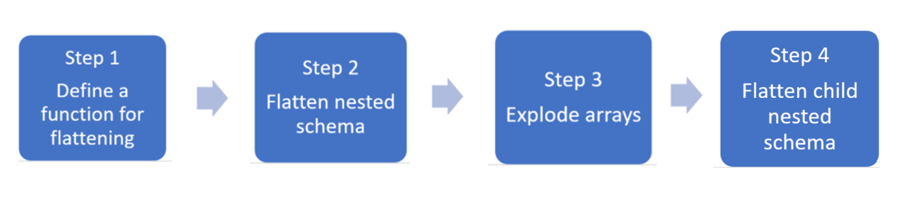

Some use cases for transforming complex data types are as follows:

* Complex data types are increasingly common and represent a challenge for data engineers as analyzing nested schema and arrays tend to include time-consuming and complex SQL queries. 
* It can be difficult to rename or cast the nested columns data type. 
* Performance issues arise when working with deeply nested objects. 
* Data Engineers need to understand how to efficiently process complex data types and make them easily accessible to everyone. 

Synapse Spark can be used to read and transform objects into a flat structure through data frames. 
Synapse SQL serverless can be used to query such objects directly and return those results as a regular table.
With Synapse Spark, it's easy to transform nested structures into columns and array elements into multiple rows. 

In the overview below, the steps show the techniques involved to deal with complex data types:

* Step 1: Define a function for flattening
We define a function to flatten the nested schema. 

* Step 2:  Flatten nested schema
Use the function to flatten the nested schema of the data frame (df) into a new data frame.

* Step 3: Explode Arrays
Transform the array in the data frame into a new dataframe where you also define the column that you want to select. 

* Step 4: Flatten child nested Schema
Use the function you create to flatten the nested schema of the data frame into a new data frame. 

