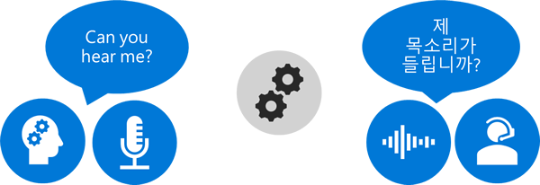

Speech translation is the process by which conversational, spoken phrases are instantly translated (and spoken aloud) in a second language. Speech translation technology enables speakers of different languages to communicate easily across a broad range of services for both consumer and business scenarios, especially in the world science, cross-cultural exchange, and global business interaction.

Most speech translation systems derive from one or more of three base technologies: automatic speech recognition (Site Recovery), machine translation, or voice synthesis. Services exposed by the Azure Cognitive Services Speech API leverage automatic speech recognition, as well as elements of machine translation and voice synthesis.

## Automatic speech recognition

Automatic speech recognition is performed using a neural network system trained on analyzing thousands of hours of incoming audio speech. This model is trained on human-to-human interactions rather than human-to-machine commands, producing speech recognition that is optimized for normal conversations. To achieve this, much more data is needed as well as a much larger neural network than traditional human-to-machine recognition systems.

## Machine translation

In the speech translation world, a machine translation system is an application or service that uses machine-learning technologies to translate large amounts of text or spoken content to another supported language. At the end of the day, a speech translation system translates “source” content from one language to a different “target” language.

Due in part to the advent of Deep Neural Network based translation, Azure Cognitive Service Speech provides higher quality translations than have been previously possible. Neural networks are a set of algorithms, modeled loosely after the human brain, designed to recognize patterns. Much like a human brain, neural networks interpret sensory data through a kind of machine perception, labeling or clustering raw input. The patterns they recognize are numerical, contained in vectors, and then translated into real-world data, such as images, text, time frames, or spoken text.

The Speech Translation API recognition and translation engines are trained to handle conversational speech. It uses silence detection to determine the end of an utterance, then, after a pause in voice activity, the service will stream back a final result for the completed utterance. For performance, the Speech Translation service can also send back partial results, which give intermediate recognitions and translations for an utterance in progress. For final results, the service provides the ability to synthesize speech from the spoken text in the target languages.

Speech translation services are used in many scenarios today.

- Live presentation translation 
- In-person or remote translated communications
- Customer support
- Business intelligence
- Media subtitling
- Multilingual AI interactions

## Speech Translation on Azure

Azure Cognitive Services **Speech Translation** provides robust, machine learning and artificial intelligence-based services **focusing specifically on the real-time multi-language translation of speech**, enabling developers to add end-to-end, real-time, speech translations to their applications or services. These client applications either stream speech audio or send text to the service and receive back a stream of results. These results include the recognized text in the source language and its translation in the target language. For audio requests, interim translations can be provided until an utterance is complete, at which time a final translation is provided.

## Migration

If you have been using Bing Speech or the Translator Speech API, Microsoft offers migration strategies for bringing your applications over to the Speech service.  Your Translator Speech access keys will not work on the new Speech services endpoints, which necessitate a migration to the new services.

- [Migrate from Bing Speech](https://docs.microsoft.com/azure/cognitive-services/speech-service/how-to-migrate-from-bing-speech)
- [Migrate from Translator Speech API](https://docs.microsoft.com/azure/cognitive-services/speech-service/how-to-migrate-from-translator-speech-api)
