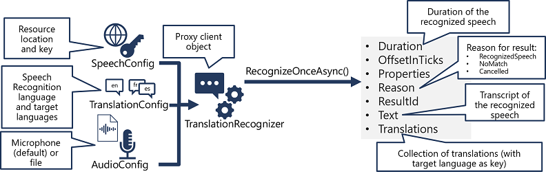

The pattern for speech translation using the Speech SDK is similar to speech recognition, with the addition of information about the source and target languages for translation:

1. Use a **SpeechTranslationConfig** object to encapsulate the information required to connect to your Speech resource. Specifically, its **location** and **key**.
2. The **SpeechTranslationConfig** object is also used to specify the speech recognition language (the language in which the input speech is spoken) and the target languages into which it should be translated.
3. Optionally, use an **AudioConfig** to define the input source for the audio to be transcribed. By default, this is the default system microphone, but you can also specify an audio file.
4. Use the **SpeechTranslationConfig**, and **AudioConfig** to create a **TranslationRecognizer** object. This object is a proxy client for the Speech service translation API.
5. Use the methods of the **TranslationRecognizer** object to call the underlying API functions. For example, the **RecognizeOnceAsync()** method uses the Speech service to asynchronously translate a single spoken utterance.
6. Process the response from the Speech service. In the case of the **RecognizeOnceAsync()** method, the result is a **SpeechRecognitionResult** object that includes the following properties:
    - Duration
    - OffsetInTicks
    - Properties
    - Reason
    - ResultId
    - Text
    - Translations

If the operation was successful, the **Reason** property has the enumerated value **RecognizedSpeech**, the **Text** property contains the transcription in the original language, and the **Translations** property contains a dictionary of the translations (using the two-character ISO language code, such as "en" for English, as a key).
