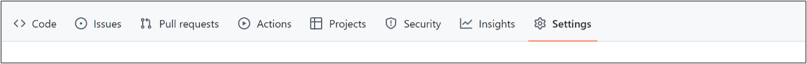
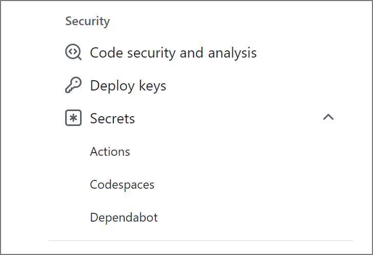

GitHub Actions is a platform that allows you to automate tasks triggered by events that occur within a GitHub repository. A GitHub Actions workflow consist of **jobs**. A job groups a **set of steps** that you can define. One of these steps can use the CLI (v2) to run an **Azure Machine Learning job** to train a model.

To automate model training with GitHub Actions, you'll need to:

- Create a service principal using the Azure CLI.
- Store the Azure credentials in a GitHub secret.
- Define a GitHub Action in YAML.

## Create a service principal

When you use GitHub Actions to automate Azure Machine Learning jobs, you need to use a service principal to authenticate GitHub to manage the Azure Machine Learning workspace. For example, to train a model using Azure Machine Learning compute, you or any tool that you use, needs to be authorized to use that compute.

> [!Tip]
> Learn more about how to [use GitHub Actions to connect to Azure](/azure/developer/github/connect-from-azure)

## Store the Azure credentials

The Azure credentials you need to authenticate should not be stored in your code or plain text and should instead be stored in a GitHub secret. 

To add a secret to your GitHub repository:

1. Navigate to the **Settings** tab. 

   > [!div class="mx-imgBorder"]
   > 

2. In the **Settings** tab, under **Security**, expand the **Secrets** option and select **Actions**.

   > [!div class="mx-imgBorder"]
   > 

3. Enter your Azure credentials as a secret and name the secret `AZURE_CREDENTIALS`. 
4. To use a secret containing Azure credentials in a GitHub Action, refer to the secret in the YAML file.

   ```yml
   on: [push]

   name: Azure Login Sample

   jobs:
     build-and-deploy:
       runs-on: ubuntu-latest
       steps:
         - name: Log in with Azure
           uses: azure/login@v1
           with:
             creds: '${{secrets.AZURE_CREDENTIALS}}'
   ```

## Define the GitHub Action

To define a workflow, you'll need to create a YAML file. You can trigger the workflow to train a model manually or with a push event. Manually triggering the workflow is ideal for testing, while automating it with an event is better for automation.

To configure a GitHub Actions workflow so that you can trigger it manually, use `on: workflow_dispatch`. To trigger a workflow with a push event, use `on: [push]`. 

Once the GitHub Actions workflow is triggered, you can add various steps to a job. For example, you can use a step to run an Azure Machine Learning job:

```yml
name: Manually trigger an Azure Machine Learning job

on:
  workflow_dispatch:

jobs:
  train-model:
    runs-on: ubuntu-latest
    steps:
    - name: Trigger Azure Machine Learning job
      run: |
        az ml job create --file src/job.yml
```

> [!Tip]
> Learn more about [GitHub Actions, including core concepts and essential terminology.](https://docs.github.com/actions/learn-github-actions/understanding-github-actions).

