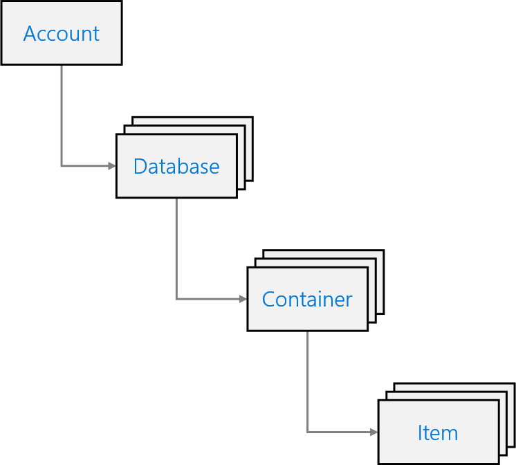
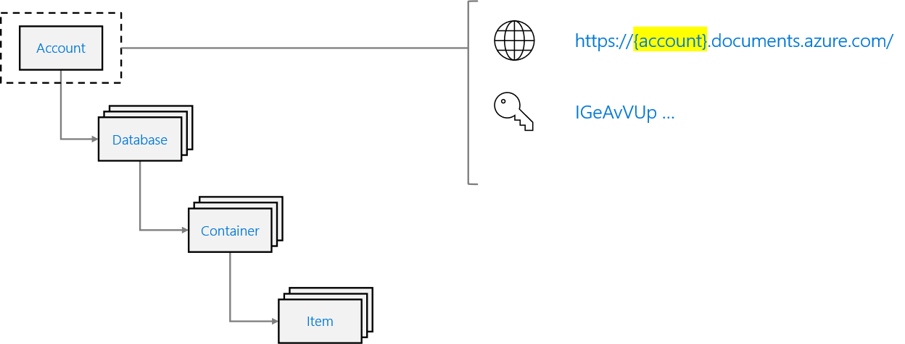
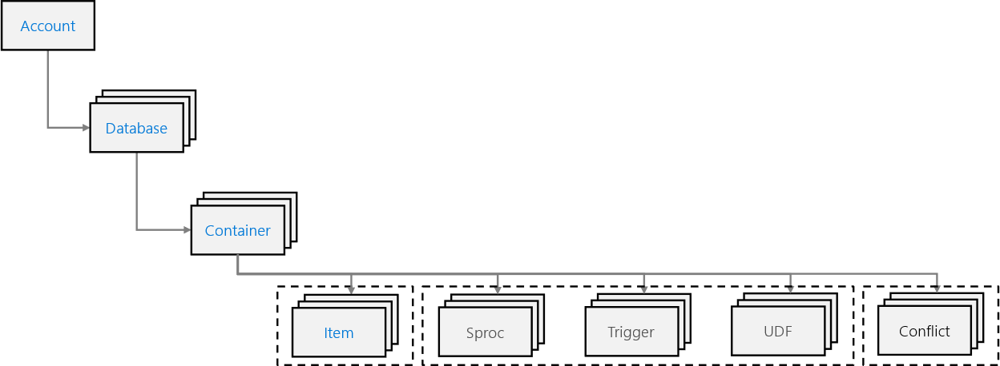

An Azure Cosmos DB for NoSQL account is composed of a basic hierarchy of resources that include:

- An account
- One or more databases
- One or more containers
- Many items

Let's explore each item in this hierarchy.

## Account

Each tenant of the Azure Cosmos DB service is created by provisioning a database account. Accounts are the fundamental units of distribution and high availability. At the account level, you can configure the region\[s\] for your data in Azure Cosmos DB for NoSQL. Accounts also contain the globally unique DNS name used for API requests

## Database

A database is a logical unit of management for containers in Azure Cosmos DB for NoSQL. An Azure Cosmos DB database manages users, permissions, and containers. Within the database, you can find one or more containers. You can also elect to provision throughput for your data here at the database level.

## Container

Containers are the fundamental unit of scalability in Azure Cosmos DB for NoSQL. Typically, you provision throughput at the container level. Azure Cosmos DB for NoSQL will automatically and transparently partition the data in a container. You can also optionally configure an indexing policy or a default time-to-live value at the container level.

## Item\[s\]

An Azure Cosmos DB for NoSQL resource container is a schema-agnostic container of arbitrary user-generated JSON items. The NoSQL API for Azure Cosmos DB stores individual documents in JSON format as items within the container. Azure Cosmos DB for NoSQL natively supports JSON files and can provide fast and predictable performance because write operations on JSON documents are atomic.

> [!TIP]
> Containers can also store JavaScript based stored procedures, triggers and user-defined-functions (UDFs)

