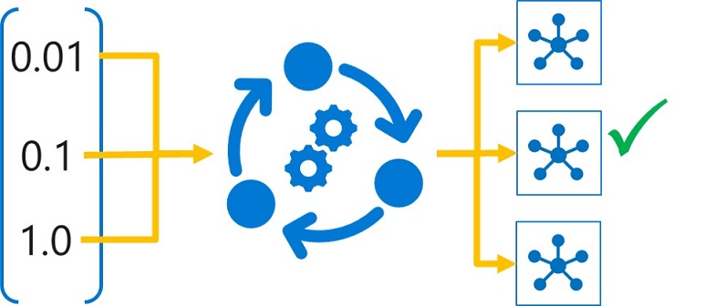

In machine learning, models are trained to predict unknown labels for new data based on correlations between known labels and features found in the training data. Depending on the algorithm used, you may need to specify *hyperparameters* to configure how the model is trained. For example, the *logistic regression* algorithm uses a *regularization rate* hyperparameter to counteract overfitting; and deep learning techniques for convolutional neural networks (CNNs) use hyperparameters like *learning rate* to control how weights are adjusted during training, and *batch size* to determine how many data items are included in each training batch.

> [!NOTE]
> Machine Learning is an academic field with its own particular terminology. Data scientists refer to the values determined from the training features as *parameters*, so a different term is required for values that are used to configure training behavior but which are ***not*** derived from the training data - hence the term *hyperparameter*.

The choice of hyperparameter values can significantly affect the resulting model, making it important to select the best possible values for your particular data and predictive performance goals.

## Tuning hyperparameters

Hyperparameter tuning is accomplished by training the multiple models, using the same algorithm and training data but different hyperparameter values. The resulting model from each training run is then evaluated to determine the performance metric for which you want to optimize (for example, *accuracy*), and the best-performing model is selected.

In Azure Machine Learning, you achieve this through an experiment that consists of a *hyperdrive* run, which initiates a child run for each hyperparameter combination to be tested. Each child run uses a training script with parameterized hyperparameter values to train a model, and logs the target performance metric achieved by the trained model.

## Learning objectives

In this module, you will learn how to:

- Define a hyperparameter search space.
- Configure hyperparameter sampling.
- Select an early-termination policy.
- Run a hyperparameter tuning experiment.
