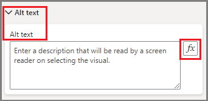
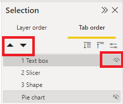

Accessibility is at the heart of Microsoft's values, and Power BI is committed to making Power BI experiences as accessible to as many people as possible. As an enterprise report creator, it's up to you to use the available tools to create inclusive reporting across the organization.

> [!NOTE]
> This unit highlights some accessible design features, and more details including a checklist, can be found in the [Power BI Documentation](/power-bi/create-reports/desktop-accessibility-creating-reports).

## Consider your audience

Easily improve accessibility for most consumers with the following modifications:

* **Alt text** for visuals, shapes, and images
* Set **tab order** for visuals, shapes, and images
* Consistent font, colors, positioning
* Colorblind-friendly color schemes
* Using text or icons in addition to color
* Avoid jargon and acronyms
* Set sort order for visuals
* Disable auto-start videos and audio
* Provide captions and transcripts for videos and audio
* Avoid excess decorative shapes and images

## Alt text

Alt text is one of the most helpful and easily configurable accessibility features. For all visuals, shapes, and images, you can add alt text - a description for use with screen readers.

Screen readers will automatically read the title and type of visual, so add insight and context for low vision users, such as *"Total sales by category, further broken down by product"*. If you want to include specific data points, instead of adding them to the static alt text, you can use DAX measures and conditional formatting to create dynamic alt text in enrich the user experience.

To set alt text, first select the visual or image, navigate to the **Format visual/shape** menu, and select **Alt text**. To add dynamic alt text, select the **Fx** button.

## Set tab order

In Power BI Desktop, you can set the **tab order** for how a keyboard user will experience your report. First, navigate to the **View** tab in the ribbon, then select **Selection** in the **Show Panes** section.

You'll see **Layer order** and **Tab order**, with a list of report elements. Layer order allows you to stack elements, whereas tab order dictates which item will be accessed next when the keyboard user *tabs* to the next item. Use the up/down arrows to set the order. Hide items by clicking the **eye icon**. This action will move the item to the bottom, remove the numbered position, and put a line through the eye to indicate hidden state.

> [!TIP]
> Set tab order and turn off tab order (mark the item as hidden) on any decorative items.
