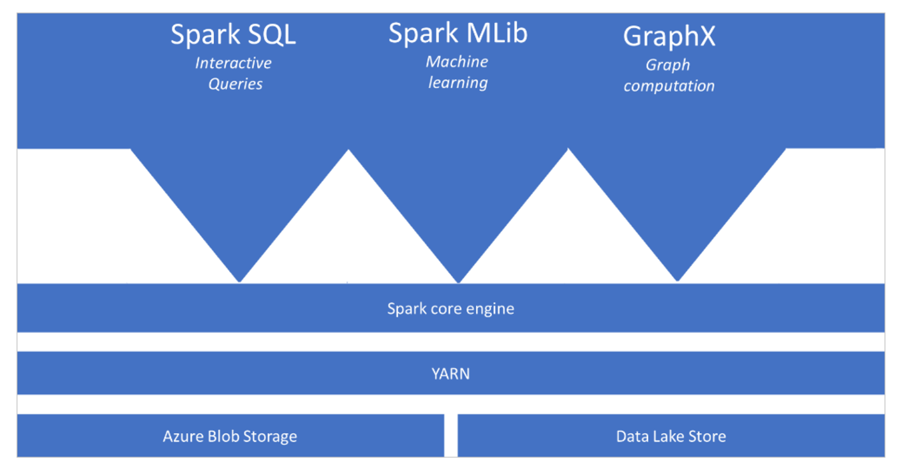

Apache Spark is a parallel processing framework that supports in-memory processing to boost the performance of big-data analytics applications. The Apache Spark core engine is a distributed execution engine, of which its resources are managed by the YARN (Yet Another Resource Negotiator) layer to ensure proper use of the distributed engine to process the Spark queries and jobs. You can have different functionalities sit on top of the Apache Spark core engine that you add as your analytics requires. Examples include adding Apache Spark SQL to perform interactive queries for exploratory data analysis, Spark MLib for machine learning, and GraphX for graph computations. The functionalities enable you to set up diverse workloads on a single platform.

Apache Spark in Azure Synapse Analytics is one of Microsoft's implementations of Apache Spark in the cloud. Azure Synapse Analytics makes it easy to create and configure a serverless Apache Spark pool in Azure. Spark pools in Azure Synapse Analytics are compatible with Azure Storage and Azure Data Lake Generation 2 Storage. Therefore, you can use Spark pools to process your data stored in Azure.

Its key strength is that it resides on the same platform that contains features for building data warehouses with SQL pools, creating data integration solutions with Azure Synapse Pipelines, and integrating with services such as Microsoft Power BI. This integration makes it a compelling choice to use Azure Synapse Analytics as it can act as your one stop shop for all of your analytical solutions.

The benefits of using Apache Spark pools in Azure Synapse Analytics are as follows:

- **Speed and Efficiency**: There is a quick start-up time for nodes and automatic shut-down when instances are not used within 5 minutes after the last job, unless there is a live notebook connection. 
- **Ease of creation**: Creating an Apache Spark pool can be done through the Azure portal, PowerShell, or .NET SDK for Azure Synapse Analytics. 
- **Ease of use**: Within the Azure Synapse Analytics workspace, you can connect directly to the Apache Spark pool and interact with the integrated notebook experience, or use custom notebooks derived from Nteract. Notebook integration helps you develop interactive data processing and visualization pipelines. 
- **REST APIs**: In order to monitor and submit jobs remotely, you can use Apache Livy as a Rest API for the Spark job server. Apache Livy is a service that enables interaction with a  Spark cluster over a REST interface to enable submission of Spark jobs, snippets of Spark code, synchronous or asynchronous result retrieval, and Spark Context management.
- **Integration with third-party Integrated Development Environments (IDEs)**: Azure Synapse Analytics provides an IDE for IntelliJ to create and submit applications to the Apache Spark pool
- **Pre-loaded Anaconda libraries**: Over 200 Anaconda libraries are pre-installed on the Spark pool in Azure Synapse Analytics. 
- **Scalability**: Possibility for autoscale, so that pools can be scaled up/down as required, by adding or removing nodes. 
