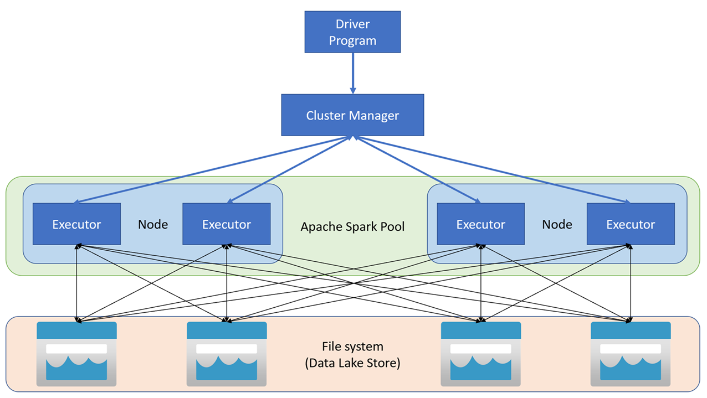

Within Azure Synapse Analytics, Apache Spark applications run as independent sets of processes on a pool, coordinated by the SparkContext object in your main program (called the driver program). The SparkContext can connect to the cluster manager, which allocates resources across applications. The cluster manager is Apache Hadoop YARN. Once connected, Spark acquires executors on nodes in the pool, which are processes that run computations and store data for your application. Next, it sends your application code (defined by JAR or Python files passed to SparkContext) to the executors. Finally, SparkContext sends tasks to the executors to run.

The SparkContext runs the user's main function and executes the various parallel operations on the nodes. Then, the SparkContext collects the results of the operations. The nodes read and write data from and to the file system. The nodes also cache transformed data in-memory as Resilient Distributed Datasets (RDDs).

The SparkContext connects to the Apache Spark pool and is responsible for converting an application to a directed acyclic graph (DAG). The graph consists of individual tasks that get executed within an executor process on the nodes. Each application gets its own executor processes, which stay up for the duration of the whole application and runs tasks in multiple threads.

The processes are managed automatically when you create an Apache Spark pool in Azure Synapse Analytics. In order to do so, you would have to create an Azure Synapse Analytics workspace first, then you can create a new Apache Spark pool as shown in the following steps. 

1. In the Azure portal, select **+ Create a resource**

    

2. In the search environment type **Synapse** and select **Azure Synapse Analytics**:

    

3. Once you select **Create**, you'll have some parameters to fill out.

    

4. Once you've filled out the parameters, select **Review + create** and wait until the resource gets deployed. Once the Azure Synapse Analytics Workspace resource is created, you are now able to add an Apache Spark pool.

5. In the Azure portal, navigate to the Azure Synapse workspace, and in the overview screen, select **New Apache Spark pool**

    

6. In the **Create Apache Spark pool** screen, you'll have to specify a couple of parameters including:
    - Apache Spark pool name
    - Node size
    - Autoscale
    - Number of nodes

        

7. Once you've filled out the basic parameters, you could navigate to the **additional settings** tab to customize extra configuration parameters including autoscale and component versions.

    

8. Once you've finished setting up the parameters, you can select **Review + create** and the Spark pool will be created. 

