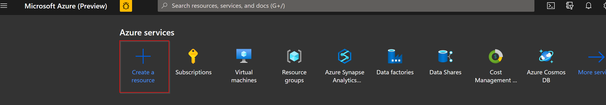
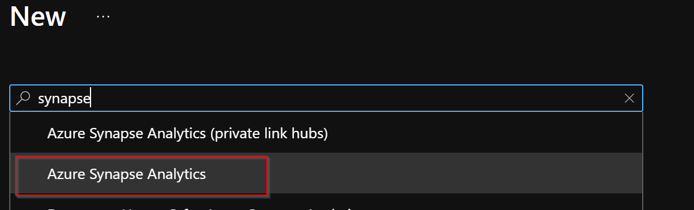
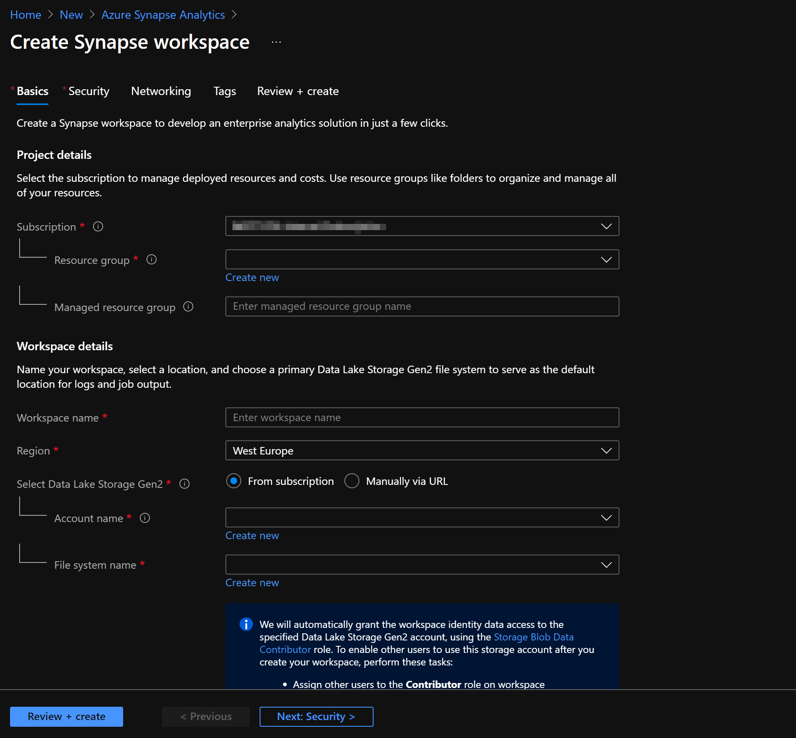
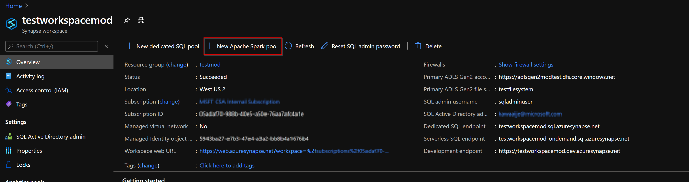
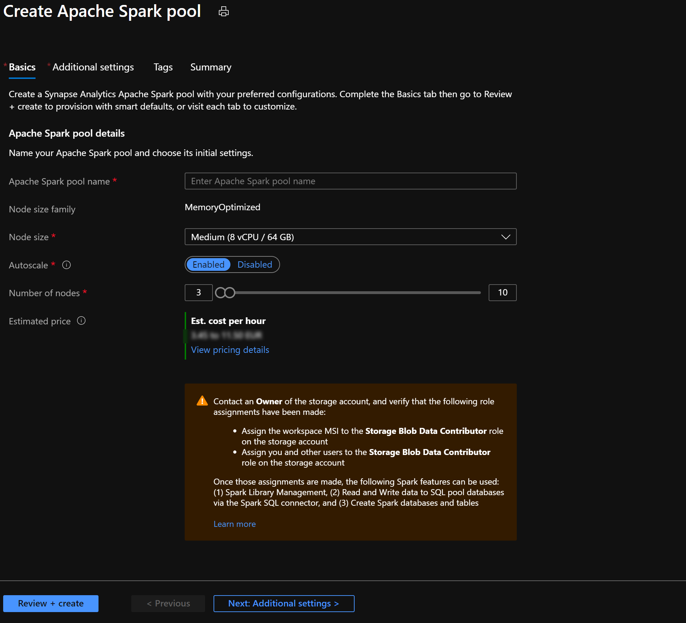

There are two concepts within apache spark pools in Azure Synapse Analytics, namely Spark pools and Spark Instances. 
In short, they do the following:

Spark Pools:
* Exists as Metadata​
* Creates a Spark Instance ​
* No costs associated with creating Pool​
* Permissions can be applied​
* Best practices

Spark Instances:
* Created when connected to Spark Pool, Session, or Job​
* Multiple users can have access​
* Reusable

​When we go a little more in depth, a Spark pool (preview) is created in the Azure portal. 
It is the definition of a Spark pool that, when instantiated, is used to create a Spark instance that processes data. 
When a Spark pool is created, it exists only as metadata; no resources are consumed, running, or charged for. 
A Spark pool has series of properties that control the characteristics of a Spark instance; these characteristics include but are not limited to name, size, scaling behavior, time to live.​

As there is no resource cost associated with creating Spark pools, any number of pools can be created with any number of different configurations. Permissions can also be applied to Spark pools allowing users only to have access to some and not others.​

A best practice is to create smaller Spark pools that may be used for development and debugging and then larger ones for running production workloads.​

An example of Spark Pools:​

* You create a Spark pool called SP1; it has a fixed cluster size of 20 nodes.​

* You submit a notebook job, J1 that uses 10 nodes, a Spark instance, SI1 is created to process the job.​

* You now submit another job, J2, that uses 10 nodes because there is still capacity in the pool and the instance, the J2, is processed by SI1.​

* If J2 had asked for 11 nodes, there would not have been capacity in SP1 or SI1. In this case, if J2 comes from a notebook, then the job will be rejected; if J2 comes from a batch job, then it will be queued.​

​
When we go a little more in depth, Spark instances are created when you connect to a Spark pool, create a session, and run a job. 
As multiple users may have access to a single Spark pool, a new Spark instance is created for each user that connects.​

When you submit a second job, then if there is capacity in the pool, the existing Spark instance also has capacity then the existing instance will process the job; if not and there is capacity at the pool level, then a new Spark instance will be created.​

​
An example of a Spark Instance:​

* You create a Spark pool call SP2; it has an autoscale enabled 10 – 20 nodes​

* You submit a notebook job, J1 that uses 10 nodes, a Spark instance, SI1, is created to process the job.​

* You now submit another job, J2, that uses 10 nodes, because there is still capacity in the pool the instance auto grows to 20 nodes and processes J2.

In order to create a Spark pool in Azure Synapse Analytics, you would have to create a Synapse Analytics Workspace. 

In the following exercise, you learn how to set up an Azure Synapse Analytics workspace as well as, the creation of a Spark Pool:

In the search environment type Azure Synapse and select Azure Synapse Analytics Workspace preview:

Once you select 'Create', you'll have some parameters to fill out.

Once you've filled out the parameters, select Create and wait until the resource gets deployed. 
Once the resource that is, the Azure Synapse Analytics Workspace resource, is created, navigate to the resource and add a Spark Pool as follows:

Once you've selected Create New Apache Spark pool, you'll be redirected to the following screen in which you'll have to specify a couple of parameters:

Once you've filled out the basic parameters, you could also navigate to the additional settings tab in which you can customize additional configuration parameters including autoscale and component versions.

Once you've finished setting the parameters, you can select create and the Spark pool will be created. 

