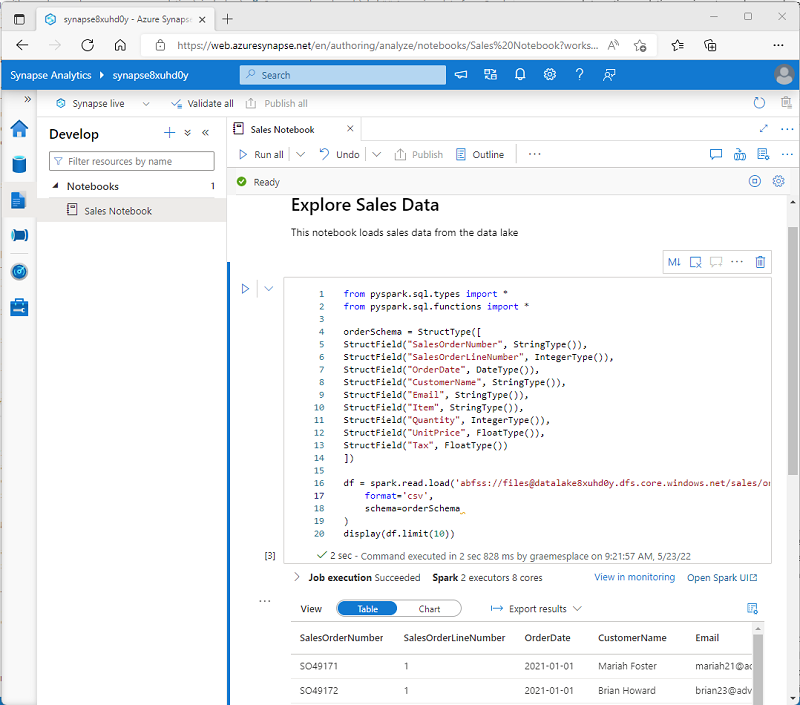

You can run many different kinds of application on Spark, including code in Python or Scala scripts, Java code compiled as a Java Archive (JAR), and others. Spark is commonly used in two kinds of workload:

- Batch or stream processing jobs to ingest, clean, and transform data - often running as part of an automated pipeline.
- Interactive analytics sessions to explore, analyze, and visualize data.

## Running Spark code in notebooks

Azure Synapse Studio includes an integrated notebook interface for working with Spark. Notebooks provide an intuitive way to combine code with Markdown notes, commonly used by data scientists and data analysts. The look and feel of the integrated notebook experience within Azure Synapse Studio is similar to that of Jupyter notebooks - a popular open source notebook platform.

> [!NOTE]
> While usually used interactively, notebooks can be included in automated pipelines and run as an unattended script.

Notebooks consist of one or more *cells*, each containing either code or markdown. Code cells in notebooks have some features that can help you be more productive, including:

- Syntax highlighting and error support.
- Code auto-completion​.
- Interactive data visualizations.
- The ability to export results.

> [!TIP]
> To learn more about working with notebooks in Azure Synapse Analytics, see the [Create, develop, and maintain Synapse notebooks in Azure Synapse Analytics](/azure/synapse-analytics/spark/apache-spark-development-using-notebooks) article in the Azure Synapse Analytics documentation.

## Accessing data from a Synapse Spark pool

You can use Spark in Azure Synapse Analytics to work with data from various sources, including:

- A data lake based on the primary storage account for the Azure Synapse Analytics workspace.
- A data lake based on storage defined as a *linked service* in the workspace.
- A dedicated or serverless SQL pool in the workspace.
- An Azure SQL or SQL Server database (using the Spark connector for SQL Server)
- An Azure Cosmos DB analytical database defined as a *linked service* and configured using *Azure Synapse Link for Cosmos DB*.
- An Azure Data Explorer Kusto database defined as a *linked service* in the workspace.
- An external Hive metastore defined as a *linked service* in the workspace.

One of the most common uses of Spark is to work with data in a data lake, where you can read and write files in multiple commonly used formats, including delimited text, Parquet, Avro, and others.
