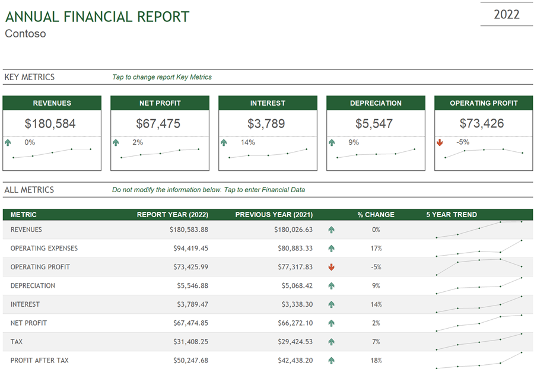
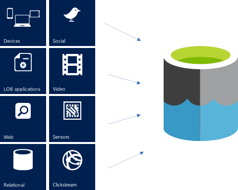

Understanding how data is structured and stored is a critical step that occurs at the beginning of every analytics project, during requirements gathering. Both structured and unstructured data are suitable for analysis, but the tools the data team will use to ingest, transform, and store data will differ according to the data type.

## Structured data

*Structured data* is familiar to most of us. Letters and numbers are organized into columns and rows for simplified search and processing. Structured data is typically quantitative in nature and stored in relational databases and data warehouses. Structured data may reside in something familiar, a Microsoft Excel table. Structured data storage on a larger scale may be stored in a relational database, like an Azure SQL database.

Structured data lends well to all types of analytics and is the most accessible. Structured Query Language (SQL) is used to query relational databases and is commonly used by data analysts, data engineers, and data scientists alike.

Presentation of annual financial data is a common example of using structured data, whether that data is stored in Excel spreadsheets or a relational database like Azure SQL database.

## Unstructured data

*Unstructured data* is information that isn't organized in any discernable manner. Unstructured data is often more suitable for qualitative analysis and is stored in non-relational databases and data lakes. 

The formats of unstructured data vary widely, from Word documents, .csv files, json files, images, and PDFs, to audio and video files. These files would be stored in an Azure Data Lake.

