There are a variety of tools at your disposal to develop solutions against Azure Synapse Analytics SQL pools. 

## Azure Synapse Studio 

The Develop hub in Azure Synapse Studio is an interface you can use for developing a variety of solutions against an Azure Synapse Analytics instance. In this area, you have the ability to create the following objects:
-	SQL Scripts
-	Notebooks
-	Azure Synapse Pipelines
-	Power BI datasets and reports
    > [!div class="mx-imgBorder"]  
    > [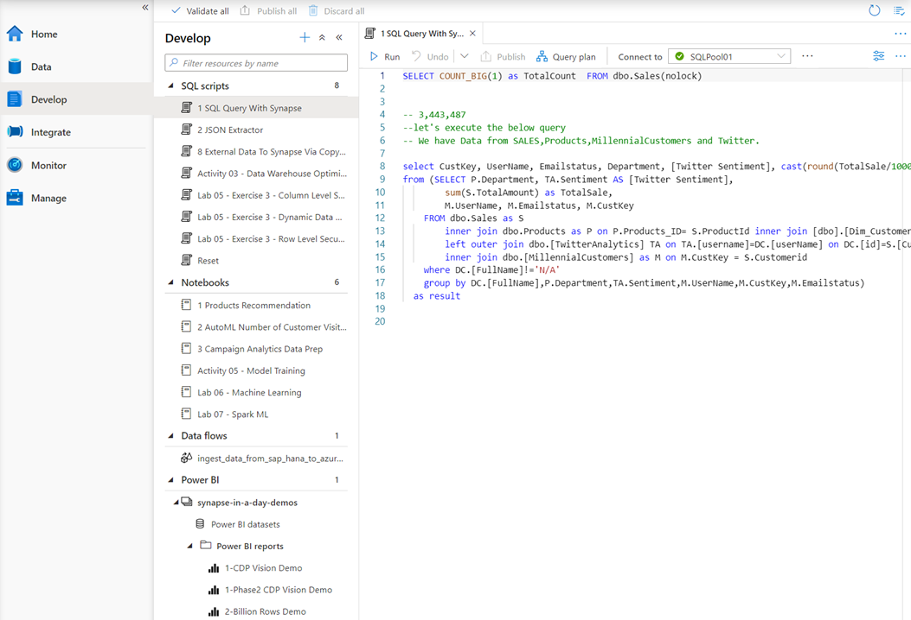](../media/define-scripts-synapse.png#lightbox)

In addition to this, you can also define Spark Job definitions, in either PySpark, Scala, or .NET Spark that can submit a batch job to the Azure Synapse Spark pool too

> [!div class="mx-imgBorder"]  
> 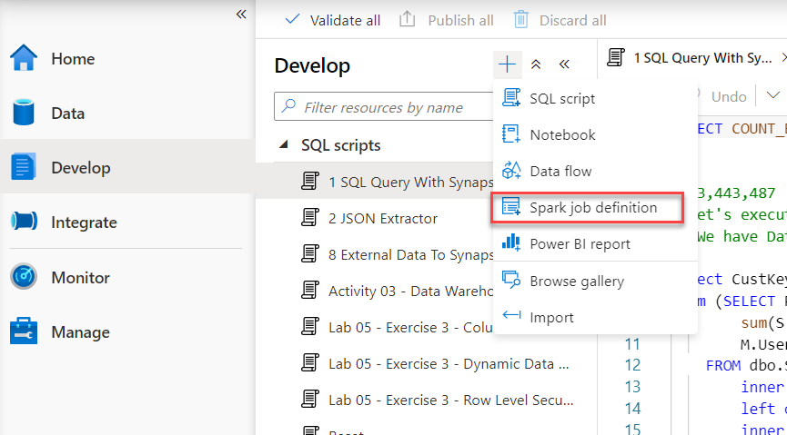

## Visual Studio and SQL Server Data Tools

You can use Visual Studio 2019 SQL Server Data Tools (SSDT) with native integration with Azure DevOps. SSDT is a single tool that allows users to create Database projects within dedicated SQL pools and integrate with source control systems. It also supports generating T-SQL scripts for objects and provides built-in continuous integration and deployment capabilities for enterprise deployments.

### Connect to your dedicated SQL pool

1.	Open Visual Studio 2019.

2.	Open SQL Server Object Explorer by selecting View > SQL Server Object Explorer.
 
    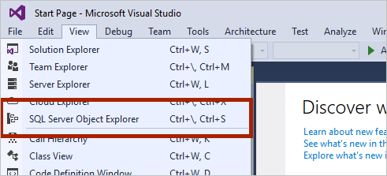

3.	Click the Add SQL Server icon.
 
    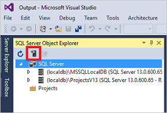

4.	Fill in the fields in the Connect to Server window.
 
    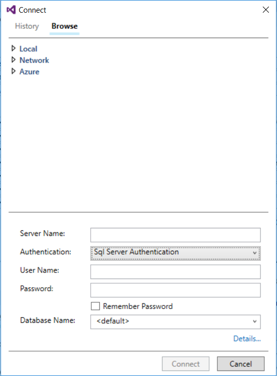

- Server name. Enter the server name previously identified.
- Authentication. Select SQL Server Authentication or Active Directory Integrated Authentication.
- User Name and Password. Enter user name and password if SQL Server Authentication was selected above.
- Click Connect.

5.	To explore, expand your Azure SQL server. You can view the databases associated with the server. Expand AdventureWorksDW to see the tables in your sample database.
 
    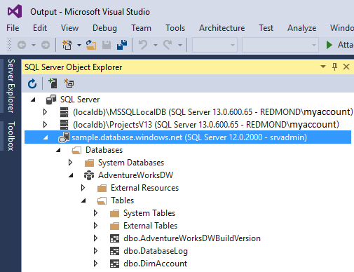

### Run a sample query

Now that a connection has been established to your database, let's write a query.

1.	Right-click your database in SQL Server Object Explorer.

2.	Select New Query. A new query window opens.
 
    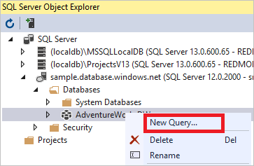

3.	Copy the following T-SQL query into the query window:

    ```sql
    SELECT COUNT(*) FROM dbo.FactInternetSales;
    ```

4.	Run the query by clicking the green arrow or use the following shortcut: CTRL+SHIFT+E.
 
    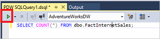

5.	Look at the query results. In this example, the FactInternetSales table has 60398 rows.
 
    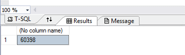

## Azure Data Studio 

Azure Data Studio is a cross-platform tool to connect and query on-premise and cloud data platforms on windows, macOS, and Linux. Synapse Analytics supports connecting and querying Synapse SQL using Azure Data Studio through either Serverless or dedicated SQL Pool resources.

To connect to Synapse SQL, open Azure Data Studio and select New Connection.
 
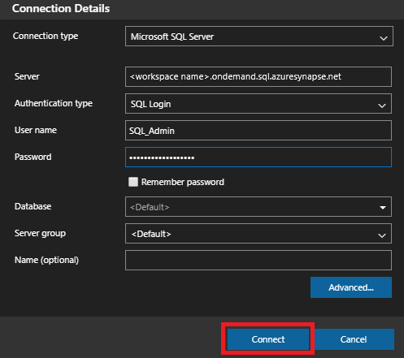

Choose Microsoft SQL Server as the Connection type.

The connection requires the following parameters:

- Server: Server in the form <Azure Synapse workspace name>-ondemand.sql.azuresynapse.net
- Database: Database name
 
If you would like to use serverless SQL pool (preview) the URL should look like:
- <Azure Synapse workspace name>-ondemand.sql.azuresynapse.net.

If you would like to use dedicated SQL pool the URL should look like:
- <Azure Synapse workspace name>.sql.azuresynapse.net

Choose Windows Authentication, Azure Active Directory, or SQL Login as the Authentication Type.

To use SQL Login as the authentication type, add the username/password parameters:
- User: Server user in the form <User>
- Password: Password associated with the user

To use Azure Active Directory, you need to choose the needed authentication type.
 
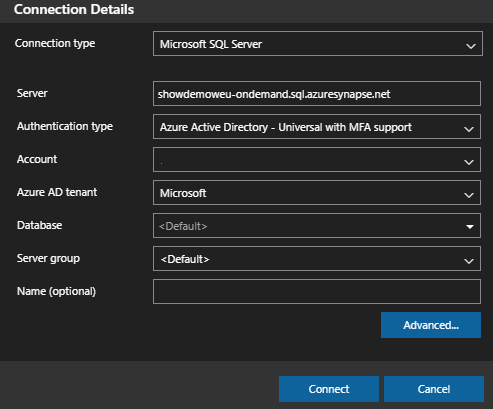

The following screenshot shows the Connection Details for Windows Authentication:
 
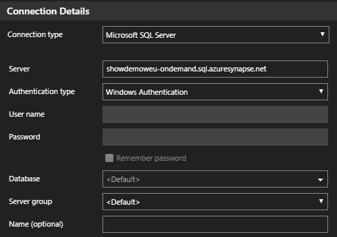

The following screenshot shows the Connection Details using SQL Login:
 


After successful login, you should see a dashboard like this:  

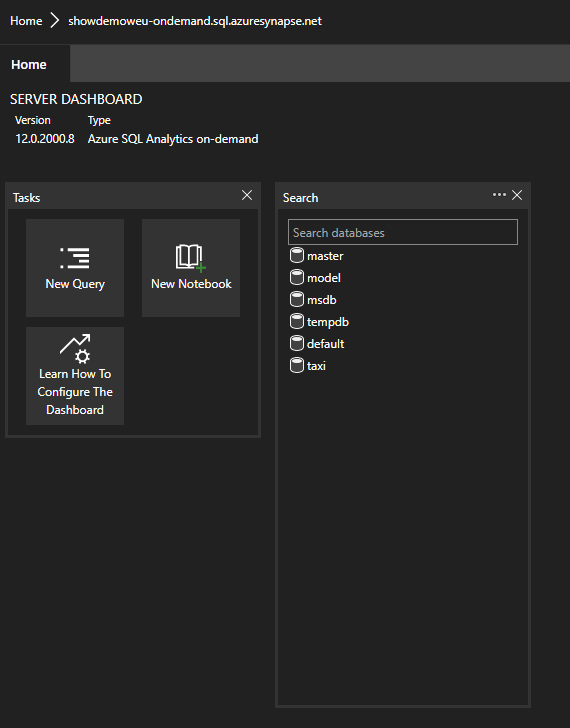

### Query

Once connected, you can query Synapse SQL using supported Transact-SQL (T-SQL) statements against the instance. Select New query from the dashboard view to get started.
 


For example, you can use the following Transact-SQL statement to query Parquet files using serverless SQL pool:

```sql
SELECT COUNT(*)
FROM  
OPENROWSET(
    BULK 'https://azureopendatastorage.blob.core.windows.net/censusdatacontainer/release/us_population_county/year=20*/*.parquet',
    FORMAT='PARQUET'
)
```

## SQL Server Management Studio (SSMS) 

SSMS is an integrated environment to design, query, monitor, and administer databases and data warehouses. Azure Synapse Analytics supports connecting and querying Synapse SQL using SSMS through either Serverless or dedicated SQL pool resources. 
