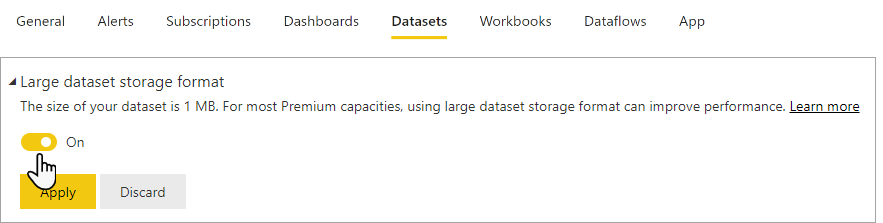

Power BI datasets store data in a highly compressed, in-memory cache for optimized query performance. Enterprise deployment of an analytics solution using Power BI will likely require [Power BI Premium](/power-bi/enterprise/service-premium-what-is). With the *large dataset storage format* enabled, dataset sizes are limited only by the capacity size, or a maximum size set by the administrator. This differs from datasets in Power BI Premium, which are limited to 10 GB after compression if large dataset storage format isn't enabled.

Large datasets can be enabled for all Premium P SKUs, Embedded A SKUs, and with Premium Per User (PPU). The large dataset size limit in Premium is comparable to Azure Analysis Services, in terms of data model size limitations.

The large dataset feature brings the Power BI dataset cache sizes to parity with Azure Analysis Services model sizes. The large dataset feature enables consolidation of tabular models from SQL Server Analysis Services and Azure Analysis Services on one common platform based on Power BI Premium.

> [!NOTE]
> To use large dataset storage format, the dataset must be stored in a workspace that allocated to Premium capacity.

Enabling the large dataset format enables fast user interactivity and allows data to grow beyond the 10-GB limit. Additionally, the large dataset format can also improve xmla write operation performance, even for datasets that may not be large.

> [!IMPORTANT]
> Datasets enabled for large models can't be downloaded as a Power BI Desktop (.pbix) file from the Power BI service. Read more about [.pbix download limitations.](/power-bi/create-reports/service-export-to-pbix#limitations-when-downloading-a-pbix-from-a-dataset)

## Enable large dataset storage format
 
To take advantage of the large dataset storage format option, it must be enabled in the Power BI service. Here you can enable large dataset storage format for a single dataset, or for all datasets created in a workspace.

### Enable large dataset storage format for a single dataset

In the dataset settings in the Power BI service, toggle the slider to on and select **Apply**.

### Enable large dataset storage format for all datasets created in a workspace

You can set the default storage format for all datasets created in a workspace in the workspace settings. In the settings, select **Premium**, and select **Large dataset storage format** as the **Default storage format**.

Large dataset storage format for a workspace can also be enabled using PowerShell.

> [!NOTE]
> See [Configure large datasets](/power-bi/enterprise/service-premium-large-models) to learn more about large models in Power BI Premium including information on checking dataset size, dataset eviction, considerations, and limitations.
