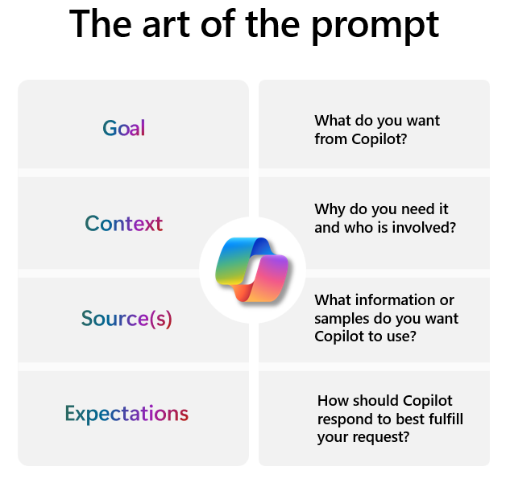
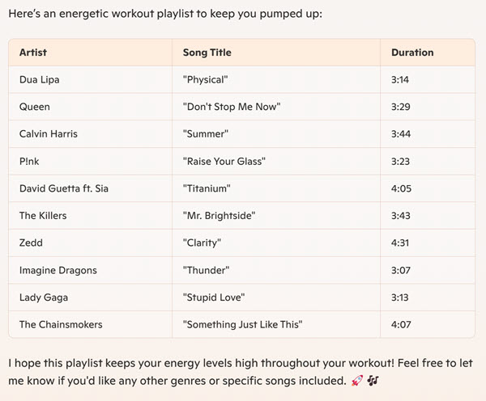

To get the best out of AI, you want to create prompts that help it give you useful responses. A **prompt** is simply a question or instruction you submit to get a specific response. It's like asking a friend or coworker for help or information, but instead you're asking an AI, like Microsoft Copilot. The clearer and more detailed your prompt, the better Copilot can understand and respond. It's often more effective to tell Copilot what you *want* it to do, rather than what you *don't want* it to do.

## Write effective prompts

An effective prompt should be clear, specific, contextual, and goal oriented. By incorporating these elements into your prompts, you can ensure that you get more accurate and relevant responses from AI tools. Remember, the more information and guidance you provide in your prompt, the better Copilot can assist you.

A prompt can be simple or detailed, but you must have a clear goal. If you want to be more specific, add additional information. Often, you'll need more than just a goal to achieve the results you want. The following graphic describes the four elements of a good prompt: Goal, Context, Source(s), and Expectations.

Here are some tips to keep in mind when writing a prompt:

- Be specific about what you want Copilot to do. Clear goals lead to better responses.
- Add some context to help Copilot understand what you're asking. Context makes the response more relevant.
- Provide some data or information for Copilot to use. This helps ground the response in the right context.
- Let Copilot know how you want the response to be formatted. This sets clear expectations.

## Explore good, better, and best prompts

The following table includes some everyday tasks that you could co-create with AI, and include examples of good, better, and best prompts. These examples help you understand how to create prompts to make your tasks more simple and effective.

> [!TIP]
> When you see text in brackets within a prompt, it indicates where you should either paste your own content or replace the bracketed text with your own ideas. After personalizing the prompt, remove the brackets. For example, you might replace **[my workout]** with **morning run** and **[upbeat and energetic]** with **relaxing and calm** to make this prompt your own.

| **Task** | **Good** | **Better** | **Best** |
|----------------|------|--------|------|
| **Rewrite Emails** | Copilot, rewrite this email to be more formal: [email text]. | Copilot, rewrite this email to be more **formal and concise**: [email text]. | Copilot, rewrite this email to be more **formal, concise, and persuasive**: [email text]. |
| **Brainstorm Podcast Ideas** | I'm thinking about starting a podcast. Can you help me brainstorm a month's worth of episode ideas centered around [technology, culture, and personal development]? | I'm thinking about starting a podcast. Can you help me brainstorm a month's worth of episode ideas centered around [technology, culture, and personal development]? **Each episode should cover a unique topic that will engage listeners**. | I'm thinking about starting a weekly podcast. Can you help me brainstorm a month's worth of episode ideas centered around [technology, culture, and personal development]? Each episode should cover a unique topic that would intrigue listeners. **For each episode idea, provide a catchy title and a brief outline of key discussion points**. |
| **Create a Playlist** | Copilot, create a playlist for [my workout] with 10 [upbeat and energetic] songs. | Copilot, create a playlist for [my workout] with 10 [upbeat and energetic] songs.**Include a mix of [pop, rock, and electronic music] to keep the energy [high].**| Copilot, create a playlist for [my workout] with 10 [upbeat and energetic] songs. Include a mix of [pop, rock, and electronic music] to keep the energy [high]. **Format the playlist as a table with [the artist, song title, and song duration].** |

The following image shows the playlist Copilot generated using the "best" prompt example. Note that it's formatted as a table and includes all of the requested details for each song.  

> [!NOTE]
> One of the best ways to effectively work with Copilot is to ask it to refine the results. When you give a prompt to an AI, the first response might not be exactly what you want. So, look at the result, think about what you want to change, and then try again with a slightly different prompt. Each time you make a change, you're getting closer to the perfect result. This is called **iterating**.
>
> For example, let's say you used Copilot to create a menu for a dinner party, but you forgot you need to include vegetarian options. All you need to do is ask Copilot to update the menu to include some vegetarian dishes. This way, you can keep refining your prompts until you get the perfect result.
>
> 

## Find inspiration

The following table includes some prompt resources you might find helpful to get started with more complex prompting.

| Resource Name | Description | Use cases  |
|--|--|--|
| **[Do more with Copilot](https://www.microsoft.com/microsoft-copilot/for-individuals/do-more-with-ai?azure-portal=true)** | A selection of use cases and examples of how AI can be applied to everyday tasks. | Explore articles grouped by categories such as daily life, AI art & creativity, general AI, learning & education, and professional life. |
| **[Copilot prompt gallery](https://copilot.cloud.microsoft/prompts?azure-portal=true)** | A collection of prompts that you can use as inspiration. | Find sample prompts that you can edit to make your own. Some editable parts are obvious, denoted by a pair of square brackets, like [topic], [file], and [your title]. But you can also edit various parts of those prompts, such as the goal, context, expectations, and source, to suit your purpose. |
| **[Copilot scenario library](https://adoption.microsoft.com/copilot-scenario-library?azure-portal=true)** | A wide range of scenarios and prompts organized by job functions and roles | Find relevant prompts for your specific needs and industry. |

> [!TIP]
> To learn more about the art of prompting, review [Cooking up a great prompt: Getting the most from Copilot](https://support.microsoft.com/topic/cooking-up-a-great-prompt-getting-the-most-from-copilot-7b614306-d5aa-4b62-8509-e46674a29165?ocid=PromptGallery_SMC_Article_GetTips?azure-portal=true).

> [!NOTE]
> **Build your AI habit**:
> Now that you know what it takes to craft clear, specific, and goal-oriented prompts, try to identify tasks in your own daily routine where AI might help you save time or be more creative. Commit to a daily experiment, such as one prompt to try every day. Remember to iterate as much as you want to perfect your prompt.

Next, let's explore some ways you might use AI to help with personal tasks.
