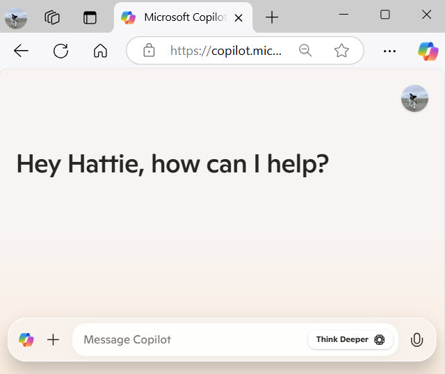

**THIS IS NOT FINAL, OR EVEN REALLY A ROUGH DRAFT JUST 1 IDEA**

In this activity, learn how to create personalized prompts for AI tools like Microsoft Copilot and refine them to get the best results. By the end of this exercise, you'll be more comfortable using AI to enhance your everyday tasks.

## Before you start

In this module, we use Microsoft Copilot to interact with generative AI. To follow along and complete the exercise, you'll need to do a few things to get set-up.

 **NEED DETAILS HERE:**
1. Sign Up for a Microsoft Account. If you don't already have a Microsoft account, sign up for one at https://signup.live.com.
2. Step 2 ...
3. Step 3 ...

> 

## Personalize sample prompts
To start, we'll practice creating personalized AI prompts. Here are a few fill-in-the-blank prompts. Your task is to fill in the blanks with specific details such as goals, timelines, topics, or other relevant information. This will help you create clear and effective prompts for Copilot.

Example prompts:

- "Copilot, create a [weekly meal plan] for [a family of four] with [healthy and budget-friendly] recipes."
- "Copilot, help me draft an email to [my team] about [the upcoming project deadline] and [key milestones]."
- "Copilot, generate a list of [10 book recommendations] for [summer reading] that focus on [self-improvement and personal growth]."

Now that you have your personalized prompts, it's time to try them out.

1. Open Microsoft Copilot.
2. Select the text input area where you can type your prompt.
3. Choose one of the example prompts provided, and fill in the blanks with your own specific details.
4. Type or paste your personalized prompt into the text input area, then press Enter to submit your prompt to Copilot.
  
## Analyze your results

Now that you've submitted your personalized prompt to Copilot, it's time to analyze the results. Take a moment to review the response you received. Consider the following questions as you evaluate the results:

- Did Copilot understand your prompt correctly?
- Is the response relevant and useful for your needs?
- Are there any areas where the response could be improved?

Now, go ahead and submit and analyze the rest of your personalized prompts. Don't worry, you won't overwrite earlier prompts and responses. Once you're done, we'll move on to analyzing the results.

As you review the results, make a note of what you liked about the responses and any areas that could be refined. This will help you in the next steps as you work on improving your prompts.

## Iterate and improve your prompts

Iteration is a key part of creating effective AI prompts. In this step, you'll refine your original prompts based on the initial results and the expanded information from Think Deeper. By iterating, you can improve the quality of the responses and better meet your needs.

1. Review the initial response and the expanded information **from Think Deeper - maybe move this** and identify any areas where the response could be further improved or refined.
2. Modify your original prompt to address these areas. For example, if the initial meal plan didn't include vegetarian options, you could refine the prompt to specify this requirement: "Copilot, create a weekly meal plan for a family of four with healthy, budget-friendly, and vegetarian recipes."
3. Submit your refined prompt to Copilot and review the new response.

Take a couple of minutes to iterate on your prompts and see how refining them can lead to better outcomes. Remember, the more specific and clear your prompts are, the more accurate and useful the responses will be.

Congratulations on completing the exercise! You've now practiced creating personalized AI prompts, analyzing the results, and iterating to improve them. Remember, the key to getting the best responses from AI tools like Microsoft Copilot is to be clear, specific, and goal-oriented in your prompts. Don't hesitate to use the Think Deeper feature to expand on initial results and refine your prompts through iteration. Keep experimenting with different prompts in your daily tasks to see how AI can make your work easier and more efficient. Happy prompting!
______________________________

## Think Deeper with Copilot (needs much work still. Will use free Copilot.)

In this step, we'll use the **Think Deeper** feature to expand on the initial results you received from your prompts. Think Deeper is a powerful tool that allows you to get more detailed or refined information from Copilot. It's especially useful when you need more insights or want to enhance the output you initially received.

When to use Think Deeper:
- When you need more detailed information or a more comprehensive response.
- When the initial response is good but could be improved with more context or specifics.
- When you want to explore different aspects of the initial response.

With Think Deeper, you can expect:
- More detailed and refined information.
- Enhanced responses that provide deeper insights.
- The ability to iterate and improve the initial results.

1. Choose one of your prompts, and review the initial response you received from Copilot, and identify any areas where you would like more information or a more detailed response.
2. Use the Think Deeper feature by asking Copilot to expand on those specific areas. For example, if you received a meal plan but want more vegetarian options, you could ask, "Copilot, can you provide more vegetarian recipes for this meal plan?"
Submit your refined prompt and review the expanded response.
Take a couple of minutes to use Think Deeper on one of your prompt results and see how it enhances the information provided.

## COPILOT-GENERATED IDEA - PLACEHOLDER

Introduction (1 minute)

Briefly explain the exercise's objective: to create effective AI prompts and refine them based on the results.
**Step 1: Personalize Fill-in-the-Blank Prompts** (3 minutes)

Provide learners with a few fill-in-the-blank prompts. Encourage them to personalize these prompts by adding specific goals, timelines, topics, or other details.
Example prompts:
"Copilot, create a [weekly meal plan] for [a family of four] with [healthy and budget-friendly] recipes."
"Copilot, help me draft an email to [my team] about [the upcoming project deadline] and [key milestones]."
"Copilot, generate a list of [10 book recommendations] for [summer reading] that focus on [self-improvement and personal growth]."
**Step 2: Analyze the Results** (2 minutes)

Ask learners to submit their personalized prompts to Copilot and review the responses.
Encourage them to note what they liked about the responses and any areas that could be improved.
**Step 3: Use Think Deeper to Expand on the Results** (2 minutes)

Introduce the Think Deeper feature and explain how it can be used to expand on the initial results.
Ask learners to use Think Deeper on one of their prompt results to get more detailed or refined information.
**Step 4: Iterate and Improve** (2 minutes)

Explain the importance of iteration in creating effective prompts.
Encourage learners to refine their original prompts based on the initial results and the expanded information from Think Deeper.
Example: If the initial meal plan didn't include vegetarian options, learners can refine the prompt to specify this requirement.
Conclusion (1 minute)

**Key takeaways**: the importance of clear and specific prompts, using Think Deeper to enhance results, and iterating to improve the outcomes.
Encourage learners to continue practicing with different prompts in their daily tasks.