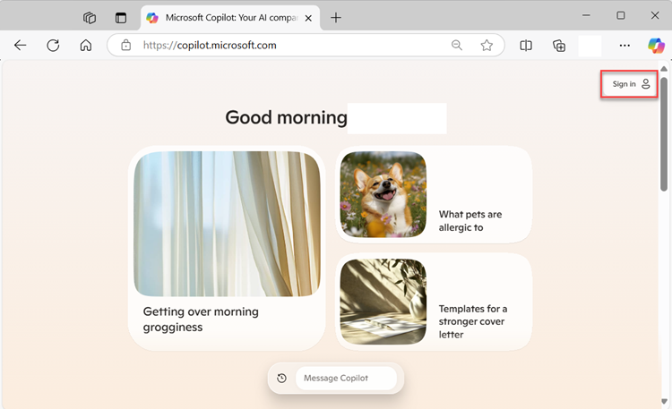
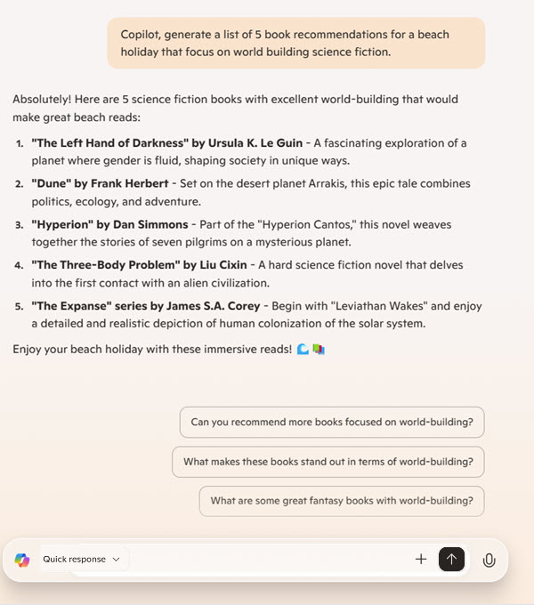
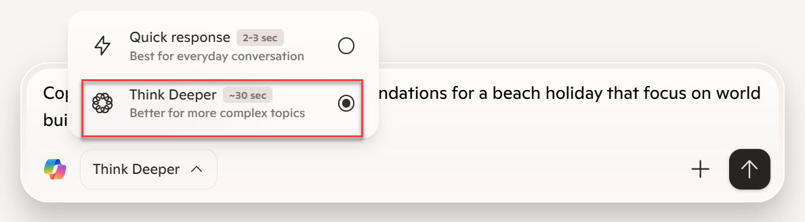

In this activity, learn how to create personalized prompts and refine them to get the best results. By the end of this exercise, you'll be more comfortable using AI to enhance your everyday tasks.

**Before you start**

In this module, you use Microsoft Copilot to interact with generative AI. To follow along and complete the exercise, you need to do a few things to get set-up.

1. In your browser, navigate to [copilot.microsoft.com](https://copilot.microsoft.com?azure-portal=true). For this tutorial you need to use Copilot in the **full browser**, not in the browser sidebar.

2. Sign in to Copilot with your [personal Microsoft Account](https://signup.live.com?azure-portal=true) (such as an outlook.com account).

## Personalize sample prompts
To start, you practice creating personalized prompts using a few fill-in-the-blank examples. Your task is to fill in the blanks with specific details such as goals, timelines, topics, or other relevant information. This helps you create clear and effective prompts for Copilot.

### Generate recommendations

1. Copy the sample prompt and paste it into the chat box in [copilot.microsoft.com](https://copilot.microsoft.com?azure-portal=true).
2. Personalize the prompt by updating the content in brackets to whatever suits you.
3. Submit the message to Copilot.

> [!IMPORTANT]
> In this exercise, bracketed text indicates where you should replace the bracketed text with your own ideas. After personalizing the prompt, remove the brackets.

**Sample prompt**:
> Copilot, generate a list of **[10 book recommendations]** for **[summer reading]** that focus on **[self-improvement and personal growth]**.

The following screenshot is an example of what Copilot might generate. How does it compare to the personalized prompt that you submitted?

> [!TIP]
> **Iterate and expand**. Remember that you can iterate, and ask Copilot to refine the ideas,  generate more ideas, or provide more information about your list. Use Copilot's suggestions to dig deeper. For example, ask Copilot: "Can you recommend similar books by diverse authors?", or "What makes these books stand out in terms of world-building?"

### Analyze your results

Now that you submitted your personalized prompts to Copilot, it's time to analyze the results. Take a moment to review the response you received. Consider the following questions as you evaluate the results:

- Did Copilot understand your prompt correctly?
- Is the response relevant and useful for your needs?
- Are there any areas where the response could be improved?

> [!TIP]
> As you review the results, make a note of what you liked about the responses and any areas that could be refined.

If you want, take a few minutes to personalize some more prompts, and analyze the results. Don't worry, you won't overwrite earlier prompts and responses. 
 
**Sample prompts**:
> - Copilot, list **[10 TV shows]** for **[weekend binge-watching]** that are **[comedy and family-friendly]**.
> - Copilot, create a **[playlist]** for **[studying]** that features **[calm and focus-enhancing music]**.
> - Copilot, recommend **[5 healthy recipes]** for **[weeknight dinners]** that are **[quick and easy to make]**.

## Expand results using Think Deeper

Iteration is a key part of creating effective AI prompts. In this step, you refine your original results to get expanded information using **Think Deeper**. 

> [!NOTE]
> Think Deeper unlocks the power of deep reasoning in Microsoft Copilot. It can handle more complex questions by breaking them down into multiple steps, allowing for more accurate and detailed responses.

1. Pick one of your earlier prompts and submit to Copilot, then review the results. For example, enter the sample prompt "Copilot, generate a list of 5 book recommendations for a beach holiday that focus on world building science fiction."

2. Activate **Think Deeper** by selecting the icon.

3. Ask a follow-up question for more detailed information. For example, try the sample prompt "I'd like to dive into the central themes and motifs of each book, to understand the underlying messages and connections between the stories." This will take Copilot around 30 seconds to return your results.

4. Review the output from Think Deeper. Consider how it compares to standard responses.

Congratulations on completing the exercise! You created personalized prompts, analyzed the results, and used Think Deeper to unlock deep reasoning. Keep experimenting with different prompts in your daily tasks to see how AI can make your work easier and more efficient.