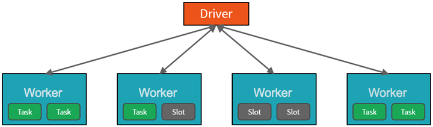
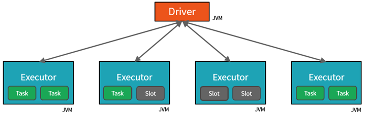
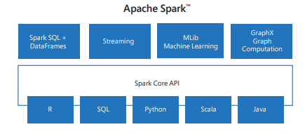

To gain a better understanding of how to process and analyze data with Apache Spark in Azure Databricks, it's important to understand the underlying architecture.

## High-level overview

From a high level, the Azure Databricks service launches and manages Apache Spark clusters within your Azure subscription. Apache Spark clusters are groups of computers that are treated as a single computer and handle the execution of commands issued from notebooks. Clusters enable processing of data to be parallelized across many computers to improve scale and performance. They consist of a Spark *driver* and *worker* nodes. The driver node sends work to the worker nodes and instructs them to pull data from a specified data source.

In Databricks, the notebook interface is typically the driver program. This driver program contains the main loop for the program and creates distributed datasets on the cluster, then applies operations to those datasets. Driver programs access Apache Spark through a *SparkSession* object regardless of deployment location.

Microsoft Azure manages the cluster, and auto-scales it as needed based on your usage and the setting used when configuring the cluster. Auto-termination can also be enabled, which allows Azure to terminate the cluster after a specified number of minutes of inactivity.

## Spark jobs in detail

Work submitted to the cluster is split into as many independent jobs as needed. This is how work is distributed across the Cluster's nodes. Jobs are further subdivided into tasks. The input to a job is partitioned into one or more partitions. These partitions are the unit of work for each slot. In between tasks, partitions may need to be reorganized and shared over the network.

The secret to Spark's high performance is parallelism. Scaling *vertically* (by adding resources to a single computer) is limited to a finite amount of RAM, Threads and CPU speeds; but clusters scale *horizontally*, adding new nodes to the cluster as needed.

Spark parallelizes jobs at two levels:
  - The first level of parallelization is the *executor* - a Java virtual machine (JVM) running on a worker node, typically, one instance per node.
  - The second level of parallelization is the *slot* - the number of which is determined by the number of cores and CPUs of each node.
- Each executor has multiple slots to which parallelized tasks can be assigned.

The JVM is naturally multi-threaded, but a single JVM, such as the one coordinating the work on the driver, has a finite upper limit. By splitting the work into tasks, the driver can assign units of work to *slots in the executors on worker nodes for parallel execution. Additionally, the driver determines how to partition the data so that it can be distributed for parallel processing. So, the driver assigns a partition of data to each task so that each task knows which piece of data it is to process. Once started, each task will fetch the partition of data assigned to it.

### Jobs and stages

Depending on the work being performed, multiple parallelized jobs may be required. Each job is broken down into *stages*. A useful analogy is to imagine that the job is to build a house:

- The first stage would be to lay the foundation.
- The second stage would be to erect the walls.
- The third stage would be to add the roof.

Attempting to do any of these steps out of order just doesn't make sense, and may in fact be impossible. Similarly, Spark breaks each job into stages to ensure everything is done in the right order.

### Modularity

Spark includes libraries for tasks ranging from SQL to streaming and machine learning, making it a tool for data processing tasks.  Some of the Spark libraries include:

- Spark SQL: For working with structured data.
- SparkML: For machine learning.
- GraphX: For graph processing.
- Spark Streaming: For real-time data processing.

### Compatibility

Spark can run on a variety of distributed systems, including Hadoop YARN, Apache Mesos, Kubernetes, or Spark's own cluster manager. It also reads from and writes to diverse data sources like HDFS, Cassandra, HBase, and Amazon S3.
