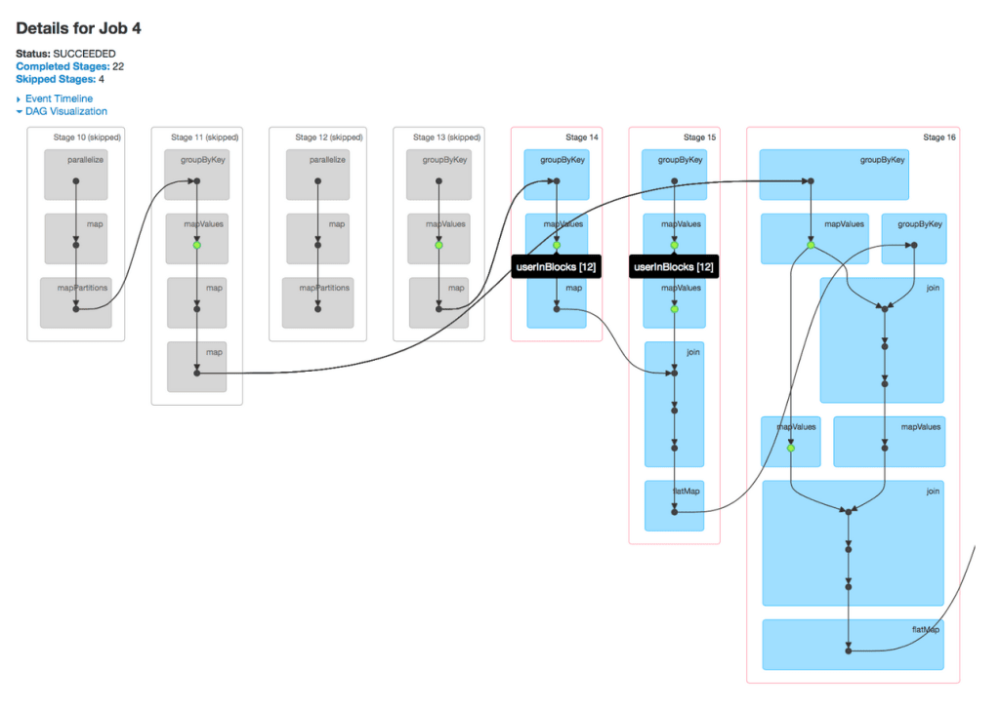

At its core, Spark is a **data processing engine**, meaning it enables data engineers to efficiently extract, transform, and analyze massive datasets across distributed systems. What sets it apart is its ability to unify different types of data workloads under one framework. With Spark, you don’t need separate systems for real-time streaming, batch processing, SQL queries, or machine learning. Everything can be done in Spark with a consistent set of APIs.

Another strength lies in its ease of use. Spark supports multiple programming languages, including Python, Java, Scala, and R. If you are already comfortable with Python, you can use **PySpark**, the Python interface for Spark, to start analyzing data right away.

Perhaps most importantly, Spark was built with scalability in mind. You can start experimenting on your local machine and then, without changing your code, run the same application on a cluster of hundreds or thousands of machines.

## Spark’s ecosystem

While people often talk about Spark as a single thing, it is actually an ecosystem of libraries built on top of the core engine:

- **Spark Core** provides the foundation for distributed computing, including task scheduling, memory management, and fault recovery.

- **Spark SQL** lets you work with structured data using a language most analysts already know: SQL. It also integrates with external data sources like Hive, Parquet, and JSON.

- **Spark Streaming** allows you to process data in near real time, which is useful for applications like fraud detection or monitoring system logs.

- **MLlib** is Spark’s machine learning library. It provides scalable implementations of algorithms for classification, clustering, regression, and recommendation.

- **GraphX** is used for graph computation, such as analyzing social networks or modeling relationships between entities.

Together, these components make Spark a one-stop solution for most big data problems.

## How Spark works

You might be wondering: *why would I write a Spark program in the first place?* The answer is scale. When your dataset is too large to fit in memory on a single machine, or when you need computations to finish much faster than traditional tools like Pandas or Excel can manage, Spark steps in. Spark lets you write code that feels very similar to working with local data, but it distributes that work automatically across many machines in a cluster. The result is that you can analyze gigabytes, terabytes, or even petabytes of data without rewriting your logic each time the dataset grows.

Suppose your company stores website clickstream data in Azure Data Lake Storage. You want to understand customer behavior by filtering all the clicks from the last 24 hours, joining that with a user profile table, and then calculating the top five most visited product categories.

Here’s what happens when you implement this in Databricks:

- Your **notebook** contains the code you wrote in Python (PySpark), and this runs on the driver program. The driver is responsible for turning your high-level commands (like filtering rows or grouping data) into a plan of smaller tasks.

- The **cluster manager** then assigns these tasks to different **executors**. Each executor is a worker process running on a machine in your cluster. Apache Spark clusters are groups of interconnected servers that are treated as a single compute engine and handle the execution of commands issued from notebooks. One executor might filter yesterday’s clicks for user IDs 1–100,000, another executor (on the same or another server) for IDs 100,001–200,000, and so on.

- Once all executors finish their part of the work, Spark collects the results, combines them, and gives you back a clean DataFrame showing the top product categories.

From your perspective as a data engineer, you’re just writing familiar DataFrame code in your Databricks notebook. Spark takes care of distributing the data, parallelizing the computation, and retrying tasks if something fails in the cluster. This design makes Spark feel approachable—almost like you’re working with local data tools—but under the hood it’s orchestrating a highly parallel, fault-tolerant computation across potentially hundreds of machines.

## Lazy Evaluation and the DAG

One of Spark’s most important design choices is **lazy evaluation**. Unlike tools such as Pandas, where each operation runs immediately, Spark does not execute your commands as soon as you write them. Instead, when you apply transformations—like filtering rows, joining tables, or selecting columns—Spark simply records these operations in a plan. Nothing is actually computed yet. This approach allows Spark to look at the full sequence of operations before deciding the most efficient way to execute them.

Behind the scenes, Spark builds a **Directed Acyclic Graph (DAG)** of operations. Each node in the graph represents a dataset, and each edge represents a transformation applied to that dataset. Because the graph is acyclic, it flows in one direction—from your raw input data to the final result—without looping back on itself. Spark’s optimizer analyzes this DAG to combine steps, minimize data movement, and determine the best execution strategy across the cluster.

Execution only begins when you perform an **action**, such as collecting results to the driver, writing data to storage, or counting rows. At that point, Spark submits the optimized DAG as a series of tasks to the cluster manager, which distributes them across executors. This design helps Spark achieve high performance: it avoids unnecessary computations, reduces shuffling of data between nodes, and ensures that the cluster resources are used as efficiently as possible.

## Real-World use cases

Organizations across many industries use Spark whenever they need to process and analyze large or fast-moving datasets. For example, a **video streaming service** might use Spark to build a recommendation engine that suggests new content based on viewing history. A **financial institution** could rely on Spark Streaming to monitor transactions in real time and flag suspicious activity. In the **healthcare sector**, researchers might use Spark to analyze genetic data at scale to identify patterns related to diseases. Even in more traditional business settings, Spark often plays a role in preparing and transforming raw operational data so that it can be used for dashboards and reporting.

Other common applications include analyzing large volumes of **web server logs**, powering **real-time dashboards** for Internet of Things (IoT) devices, training **machine learning models** on very large datasets, and building **ETL pipelines** that extract, clean, and combine raw data from multiple sources.

## Compatibility and deployment options

One of Spark’s strengths is that it does not lock you into a single infrastructure. Instead, it is designed to run on top of a variety of distributed systems, which gives you flexibility in how and where you deploy it. At the simplest level, Spark can run locally on your own computer, making it easy to experiment with small datasets or learn the basics without setting up a cluster. When you need more power, you can scale out by running Spark on a standalone cluster of machines, or integrate it with resource managers such as Hadoop YARN or Apache Mesos, which handle scheduling and resource allocation.

In the cloud, Spark is widely supported across providers. For example, services like **Azure Databricks**, **Azure Synapse Analytics** and **Microsoft Fabric**, make it straightforward to launch Spark clusters without worrying about the details of cluster setup and management. Spark is also increasingly deployed on Kubernetes, which allows organizations to containerize their Spark applications and run them in modern, cloud-native environments. This flexibility means that as your needs evolve—from local development, to on-premises clusters, to large-scale cloud deployments—you can continue using the same Spark applications without rewriting them for a different platform.