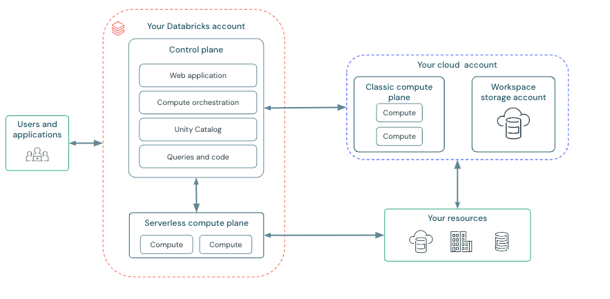

You can create one or more clusters in your Azure Databricks workspace by using the Azure Databricks Workspace UI.

When creating the cluster, you can specify configuration settings, including:

- A name for the cluster.
- A *cluster mode*, which can be:
    - *Standard*: Suitable for single-user workloads that require multiple worker nodes.
    - *High Concurrency*: Suitable for workloads where multiple users will be using the cluster concurrently.
    - *Single Node*: Suitable for small workloads or testing, where only a single worker node is required.
- The version of the *Databricks Runtime* to be used in the cluster; which dictates the version of Spark and individual components such as Python, Scala, and others that get installed.
- The type of virtual machine (VM) used for the worker nodes in the cluster.
- The minimum and maximum number of worker nodes in the cluster.
- The type of VM used for the driver node in the cluster.
- Whether the cluster supports *autoscaling* to dynamically resize the cluster.
- How long the cluster can remain idle before being shut down automatically.

## How Azure manages cluster resources

When you create an Azure Databricks workspace, a *Databricks appliance* is deployed as an Azure resource in your subscription. When you create a cluster in the workspace, you specify the types and sizes of the virtual machines (VMs) to use for both the driver and worker nodes, and some other configuration options, but Azure Databricks manages all other aspects of the cluster.

The Databricks appliance is deployed into Azure as a **managed resource group** within your subscription. This resource group contains the driver and worker VMs for your clusters, along with other required resources, including a virtual network, a security group, and a storage account. All metadata for your cluster, such as scheduled jobs, is stored in an Azure Database with geo-replication for fault tolerance.

Azure Databricks is split into two main planes: the **control plane**, which consists of backend services (for example, the web UI) managed by Microsoft, and the **compute plane**, where your data workloads run. There are two variants of compute: classic compute, which uses your own Azure subscription and virtual network (offering isolation inside your subscription), and serverless compute, which runs within Databricks’ managed environment but still in the same Azure region as your workspace, with network-and-security controls to isolate between customers. Every workspace has a storage account in your subscription that holds system data (notebooks, logs, job metadata), the distributed file system (DBFS), and catalog assets (if you have Unity Catalog enabled), with additional controls for networking, firewalling, and access to ensure security and proper isolation.

> [!NOTE]
> You also have the option of attaching your cluster to a *pool* of idle nodes to reduce cluster startup time. For more information, see [Pools](/azure/databricks/clusters/instance-pools/) in the Azure Databricks documentation.
