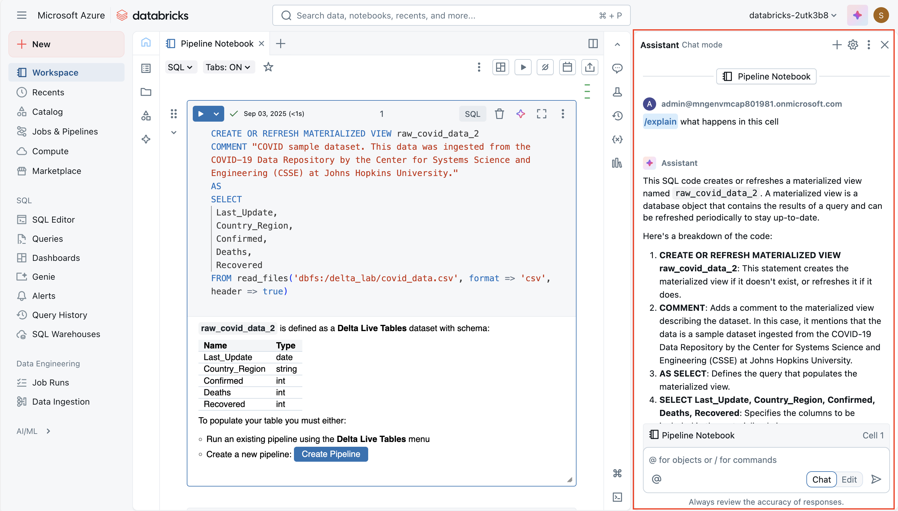
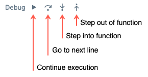
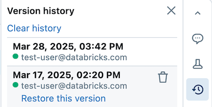

You can run many different kinds of applications on Spark, including code in Python or Scala scripts, Java code compiled as a Java Archive (JAR), and others. Spark is commonly used in two kinds of workloads:

- Batch or stream processing jobs to ingest, clean, and transform data - often running as part of an automated pipeline.
- Interactive analytics sessions to explore, analyze, and visualize data.

## Notebook editing & code basics

Databricks notebooks are the primary workspace for data science, engineering, and analytics. They're built around cells, which can contain either code or formatted text (Markdown). This cell-based approach makes it easy to experiment, test, and explain your work in one place. You can run a single cell, a group of cells, or the entire notebook, with outputs such as tables, charts, or plain text appearing directly below the executed cell. Cells can be rearranged, collapsed, or cleared to keep your notebook organized and readable.

A major strength of Databricks notebooks is multi-language support. While the default is often Python, you can switch to SQL, Scala, or R within the same notebook by using magic commands like %sql or %scala. This flexibility means you can write ETL logic in SQL, machine learning code in Python, and then visualize results with R—all in one workflow. Databricks also provides autocomplete and syntax highlighting, making it easier to catch mistakes and speed up coding.

Before running any code, a notebook must be attached to a cluster. Without an attached cluster, code cells can't be run. You can select an existing cluster from the notebook toolbar or create a new one, and you can easily detach and reattach notebooks as needed. This connection is what allows your notebook to leverage distributed processing power in Azure Databricks.

## Using Databricks Assistant 

The **Databricks Assistant** is an AI-powered coding companion built directly into notebooks. Its goal is to help you write, understand, and improve code more efficiently by leveraging context from your notebook and workspace. It can generate new code from natural language prompts, explain complex logic, suggest fixes for errors, optimize performance, and even refactor or format your code for readability. This makes it valuable not only for beginners learning Spark or SQL, but also for experienced users who want to speed up development and reduce repetitive work.

The assistant is **context-aware**, meaning it can use information about your notebook, cluster, and data environment to provide tailored suggestions. For example, if your workspace has Unity Catalog enabled, it can pull in metadata like table names, column names, and schemas when writing SQL queries. This allows you to ask something like "Select the average sales amount by region from the sales table" and get working SQL code that fits your actual data model. Similarly, in Python, you can ask it to create data transformations or Spark jobs without having to recall every function signature from memory.

You interact with the assistant in two main ways:

1. **Natural language prompts**—you can type plain English instructions in the chat-like interface, and it will insert code into your notebook.

2. **Slash commands**—quick commands such as `/explain`, `/fix`, or `/optimize` that let you act on selected code. For example, `/explain` breaks down a complex function into simpler steps, `/fix` can attempt to resolve syntax or runtime errors, and `/optimize` suggests performance improvements such as repartitioning or using efficient Spark functions.

A powerful feature is the edit mode, where the assistant can propose larger structural changes across multiple cells. For instance, it might refactor repeated logic into a single reusable function or restructure a workflow for better readability. You always have control: suggestions are nondestructive, meaning you can review and accept or reject them before applying changes to your notebook.

## Sharing and modularizing code

To avoid duplication and improve maintainability, Databricks supports putting reusable code into files (for example, .py modules) in the workspace, which notebooks can import. There are mechanisms to orchestrate notebooks (that is, running notebooks from other notebooks, or jobs with multiple tasks), so you can build workflows that use shared functions or modules. Using `%run` is a simpler way to include another notebook, though with some limitations.

## Debugging, version history, and undoing mistakes

Databricks offers a built-in **interactive debugger** for Python notebooks: you can set breakpoints, step through execution, inspect variables, and navigate through code execution step-by-step. This helps isolate bugs more effectively than print/log debugging. 

Notebooks also maintain version history automatically: you can view past snapshots, give version descriptions, restore old versions, or delete/clear history. If you’re using Git integration, you can sync and version notebooks/files in your repository.  

> [!TIP]
> For more information about working with notebooks in Azure Databricks, see the **[Notebooks](/azure/databricks/notebooks/)** article in the Azure Databricks documentation.

