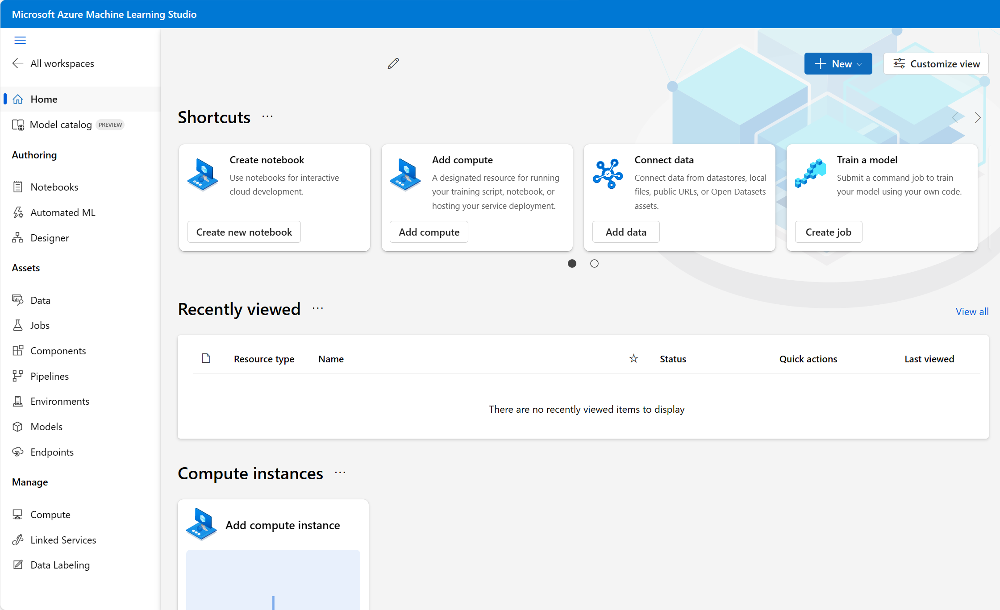

Training and deploying an effective machine learning model involves a lot of work, much of it time-consuming and resource-intensive. Azure Machine Learning is a cloud-based service that helps simplify some of the tasks it takes to prepare data, train a model, and deploy a predictive service. 

Most importantly, Azure Machine Learning helps data scientists increase their efficiency by automating many of the time-consuming tasks associated with training models; and it enables them to use cloud-based compute resources that scale effectively to handle large volumes of data while incurring costs only when actually used.

## Azure Machine Learning workspace 

To use Azure Machine Learning, you first create a *workspace* resource in your Azure subscription. You can then use this workspace to manage data, code, models, and other artifacts related to your machine learning workloads.

After you have created an Azure Machine Learning workspace, you can develop solutions with the Azure machine learning service either with developer tools or the Azure Machine Learning studio web portal.

## Azure Machine Learning studio 

Azure Machine Learning studio is a web portal for machine learning solutions in Azure. It includes a wide range of features and capabilities that help data scientists prepare data, train models, publish predictive services, and monitor their usage. To begin using the web portal, you need to assign the workspace you created in the Azure portal to Azure Machine Learning studio 

