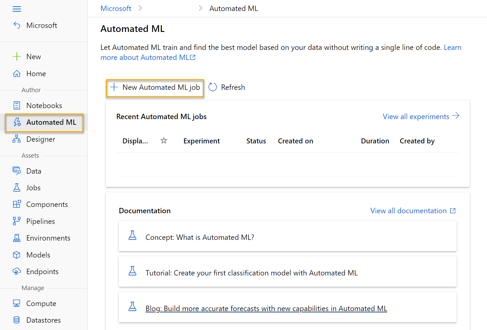
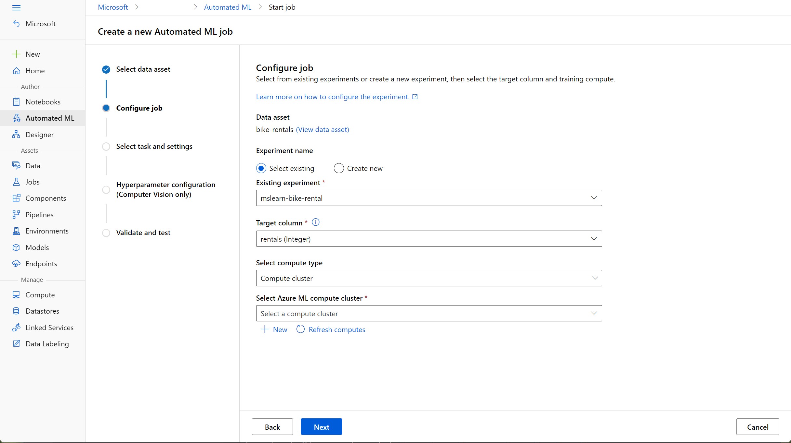

Azure Machine Learning includes an *automated machine learning* capability that automatically tries multiple pre-processing techniques and model-training algorithms in parallel. These automated capabilities use the power of cloud compute to find the best performing supervised machine learning model for your data.

Automated machine learning allows you to train models without extensive data science or programming knowledge. For people with a data science and programming background, it provides a way to save time and resources by automating algorithm selection and hyperparameter tuning.

You can create an automated machine learning job in Azure Machine Learning studio.  

In Azure Machine Learning, operations that you run are called *jobs*. You can configure multiple settings for your job before starting an automated machine learning run. The run configuration provides the information needed to specify your training script and Azure Machine Learning environment in your run configuration and run a training job.

