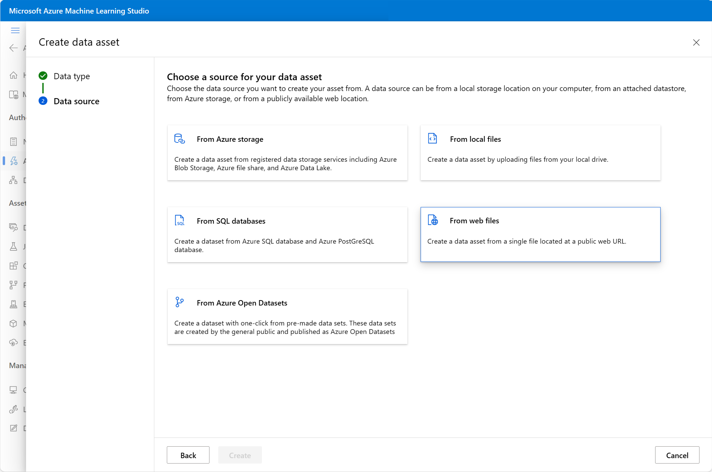
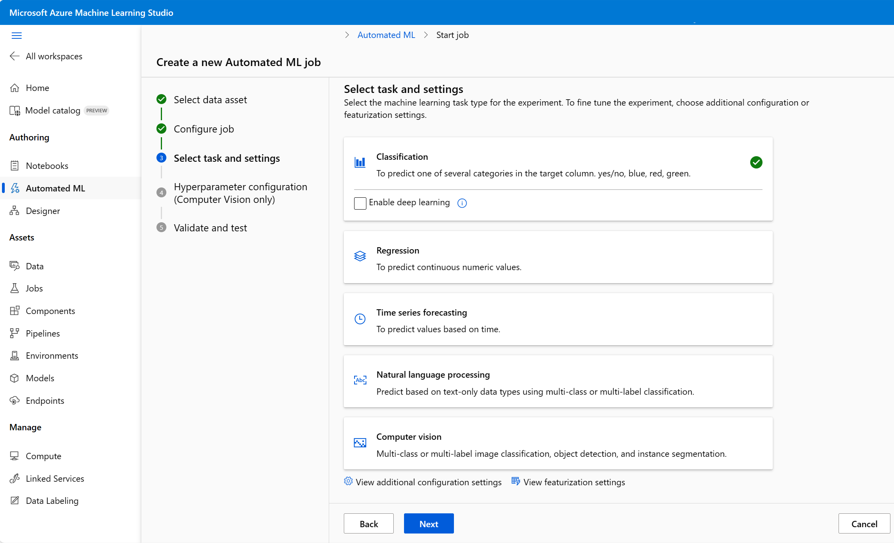

You can think of the steps in a machine learning process as: 
1. **Prepare data**: Identify the features and label in a dataset. Pre-process, or clean and transform, the data as needed.   
2. **Train model**: Split the data into two groups, a training and a validation set. Train a machine learning model using the training data set. Test the machine learning model for performance using the validation data set. 
3. **Evaluate performance**: Compare how close the model's predictions are to the known labels.  
4. **Deploy a predictive service**:  After you train a machine learning model, you can deploy the model as an application on a server or device so that others can use it. 

These are the same steps in the automated machine learning process with Azure Machine Learning.

## Prepare data 
Machine learning models must be trained with existing data. Data scientists expend a lot of effort exploring and pre-processing data, and trying various types of model-training algorithms to produce accurate models, which is time consuming, and often makes inefficient use of expensive compute hardware.

In Azure Machine Learning, data for model training and other operations is usually encapsulated in an object called a *data asset*. You can create your own data asset in Azure Machine Learning studio. 

## Train model 

The automated machine learning capability in Azure Machine Learning supports *supervised* machine learning models - in other words, models for which the training data includes known label values. You can use automated machine learning to train models for:

- **Classification** (predicting categories or *classes*)
- **Regression** (predicting numeric values)
- **Time series forecasting** (predicting numeric values at a future point in time)

In Automated Machine Learning you can select from several types of tasks: 

In Automated Machine Learning, you can select configurations for the primary metric, type of model used for training, exit criteria, and concurrency limits.  

Importantly, AutoML will split data into a training set and a validation set. You can configure the details in the settings before you run the job. 

## Evaluate performance  
After the job has finished you can review the best performing model. In this case, you used exit criteria to stop the job. Thus the "best" model the job generated might not be the best possible model, just the best one found within the time allowed for this exercise.

The best model is identified based on the evaluation metric you specified, *Normalized root mean squared error*. 

A technique called *cross-validation* is used to calculate the  evaluation metric. After the model is trained using a portion of the data, the remaining portion is used to iteratively test, or cross-validate, the trained model. The metric is calculated by comparing the predicted value from the test with the actual known value, or label. 
    
The difference between the predicted and actual value, known as the *residuals*, indicates the amount of *error* in the model.  The performance metric *root mean squared error* (RMSE), is calculated by squaring the errors across all of the test cases, finding the mean of these squares, and then taking the square root. What all of this means is that smaller this value is, the more accurate the model's predictions. The *normalized root mean squared error* (NRMSE) standardizes the RMSE metric so it can be used for comparison between models which have variables on different scales. 

The **Residual Histogram** shows the frequency of residual value ranges. Residuals represent variance between predicted and true values that can't be explained by the model, in other words, errors. You should hope to see the most frequently occurring residual values clustered around zero. You want small errors with fewer errors at the extreme ends of the scale.

The **Predicted vs. True** chart should show a diagonal trend in which the predicted value correlates closely to the true value. The dotted line shows how a perfect model should perform. The closer the line of your model's average predicted value is to the dotted line, the better its performance. A histogram below the line chart shows the distribution of true values.

After you've used automated machine learning to train some models, you can deploy the best performing model as a service for client applications to use.

## Deploy a predictive service
In Azure Machine Learning, you can deploy a service as an Azure Container Instances (ACI) or to an Azure Kubernetes Service (AKS) cluster. For production scenarios, an AKS deployment is recommended, for which you must create an *inference cluster* compute target. In this exercise, you'll use an ACI service, which is a suitable deployment target for testing, and does not require you to create an inference cluster.