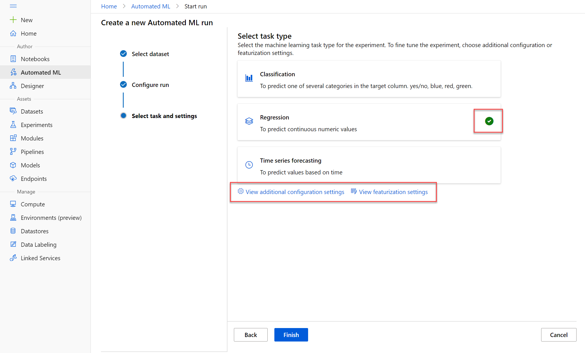
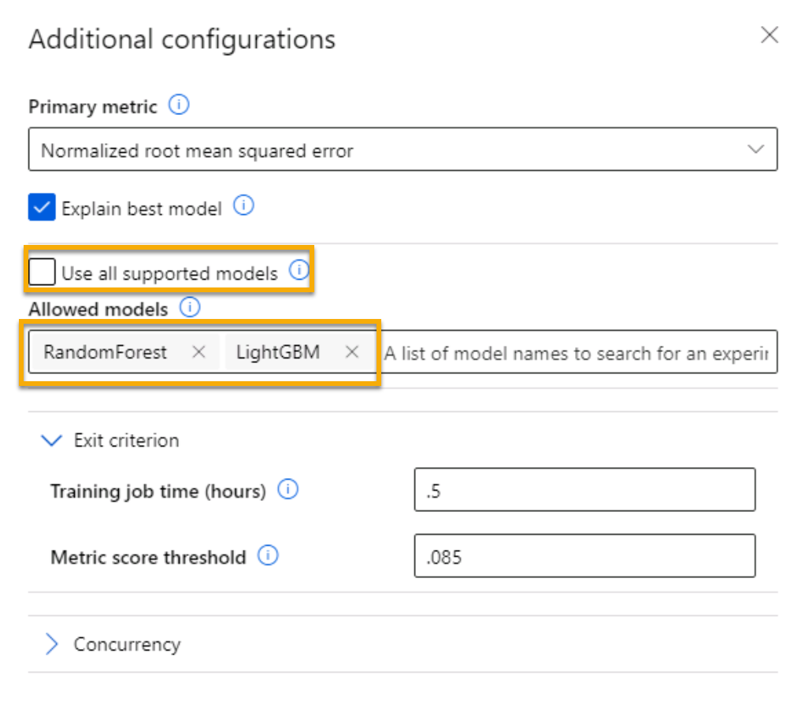
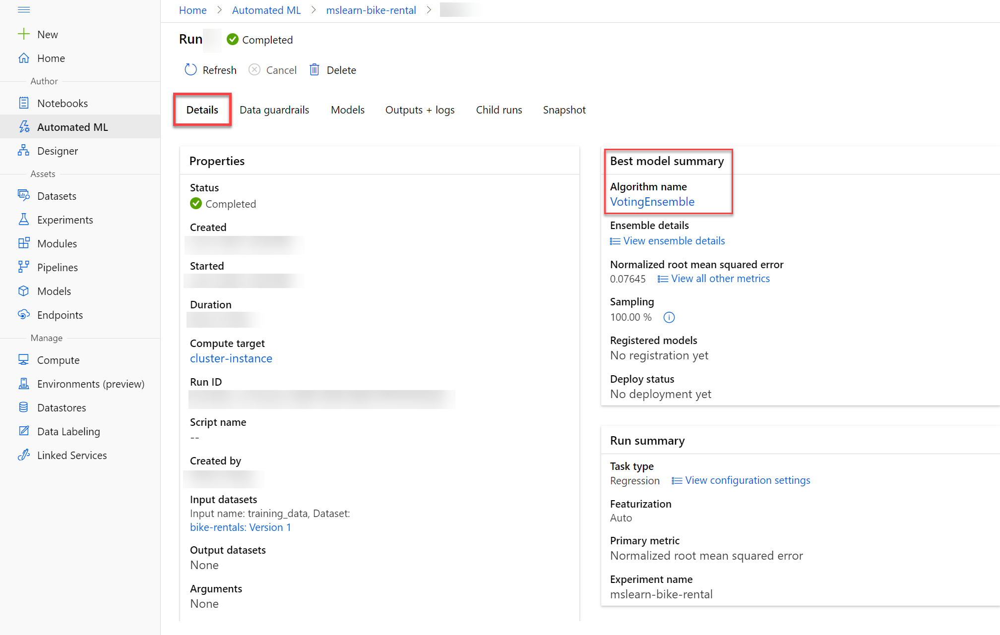
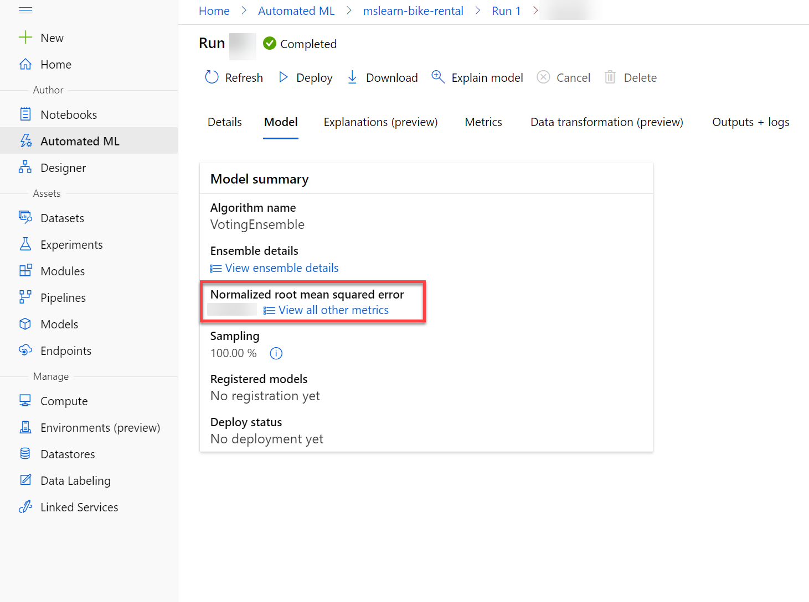
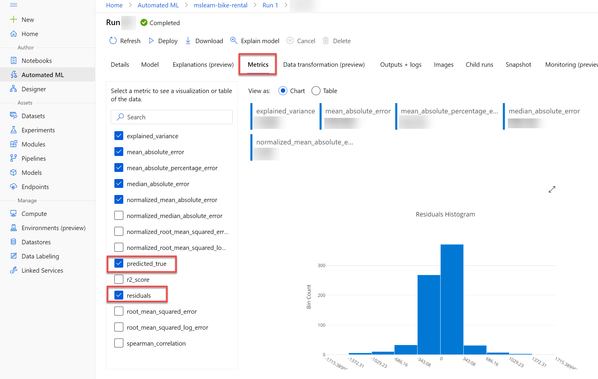
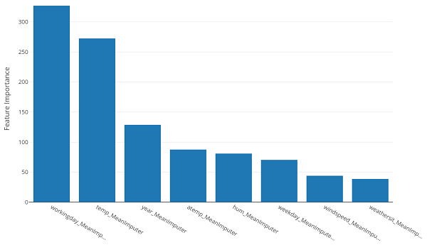

Azure Machine Learning includes an *automated machine learning* capability that automatically tries multiple pre-processing techniques and model-training algorithms in parallel. These automated capabilities use the power of cloud compute to find the best performing supervised machine learning model for your data.

> [!NOTE]
> The automated machine learning capability in Azure Machine Learning supports *supervised* machine learning models - in other words, models for which the training data includes known label values. You can use automated machine learning to train models for:
>
> - **Classification** (predicting categories or *classes*)
> - **Regression** (predicting numeric values)
> - **Time series forecasting** (predicting numeric values at a future point in time)

## Run an automated machine learning experiment

In Azure Machine Learning, operations that you run are called *experiments*. Follow the steps to run an experiment that uses automated machine learning to train a regression model that predicts bicycle rentals.

1. In [Azure Machine Learning studio](https://ml.azure.com?azure-portal=true), view the **Automated ML** page (under **Author**).

2. Create an Automated ML run with the following settings:
    - **Select dataset**:
        - **Dataset**: bike-rentals
    - **Configure run**:
        - **New experiment name**: mslearn-bike-rental
        - **Target column**: rentals (*this is the label that the model is trained to predict)*
        - **Select compute cluster**: *the compute cluster that you created previously*
    - **Select task and settings**: 
        - **Task type**: Regression *(the model predicts a numeric value)* 
       
    > [!div class="centered"]
    > 

    Notice under task type there are settings _View additional configuration settings_ and _View Featurization settings_. Now configure these settings.

    - **Additional configuration settings:**
        - **Primary metric**: Select **Normalized root mean squared error** *(more about this metric later!)*
        - **Explain best model**: Selected — *this option causes automated machine learning to calculate feature importance for the best model which makes it possible to determine the influence of each feature on the predicted label.*
        - **Use all supported models**: <u>Un</u>selected. *You'll restrict the experiment to try only a few specific algorithms.*
        - **Allowed models**: *Select only **RandomForest** and **LightGBM** — normally you'd want to try as many as possible, but each model added increases the time it takes to run the experiment.*
        > [!div class="centered"]
        >             
        - **Exit criterion**:
            - **Training job time (hours)**: 0.5 — *ends the experiment after a maximum of 30 minutes.*
            - **Metric score threshold**: 0.085 — *if a model achieves a normalized root mean squared error metric score of 0.085 or less, the experiment ends.*
        - **Concurrency**: *do not change*
    - **Featurization settings:**
        - **Enable featurization**: Selected — *automatically preprocess the features before training.*

    Click **Next** to go to the next selection pane. 

    - **[Optional] Select the validation and test type**
        - **Validation type**: Auto 
        - **Test dataset (preview)**: No test dataset required 

3. When you finish submitting the automated ML run details, it starts automatically. Wait for the run status to change from *Preparing* to *Running*.
4. When the run status changes to *Running*, view the **Models** tab and observe as each possible combination of training algorithm and pre-processing steps is tried and the performance of the resulting model is evaluated. The page automatically refreshes periodically, but you can also select **&#8635; Refresh**. It might take 10 minutes or so before models start to appear, as the cluster nodes must be initialized before training can begin.
5. Wait for the experiment to finish. It might take a while — now might be a good time for a coffee break!

## Review the best model

After the experiment has finished you can review the best performing model. In this case, you used exit criteria to stop the experiment. Thus the "best" model the experiment generated might not be the best possible model, just the best one found within the time allowed for this exercise.

1. On the **Details** tab of the automated machine learning run, note the best model summary.
    > [!div class="centered"]
    > 

2. Select the **Algorithm name** for the best model to view its details.

    The best model is identified based on the evaluation metric you specified, *Normalized root mean squared error*. 

    A technique called *cross-validation* is used to calculate the  evaluation metric. After the model is trained using a portion of the data, the remaining portion is used to iteratively test, or cross-validate, the trained model. The metric is calculated by comparing the predicted value from the test with the actual known value, or label. 
    
    The difference between the predicted and actual value, known as the *residuals*, indicates the amount of *error* in the model.  The particular performance metric you used, normalized root mean squared error, is calculated by squaring the errors across all of the test cases, finding the mean of these squares, and then taking the square root. What all of this means is that smaller this value is, the more accurate the model's predictions.

3. Next to the *Normalized root mean squared error* value, select **View all other metrics** to see values of other possible evaluation metrics for a regression model.
    > [!div class="centered"]
    > 

4. Select the **Metrics** tab and select the **residuals** and **predicted_true** charts if they are not already selected. 

    > [!div class="centered"]
    > 

    Review the charts which show the performance of the model. The chart compares the predicted values against the true values, and shows the *residuals*, the differences between predicted and actual values, as a histogram.

    The **Predicted vs. True** chart should show a diagonal trend in which the predicted value correlates closely to the true value. The dotted line shows how a perfect model should perform. The closer the line of your model's average predicted value is to the dotted line, the better its performance. A histogram below the line chart shows the distribution of true values.

    > [!div class="centered"]
    > 

    The **Residual Histogram** shows the frequency of residual value ranges. Residuals represent variance between predicted and true values that can't be explained by the model, in other words, errors. You should hope to see the most frequently occurring residual values clustered around zero. You want to small errors with fewer errors at the extreme ends of the scale.

    > [!div class="centered"]
    > 

5. Select the **Explanations** tab. Select an explanation ID and then select **Aggregate feature Importance**. This chart shows how much each feature in the dataset influences the label prediction, like this:

    > [!div class="centered"]
    > 
