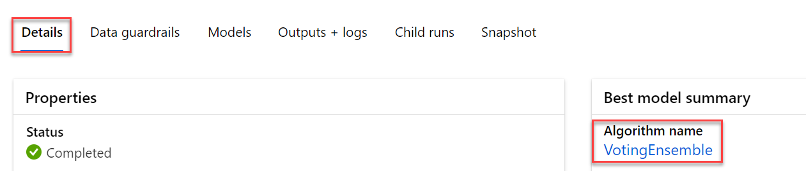
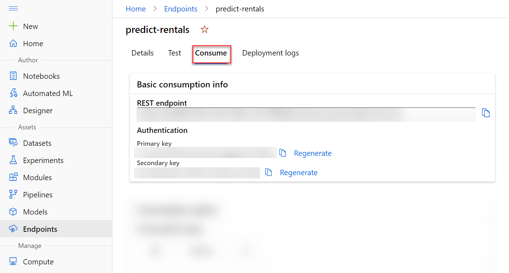
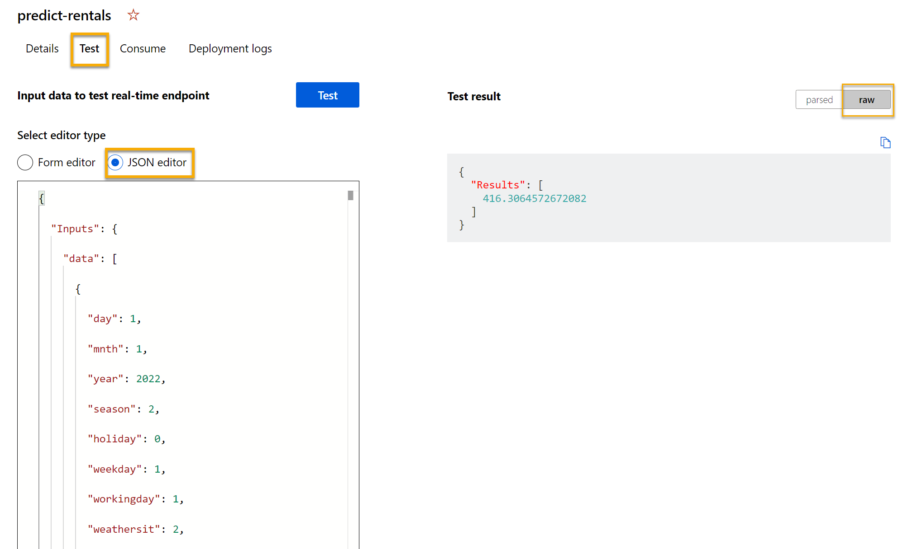

After you've used automated machine learning to train some models, you can deploy the best performing model as a service for client applications to use.

## Deploy a predictive service
In Azure Machine Learning, you can deploy a service as an Azure Container Instances (ACI) or to an Azure Kubernetes Service (AKS) cluster. For production scenarios, an AKS deployment is recommended, for which you must create an *inference cluster* compute target. In this exercise, you'll use an ACI service, which is a suitable deployment target for testing, and does not require you to create an inference cluster.

1. In [Azure Machine Learning studio](https://ml.azure.com?azure-portal=true), on the **Automated ML** page, select the run for your automated machine learning experiment.

2. On the **Details** tab, select the algorithm name for the best model.
   
    > [!div class="centered"]
    > 

3. on the **Model** tab, select the **Deploy** button and use the **Deploy to web service** option to deploy the model with the following settings:
    - **Name**: predict-rentals
    - **Description**: Predict cycle rentals
    - **Compute type**: Azure Container Instance
    - **Enable authentication**: Selected

4. Wait for the deployment to start - this may take a few seconds. Then, in the **Model summary** section, observe the **Deploy status** for the **predict-rentals** service, which should be **Running**. Wait for this status to change to **Successful**, which may take some time. You may need to select **&#8635; Refresh** periodically.
5. In Azure Machine Learning studio, view the **Endpoints** page and select the **predict-rentals** real-time endpoint. Then select the **Consume** tab and note the following information there. If you do not see the **Consume** tab, the deployment is not completely finished - you will need to wait and refresh the page. You would need the information from the **Consume** tab to connect to your deployed service from a client application.
  
    - The REST endpoint for your service
    - The primary or secondary key for your service

    > [!div class="centered"]
    > 

## Test the deployed service

Now you can test your deployed service.

1. On the **Endpoints** page, open the **predict-rentals** real-time endpoint.
2. When the **predict-rentals** endpoint opens, view the **Test** tab. 
3. In the input data pane, replace the template JSON with the following input data: 

    ```JSON
    {
      "Inputs": { 
        "data": [
          {
            "day": 1,
            "mnth": 1,   
            "year": 2022,
            "season": 2,
            "holiday": 0,
            "weekday": 1,
            "workingday": 1,
            "weathersit": 2, 
            "temp": 0.3, 
            "atemp": 0.3,
            "hum": 0.3,
            "windspeed": 0.3 
          }
        ]    
      },   
      "GlobalParameters": 1.0
    }
    ```

4. Click on the **Test** button.

5. Review the test results, which include a predicted number of rentals based on the input features. The test pane took the input data and used the model you trained to return the predicted number of rentals.

    > [!div class="centered"]
    > 

Let's review what you have done. You used a dataset of historical bicycle rental data to train a model. The model predicts the number of bicycle rentals expected on a given day, based on seasonal and meteorological _features_. In this case, the _labels_ are number of bicycle rentals.
