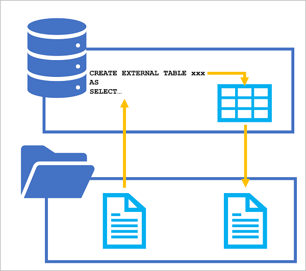

The SQL language includes many features and functions that enable you to manipulate data. For example, you can use SQL to:

- Filter rows and columns in a dataset.
- Rename data fields and convert between data types.
- Calculate derived data fields.
- Manipulate string values.
- Group and aggregate data.

Azure Synapse serverless SQL pools can be used to run SQL statements that transform data and persist the results as a file in a data lake for further processing or querying. If you're familiar with Transact-SQL syntax, you can craft a SELECT statement that applies the specific transformation you're interested in, and store the results of the SELECT statement in a selected file format with a metadata table schema that can be queried using SQL.

You can use a CREATE EXTERNAL TABLE AS SELECT (CETAS) statement in a dedicated SQL pool or serverless SQL pool to persist the results of a query in an external table, which stores its data in a file in the data lake.

The CETAS statement includes a SELECT statement that queries and manipulates data from any valid data source (which could be an existing table or view in a database, or an OPENROWSET function that reads file-based data from the data lake). The results of the SELECT statement are then persisted in an external table, which is a metadata object in a database that provides a relational abstraction over data stored in files. The following diagram illustrates the concept visually:



By applying this technique, you can use SQL to extract and transform data from files or tables, and store the transformed results for downstream processing or analysis. Subsequent operations on the transformed data can be performed against the relational table in the SQL pool database or directly against the underlying data files.

## Creating external database objects to support CETAS

To use CETAS expressions, you must create the following types of object in a database for either a serverless or dedicated SQL pool. When using a serverless SQL pool, create these objects in a custom database (created using the `CREATE DATABASE` statement), not the **built-in** database.

### External data source

An external data source encapsulates a connection to a file system location in a data lake. You can then use this connection to specify a relative path in which the data files for the external table created by the CETAS statement are saved.

If the source data for the CETAS statement is in files in the same data lake path, you can use the same external data source in the OPENROWSET function used to query it. Alternatively, you can create a separate external data source for the source files or use a fully qualified file path in the OPENROWSET function.

To create an external data source, use the `CREATE EXTERNAL DATA SOURCE` statement, as shown in this example:

```sql
CREATE EXTERNAL DATA SOURCE files
WITH (
    LOCATION = 'https://mydatalake.blob.core.windows.net/data/files/'
);
```

The previous example assumes that users running queries that use the external data source will have sufficient permissions to access the files. An alternative approach is to encapsulate a credential in the external data source so that it can be used to access file data without granting all users permissions to read it directly:

```sql
CREATE DATABASE SCOPED CREDENTIAL storagekeycred
WITH
    IDENTITY='SHARED ACCESS SIGNATURE',  
    SECRET = 'sv=xxx...';

CREATE EXTERNAL DATA SOURCE secureFiles
WITH (
    LOCATION = 'https://mydatalake.blob.core.windows.net/data/secureFiles/'
    CREDENTIAL = storagekeycred
);
```

> [!TIP]
> In addition to SAS authentication, you can define credentials that use *managed identity* (the Azure Active Directory identity used by your Azure Synapse workspace), a specific Azure Active Directory principal, or passthrough authentication based on the identity of the user running the query (which is the default type of authentication). To learn more about using credentials in a serverless SQL pool, see the [Control storage account access for serverless SQL pool in Azure Synapse Analytics](/azure/synapse-analytics/sql/develop-storage-files-storage-access-control) article in Azure Synapse Analytics documentation.

### External file format

The CETAS statement creates a table with its data stored in files. You must specify the format of the files you want to create as an external file format.

To create an external file format, use the `CREATE EXTERNAL FILE FORMAT` statement, as shown in this example:

```sql
CREATE EXTERNAL FILE FORMAT ParquetFormat
WITH (
        FORMAT_TYPE = PARQUET,
        DATA_COMPRESSION = 'org.apache.hadoop.io.compress.SnappyCodec'
    );
```

> [!TIP]
> In this example, the files will be saved in Parquet format. You can also create external file formats for other types of file. See [CREATE EXTERNAL FILE FORMAT (Transact-SQL)](/sql/t-sql/statements/create-external-file-format-transact-sql) for details.

## Using the CETAS statement

After creating an external data source and external file format, you can use the CETAS statement to transform data and stored the results in an external table.

For example, suppose the source data you want to transform consists of sales orders in comma-delimited text files that are stored in a folder in a data lake. You want to filter the data to include only orders that are marked as "special order", and save the transformed data as Parquet files in a different folder in the same data lake. You could use the same external data source for both the source and destination folders as shown in this example:

```sql
CREATE EXTERNAL TABLE SpecialOrders
    WITH (
        -- details for storing results
        LOCATION = 'special_orders/',
        DATA_SOURCE = files,
        FILE_FORMAT = ParquetFormat
    )
AS
SELECT OrderID, CustomerName, OrderTotal
FROM
    OPENROWSET(
        -- details for reading source files
        BULK 'sales_orders/*.csv',
        DATA_SOURCE = 'files',
        FORMAT = 'CSV',
        PARSER_VERSION = '2.0',
        HEADER_ROW = TRUE
    ) AS source_data
WHERE OrderType = 'Special Order';
```

The `LOCATION` and `BULK` parameters in the previous example are relative paths for the results and source files respectively. The paths are relative to the file system location referenced by the **files** external data source.

An important point to understand is that you ***must*** use an external data source to specify the location where the transformed data for the external table is to be saved. When file-based source data is stored in the same folder hierarchy, you can use the same external data source. Otherwise, you can use a second data source to define a connection to the source data or use the fully qualified path, as shown in this example:

```sql
CREATE EXTERNAL TABLE SpecialOrders
    WITH (
        -- details for storing results
        LOCATION = 'special_orders/',
        DATA_SOURCE = files,
        FILE_FORMAT = ParquetFormat
    )
AS
SELECT OrderID, CustomerName, OrderTotal
FROM
    OPENROWSET(
        -- details for reading source files
        BULK 'https://mystorage.blob.core.windows.net/data/sales_orders/*.csv',
        FORMAT = 'CSV',
        PARSER_VERSION = '2.0',
        HEADER_ROW = TRUE
    ) AS source_data
WHERE OrderType = 'Special Order';
```

## Dropping external tables

If you no longer need the external table containing the transformed data, you can drop it from the database by using the `DROP EXTERNAL TABLE` statement, as shown here:

```sql
DROP EXTERNAL TABLE SpecialOrders;
```

However, it's important to understand that external tables are a metadata abstraction over the files that contain the actual data. Dropping an external table does ***not*** delete the underlying files.
