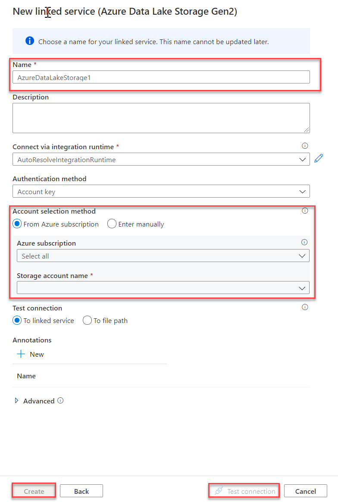
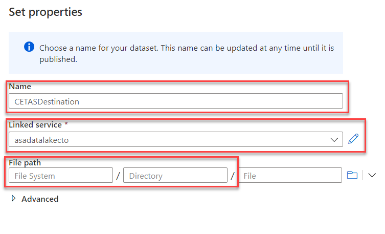
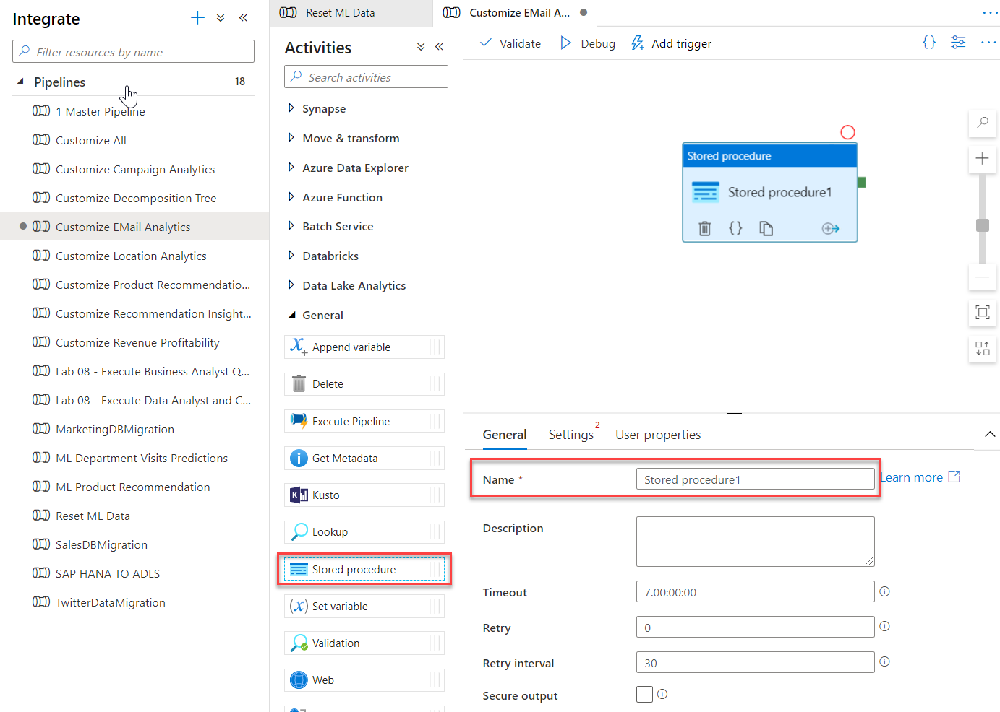
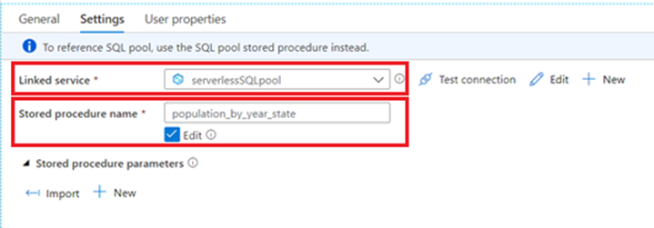

You can use Azure Synapse Pipelines to operationalize data transformations using serverless SQL pool by performing the following steps.

1.	Open your Azure Synapse Analytics workspace, go to the **Data** hub
2.	Click **+**, choose **Connect to external data** and select **Azure Data Lake Storage Gen2**
3.	Fill in **Name** field with DestinationStorage
4.	Pick the **Subscription** where your storage is
5.	Pick the **Storage account name** (use the same storage you used in CREATE EXTERNAL DATA SOURCE statement above)
6.	Create new linked service to destination storage account:
  
    

7.	Click **Test connection** to make sure linked service is properly configured
8.	Click **Create**

## Create pipeline:

1.	Go to the **Integrate** hub
2.	Click **+** and then choose **Pipeline** to create new pipeline
3.	In pipeline properties, fill in **Name** field with MyAggregatingPipeline

## Add Delete activity to delete destination storage folder:

1.	From Activities, under the group General, drag the **Delete activity** to canvas
2.	In the Activity General tab, fill in the **Name** with DeleteFolder
3.	In the **Source** tab click **New Dataset**, choose **Azure Data Lake Storage Gen2** and then click **Continue**
4.	Fill in the **Name** field with CETASDestination
5.	For the **Linked service** pick DestinationStorage
6.	Fill in File path with name of container you used in the CREATE EXTERNAL DATA SOURCE 
7.	Fill in Directory with LOCATION you used in the CETAS within the CREATE PROCEDURE statement
8.	Click **OK**
 
    

## Add Stored procedure activity that will execute stored procedure:

1.	From Activities, under the group General, drag **Stored procedure** activity to canvas
2.	In Activity General tab, fill in **Name** with AggregateByYearAndState
 
    

3.	In Activity Settings tab, click **New** to create new Linked service – here we will create connection to serverless SQL pool
4.	In New linked service panel:

    a. Fill in Name with serverlessSQLpool  
    b. Change Type to Azure Synapse Analytics (formerly SQL DW)  
    c. For Account selection method choose Enter manually  
    d. Fill in Fully qualified domain name with your serverless SQL pool endpoint  
    e. Fill in Database with name of the database in which you created stored procedure population_by_year_state previously  
    f. For Authentication type choose Managed Identity  
    g. Click Test Connection to make sure configuration is correct  
    h. Click Create to serverlessSQLpool linked service with specified options

3.	In Activity Settings tab, pick population_by_year_state for Stored Procedure Name
 
    

## Link Delete and Stored procedure activities to define order of execution of activities:

1.	Drag green connector from the Delete activity to Stored procedure activity.

You successfully created pipeline that will invoke data transformation stored procedure. You can click Debug at the top of the screen to execute it.

After successful pipeline execution, you can execute following statement to see data prepared with this pipeline.

```sql
SELECT TOP 10 * FROM population_by_year_state
```