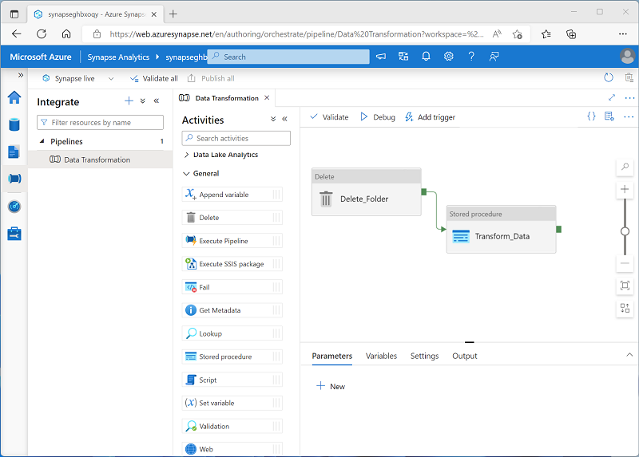

Encapsulating a `CREATE EXTERNAL TABLE AS SELECT` (CETAS) statement in a stored procedure makes it easier for you to operationalize data transformations that you may need to perform repeatedly. In Azure Synapse Analytics and Azure Data Factory, you can create pipelines that connect to *linked services*, including Azure Data Lake Store Gen2 storage accounts that host data lake files, and serverless SQL pools; enabling you to call your stored procedures as part of an overall data extract, transform, and load (ETL) pipeline.

For example, you can create a pipeline that includes the following  activities:

- A **Delete** activity that deletes the target folder for the transformed data in the data lake if it already exists.
- A **Stored procedure** activity that connects to your serverless SQL pool and runs the stored procedure that encapsulates your CETAS operation.

Creating a pipeline for the data transformation enables you to schedule the operation to run at specific times or based on specific events (such as new files being added to the source storage location).

> [!TIP]
> For more information about using the **Stored procedure** activity in a pipeline, see [Transform data by using the SQL Server Stored Procedure activity in Azure Data Factory or Synapse Analytics](/azure/data-factory/transform-data-using-stored-procedure) in the Azure Data Factory documentation.
