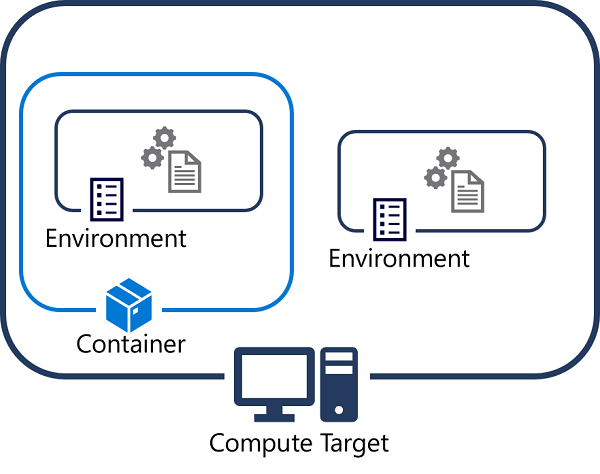

Python code runs in the context of a *virtual environment* that defines the version of the Python runtime to be used as well as the installed packages available to the code. In most Python installations, packages are installed and managed in environments using **Conda** or **pip**.

To improve portability, we usually create environments in docker containers that are in turn be hosted in compute targets, such as your development computer, virtual machines, or clusters in the cloud.

## Environments in Azure Machine Learning

In general, Azure Machine Learning handles environment creation and package installation for you - usually through the creation of Docker containers. You can specify the Conda or pip packages you need, and have Azure Machine Learning create an environment for the experiment.

In an enterprise machine learning solution, where experiments may be run in a variety of compute contexts, it can be important to be aware of the environments in which your experiment code is running. Environments are encapsulated by the **Environment** class; which you can use to create environments and specify runtime configuration for an experiment.

You can have Azure Machine Learning manage environment creation and package installation to define an environment, and then register it for reuse. Alternatively, you can manage your own environments and register them. This makes it possible to define consistent, reusable runtime contexts for your experiments - regardless of where the experiment script is run.

## Creating environments
There are multiple ways to create environments in Azure Machine Learning.

### Creating an environment from a specification file

You can use a Conda or pip specification file to define the packages required in a Python environment, and use it to create an **Environment** object.

For example, you could save the following Conda configuration settings in a file named **conda.yml**:

```bash
name: py_env
dependencies:
  - numpy
  - pandas
  - scikit-learn
  - pip:
    - azureml-defaults
```

You could then use the following code to create an Azure Machine Learning environment from the saved specification file:

```python
from azureml.core import Environment

env = Environment.from_conda_specification(name='training_environment',
                                           file_path='./conda.yml')
```

### Creating an environment from an existing Conda environment

If you have an existing Conda environment defined on your workstation, you can use it to define an Azure Machine Learning environment:

```python
from azureml.core import Environment

env = Environment.from_existing_conda_environment(name='training_environment',
                                                  conda_environment_name='py_env')
```

### Creating an environment by specifying packages

You can define an environment by specifying the Conda and pip packages you need in a **CondaDependencies** object, like this:

```python
from azureml.core import Environment
from azureml.core.conda_dependencies import CondaDependencies

env = Environment('training_environment')
deps = CondaDependencies.create(conda_packages=['scikit-learn','pandas','numpy'],
                                pip_packages=['azureml-defaults'])
env.python.conda_dependencies = deps
```

## Configuring environment containers

Usually, you should create environments in containers (this is the default unless the **docker.enabled** property is set to **False**, in which case the environment is created directly in the compute target)

```Python
env.docker.enabled = True
deps = CondaDependencies.create(conda_packages=['scikit-learn','pandas','pip'],                      
                                pip_packages=['azureml-defaults']
env.python.conda_dependencies = deps
```

Azure Machine Learning uses a library of base images for containers, choosing the appropriate base for the compute target you specify (for example, including Cuda support for GPU-based compute). If you have created custom container images and registered them in a container registry, you can override the default base images and use your own.

```Python
env.docker.base_image='my-base-image'
env.docker.base_image_registry='myregistry.azurecr.io/myimage'
```

Alternatively, you can have an image created on-demand based on the base image and additional settings in a dockerfile.

```Python
env.docker.base_image = None
env.docker.base_dockerfile = './Dockerfile'
```

By default, Azure machine Learning handles Python paths and package dependencies. If your image already includes an installation of Python with the dependencies you need, you can override this behavior by setting **python.user_managed_dependencies** to **True** and setting an explicit Python path for your installation.

```Python
env.python.user_managed_dependencies=True
env.python.interpreter_path = '/opt/miniconda/bin/python'
```

## Registering and reusing environments

After you've created an environment, you can register it in your workspace and reuse it for future experiments that have the same Python dependencies.

### Registering an environment

Use the **register** method of an **Environment** object to register an environment:

```python
env.register(workspace=ws)
```

You can view the registered environments in your workspace like this:

```python
from azureml.core import Environment

env_names = Environment.list(workspace=ws)
for env_name in env_names:
    print('Name:',env_name)
```

### Retrieving and using an environment

You can retrieve a registered environment by using the **get** method of the **Environment** class, and then assign it to a **ScriptRunConfig**.

For example, the following code sample retrieves the *training_environment* registered environment, and assigns it to a script run configuration:

```python

from azureml.core import Environment, ScriptRunConfig

training_env = Environment.get(workspace=ws, name='training_environment')

script_config = ScriptRunConfig(source_directory='my_dir',
                                script='script.py',
                                environment=env)
```

When an experiment based on the estimator is run, Azure Machine Learning will look for an existing environment that matches the definition, and if none is found a new environment will be created based on the registered environment specification.
