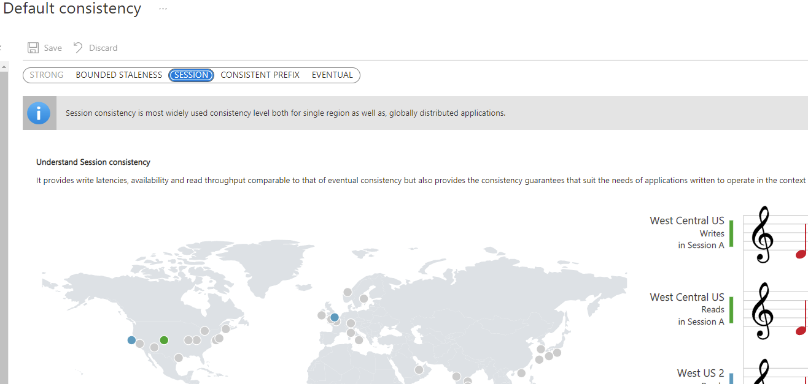

Each new Azure Cosmos DB account has a default consistency level of Session. In the Azure portal, the Default consistency pane is used to configure a new default consistency level for the entire account.

All reads and queries issued against containers in the account will use the default consistency level.
