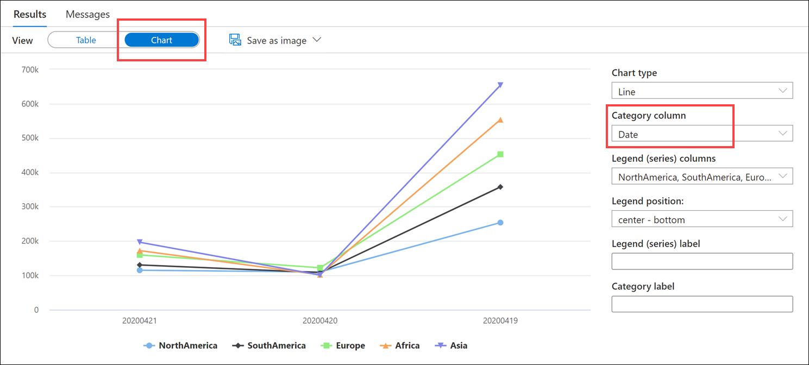

The broad capabilities of the Copy Activity allow you to quickly and easily move data into SQL Pools from a variety of sources.

There are different options for loading large amounts and varying types of data into Azure Synapse Analytics, such as through T-SQL commands using a dedicated SQL pool, and with Azure Synapse pipelines. There are some things to consider when loading large or disparate file types and formats. When files are stored in ADLS Gen2, you can use either PolyBase external tables or the new COPY statement when using T-SQL commands. Both options enable fast and scalable data load operations, but there are some differences between the two:

| PolyBase | COPY |
| --- | --- |
| Needs `CONTROL` permission | Relaxed permission |
| Has row width limits | No row width limit |
| No delimiters within text | Supports delimiters in text |
| Fixed line delimiter | Supports custom column and row delimiters |
| Complex to set up in code | Reduces amount of code |

## Ingest data using PolyBase

PolyBase requires the following elements:

- An external data source that points to the `abfss` path in ADLS Gen2 where the Parquet files are located
- An external file format for Parquet files
- An external table that defines the schema for the files, as well as the location, data source, and file format

1. Create a new SQL script with the following to create the external data source. Be sure to replace `YOURACCOUNT` with the name of your ADLS Gen2 account:

    ```sql
    -- Replace YOURACCOUNT with the name of your ADLS Gen2 account.
    CREATE EXTERNAL DATA SOURCE ABSS
    WITH
    ( TYPE = HADOOP,
        LOCATION = 'abfss://wwi-02@YOURACCOUNT.dfs.core.windows.net'
    );
    ```

2. Select **Run** from the toolbar menu to execute the SQL command.

3. In the query window, replace the script with the following to create the external file format and external data table. Notice that we defined `TransactionId` as an `nvarchar(36)` field instead of `uniqueidentifier`. This is because external tables do not currently support `uniqueidentifier` columns:

    ```sql
    CREATE EXTERNAL FILE FORMAT [ParquetFormat]
    WITH (
        FORMAT_TYPE = PARQUET,
        DATA_COMPRESSION = 'org.apache.hadoop.io.compress.SnappyCodec'
    )
    GO

    CREATE SCHEMA [wwi_external];
    GO

    CREATE EXTERNAL TABLE [wwi_external].Sales
        (
            [TransactionId] [nvarchar](36)  NOT NULL,
            [CustomerId] [int]  NOT NULL,
            [ProductId] [smallint]  NOT NULL,
            [Quantity] [smallint]  NOT NULL,
            [Price] [decimal](9,2)  NOT NULL,
            [TotalAmount] [decimal](9,2)  NOT NULL,
            [TransactionDate] [int]  NOT NULL,
            [ProfitAmount] [decimal](9,2)  NOT NULL,
            [Hour] [tinyint]  NOT NULL,
            [Minute] [tinyint]  NOT NULL,
            [StoreId] [smallint]  NOT NULL
        )
    WITH
        (
            LOCATION = '/sale-small%2FYear%3D2019',  
            DATA_SOURCE = ABSS,
            FILE_FORMAT = [ParquetFormat]  
        )  
    GO
    ```

    > **Note:** The `/sale-small/Year=2019/` folder's Parquet files contain **339,507,246 rows**.

4. Select **Run** from the toolbar menu to execute the SQL command.

5. In the query window, replace the script with the following to load the data into the `wwi_staging.SalesHeap` table. **DO NOT RUN** this command. In the interest of time, we will skip this command since it takes around 6 minutes to execute:

    ```sql
    INSERT INTO [wwi_staging].[SaleHeap]
    SELECT *
    FROM [wwi_external].[Sales]
    ```

## Simplify ingestion with the COPY activity

Now let's see how to perform the same load operation with the COPY statement.

1. In the query window, replace the script with the following to truncate the heap table and load data using the COPY statement. As you did before, be sure to replace `YOURACCOUNT` with the name of your ADLS Gen2 account:

    ```sql
    TRUNCATE TABLE wwi_staging.SaleHeap;
    GO

    -- Replace YOURACCOUNT with the workspace default storage account name.
    COPY INTO wwi_staging.SaleHeap
    FROM 'https://YOURACCOUNT.dfs.core.windows.net/wwi-02/sale-small%2FYear%3D2019'
    WITH (
        FILE_TYPE = 'PARQUET',
        COMPRESSION = 'SNAPPY'
    )
    GO
    ```

2. Select **Run** from the toolbar menu to execute the SQL command. It takes a few minutes to execute this command. **Take note** of how long it took to execute this query.

3. In the query window, replace the script with the following to see how many rows were imported:

    ```sql
    SELECT COUNT(1) FROM wwi_staging.SaleHeap(nolock)
    ```

4. Select **Run** from the toolbar menu to execute the SQL command. You should see a result of `339507246`.

Do the number of rows match for both load operations? Which activity was fastest? You should see that both copied the same amount of data in roughly the same amount of time.

### More COPY activity examples

The Copy Activity supports a large range of data sources and sinks on-premises and in the cloud. It facilitates the efficient, yet flexible parsing and transfer of data or files between systems in an optimized fashion as well as giving you capability of easily converting datasets into other formats.

In the following example, you can load data from a public storage account. Here the COPY statement's defaults match the format of the line item csv file.

```sql
COPY INTO dbo.[lineitem] FROM 'https://unsecureaccount.blob.core.windows.net/customerdatasets/folder1/lineitem.csv'
```

The default values for csv files of the COPY command are:

- DATEFORMAT = Session DATEFORMAT
- MAXERRORS = 0
- COMPRESSION default is uncompressed
- FIELDQUOTE = “”
- FIELDTERMINATOR = “,”
- ROWTERMINATOR = ‘\n'
- FIRSTROW = 1
- ENCODING = ‘UTF8’
- FILE_TYPE = ‘CSV’
- IDENTITY_INSERT = ‘OFF’

This example loads files specifying a column list with default values.

```sql
--Note when specifying the column list, input field numbers start from 1
COPY INTO test_1 (Col_one default 'myStringDefault' 1, Col_two default 1 3)
FROM 'https://myaccount.blob.core.windows.net/myblobcontainer/folder1/'
WITH (
    FILE_TYPE = 'CSV',
    CREDENTIAL=(IDENTITY= 'Storage Account Key', SECRET='<Your_Account_Key>'),
	--CREDENTIAL should look something like this:
    --CREDENTIAL=(IDENTITY= 'Storage Account Key', SECRET='x6RWv4It5F2msnjelv3H4DA80n0PQW0daPdw43jM0nyetx4c6CpDkdj3986DX5AHFMIf/YN4y6kkCnU8lb+Wx0Pj+6MDw=='),
    FIELDQUOTE = '"',
    FIELDTERMINATOR=',',
    ROWTERMINATOR='0x0A',
    ENCODING = 'UTF8',
    FIRSTROW = 2
)
```

The following example loads files that use the line feed as a row terminator such as a UNIX output. This example also uses a SAS key to authenticate to Azure blob storage.

```sql
COPY INTO test_1
FROM 'https://myaccount.blob.core.windows.net/myblobcontainer/folder1/'
WITH (
    FILE_TYPE = 'CSV',
    CREDENTIAL=(IDENTITY= 'Shared Access Signature', SECRET='<Your_SAS_Token>'),
	--CREDENTIAL should look something like this:
    --CREDENTIAL=(IDENTITY= 'Shared Access Signature', SECRET='?sv=2018-03-28&ss=bfqt&srt=sco&sp=rl&st=2016-10-17T20%3A14%3A55Z&se=2021-10-18T20%3A19%3A00Z&sig=IEoOdmeYnE9%2FKiJDSHFSYsz4AkNa%2F%2BTx61FuQ%2FfKHefqoBE%3D'),
    FIELDQUOTE = '"',
    FIELDTERMINATOR=';',
    ROWTERMINATOR='0X0A',
    ENCODING = 'UTF8',
    DATEFORMAT = 'ymd',
	MAXERRORS = 10,
	ERRORFILE = '/errorsfolder',--path starting from the storage container
	IDENTITY_INSERT = 'ON'
)
```

## Load a text file with non-standard row delimiters

One of the realities of data engineering, is that many times we need to process imperfect data. That is to say, data sources that contain invalid data formats, corrupted records, or custom configurations such as non-standard delimiters.

### Successfully load using COPY

One of the advantages COPY has over PolyBase is that it supports custom column and row delimiters.

Suppose you have a nightly process that ingests regional sales data from a partner analytics system and saves the files in the data lake. The text files use non-standard column and row delimiters where columns are delimited by a `.` and rows by a `,`:

```text
20200421.114892.130282.159488.172105.196533,20200420.109934.108377.122039.101946.100712,20200419.253714.357583.452690.553447.653921
```

The data has the following fields: `Date`, `NorthAmerica`, `SouthAmerica`, `Europe`, `Africa`, and `Asia`. They must process this data and store it in Synapse Analytics.

1. In the query window, replace the script with the following to create the `DailySalesCounts` table and load data using the COPY statement. As before, be sure to replace `YOURACCOUNT` with the name of your ADLS Gen2 account:

    ```sql
    CREATE TABLE [wwi_staging].DailySalesCounts
        (
            [Date] [int]  NOT NULL,
            [NorthAmerica] [int]  NOT NULL,
            [SouthAmerica] [int]  NOT NULL,
            [Europe] [int]  NOT NULL,
            [Africa] [int]  NOT NULL,
            [Asia] [int]  NOT NULL
        )
    GO

    -- Replace <PrimaryStorage> with the workspace default storage account name.
    COPY INTO wwi_staging.DailySalesCounts
    FROM 'https://YOURACCOUNT.dfs.core.windows.net/wwi-02/campaign-analytics/dailycounts.txt'
    WITH (
        FILE_TYPE = 'CSV',
        FIELDTERMINATOR='.',
        ROWTERMINATOR=','
    )
    GO
    ```

    Notice the `FIELDTERMINATOR` and `ROWTERMINATOR` properties that help us correctly parse the file.

2. Select **Run** from the toolbar menu to execute the SQL command.

3. In the query window, replace the script with the following to view the imported data:

    ```sql
    SELECT * FROM [wwi_staging].DailySalesCounts
    ORDER BY [Date] DESC
    ```

4. Select **Run** from the toolbar menu to execute the SQL command.

5. Try viewing the results in a Chart and set the **Category column** to `Date`:

    

### Attempt to load using PolyBase

Let's try this same operation using PolyBase.

1. In the query window, replace the script with the following to create a new external file format, external table, and load data using PolyBase:

    ```sql
    CREATE EXTERNAL FILE FORMAT csv_dailysales
    WITH (
        FORMAT_TYPE = DELIMITEDTEXT,
        FORMAT_OPTIONS (
            FIELD_TERMINATOR = '.',
            DATE_FORMAT = '',
            USE_TYPE_DEFAULT = False
        )
    );
    GO

    CREATE EXTERNAL TABLE [wwi_external].DailySalesCounts
        (
            [Date] [int]  NOT NULL,
            [NorthAmerica] [int]  NOT NULL,
            [SouthAmerica] [int]  NOT NULL,
            [Europe] [int]  NOT NULL,
            [Africa] [int]  NOT NULL,
            [Asia] [int]  NOT NULL
        )
    WITH
        (
            LOCATION = '/campaign-analytics/dailycounts.txt',  
            DATA_SOURCE = ABSS,
            FILE_FORMAT = csv_dailysales
        )  
    GO
    INSERT INTO [wwi_staging].[DailySalesCounts]
    SELECT *
    FROM [wwi_external].[DailySalesCounts]
    ```

2. Select **Run** from the toolbar menu to execute the SQL command.

You should see an error similar to: `Failed to execute query. Error: HdfsBridge::recordReaderFillBuffer - Unexpected error encountered filling record reader buffer: HadoopExecutionException: Too many columns in the line.`.

Why is this? According to [PolyBase documentation](/sql/t-sql/statements/create-external-file-format-transact-sql?view=sql-server-ver15#limitations-and-restrictions):

> The row delimiter in delimited-text files must be supported by Hadoop's LineRecordReader. That is, it must be either `\r`, `\n`, or `\r\n`. These delimiters are not user-configurable.

This is an example of where COPY's flexibility gives it an advantage over PolyBase.
