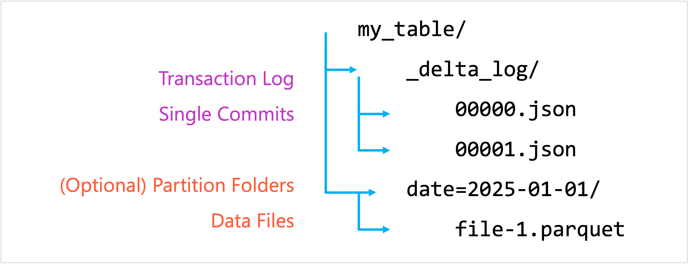

Creating a Delta table establishes a structured dataset stored in the Delta format. Tables can be **managed** (Databricks manages storage and metadata) or **external** (you provide a storage path, for example in Azure Data Lake Storage Gen2). Creating a table sets the schema, storage location, and enables ACID transactions and time travel from the start.

The following Python example creates a DataFrame with two rows and writes it as a **managed Delta table** called `main.default.people`. The SQL example explicitly creates a table with two columns and inserts two rows.

```python
from pyspark.sql import Row

data = [Row(id=1, name="a"), Row(id=2, name="b")]
df = spark.createDataFrame(data)

# Managed Delta table
df.write.format("delta").mode("overwrite").saveAsTable("main.default.people")
```

```SQL
CREATE TABLE main.default.people_sql (id INT, name STRING) USING DELTA;
INSERT INTO main.default.people_sql VALUES (1, 'a'), (2, 'b');
```

An **external Delta table** is a table whose underlying data files live in a storage location you specify (for example, in Azure Data Lake Storage Gen2), rather than being managed automatically by Databricks. In this setup, Databricks only tracks the table’s metadata, while the actual storage path remains under your control. This means you can delete the table definition from Databricks without affecting the underlying data files, which can be convenient if you need the data to be shared across multiple platforms or retained independently of Databricks. 

The consequence, however, is that you're responsible for managing that storage location—including organizing directories, handling cleanup, and enforcing retention policies—whereas a managed table would handle these aspects for you automatically.

In the following Python example, the DataFrame is written directly into a specified Azure Data Lake Storage Gen2 path, producing a folder of Delta files but not yet a registered table inside Databricks.

```python
external_path = "abfss://raw@myaccount.dfs.core.windows.net/delta/people_ext"

data_ext = [(10, "x"), (11, "y")]
df_ext = spark.createDataFrame(data_ext, ["id", "name"])

# Write Delta files to external storage path
df_ext.write.format("delta").mode("overwrite").save(external_path)
```

The following SQL statement then registers that location as a table, so it can be queried like any other Delta table. 

```sql
CREATE TABLE main.default.people_ext
USING DELTA
LOCATION 'abfss://raw@myaccount.dfs.core.windows.net/delta/people_ext';
```

> [!NOTE]
> It's generally recommended to use **managed Delta tables** rather than external tables in Databricks. Managed tables simplify operations because Databricks handles both the metadata and the underlying storage location, ensuring that schema enforcement, permissions, and lifecycle management are applied consistently.

## Read and write

Reading and writing are the core I/O operations with Delta tables. You can **read as a snapshot** (batch queries) or **continuously** (streaming). Writing can be in different modes (`append`, `overwrite`, etc.). Delta ensures that every read is consistent and that writes are **atomic**.

The following Python snippet first reads the entire people table and displays it. Then it appends a new row `(4, "d")`. The SQL example queries the table with `SELECT` and appends the same row using `INSERT`.

```python
# Read
df = spark.read.table("main.default.people")
df.show()

# Write append
new_rows = spark.createDataFrame([(4, "d")], ["id", "name"])
new_rows.write.format("delta").mode("append").saveAsTable("main.default.people")
```

```sql
-- Read
SELECT * FROM main.default.people_sql;

-- Write append
INSERT INTO main.default.people_sql VALUES (4, 'd');
```

## Update rows

Updating allows you to modify existing rows based on conditions. Delta Lake supports **SQL-style `UPDATE`** so you don’t have to rewrite the entire dataset. This is especially important for corrections, late-arriving data, or adjusting dimensions in analytics.

The following Python example updates the row with `id=2`, changing its name to `"b_updated"`. The SQL code applies the same update declaratively.

```python
from delta.tables import DeltaTable

dt = DeltaTable.forName(spark, "main.default.people")
dt.update(condition="id = 2", set={"name": "b_updated"})
```

```sql
UPDATE main.default.people_sql SET name = 'b_updated' WHERE id = 2;
```

## Delete rows

Delete removes records that match a condition. Unlike raw Parquet or CSV files (where deletes require rewriting files manually), Delta Lake supports **declarative deletes** as a transactional operation. This is crucial for **compliance use cases** (for example, personal data) or cleaning bad data.

The following Python example deletes the row with `id=1` from the people table. The SQL code performs the same deletion.

```python
from delta.tables import DeltaTable

dt = DeltaTable.forName(spark, "main.default.people")
dt.delete("id = 1")
```

```sql
DELETE FROM main.default.people_sql WHERE id = 1;
```

## Upsert (MERGE) into a Delta table

Upsert (update + insert) ensures the table reflects both **new records** and **changes to existing records** in one operation. In Delta Lake, this is done with MERGE. It checks for matches (based on a join condition) and applies updates if matched or inserts if not matched. This is essential for handling **slowly changing data** or **incremental ingestion**.

The following Python code merges an updates DataFrame into the target table people. If `id=2` exists, the row is updated; if `id=3` doesn't exist, it's inserted. The SQL code does the same using `MERGE INTO`.

```python
from delta.tables import DeltaTable
from pyspark.sql import Row

target = DeltaTable.forName(spark, "main.default.people")

updates_df = spark.createDataFrame([Row(id=2, name="b2"), Row(id=3, name="c")])

(target.alias("t")
 .merge(updates_df.alias("s"), "t.id = s.id")
 .whenMatchedUpdateAll()
 .whenNotMatchedInsertAll()
 .execute())
```

```sql
MERGE INTO main.default.people_sql AS t
USING (SELECT 2 AS id, 'b2' AS name UNION ALL SELECT 3, 'c') AS s
ON t.id = s.id
WHEN MATCHED THEN UPDATE SET *
WHEN NOT MATCHED THEN INSERT *;
```

## Transaction log

The **transaction log** (often called the DeltaLog) is a core component of Delta Lake that records every change ever made to a table—inserts, updates, deletes, metadata changes, schema updates, etc. It lives in a `_delta_log` directory alongside the table’s data files, with each atomic commit stored as a JSON file (for example, `000000.json`, `000001.json`, ...) capturing actions like "add file," "remove file," "update metadata," "commit info," among others. Periodically, Delta Lake creates checkpoints (Parquet format files) so that to compute the current state of the table, it doesn’t have to replay all JSON commits from the beginning; it can start from the latest checkpoint and then apply only more recent commits.



Because the transaction log is the single source of truth, it supports Delta Lake’s ACID guarantees. For **atomicity**, no change is considered valid unless its full commit appears in the log. For **isolation** and **consistency**, when multiple users or jobs read/write concurrently, the log helps coordinate via optimistic concurrency control: Spark checks the transaction log version, and commits are ordered to avoid conflicting changes. The log’s history also enables features like *time travel* (you can query older versions of the table) and *auditability*, because you can track exactly which operation changed what, and when.

## Partitioning

Imagine you're building a Delta table to store web application logs. Every day, your system generates billions of log records. Analysts typically run queries like "show me all errors from yesterday" or "aggregate usage by day for the past week."

If you store all the logs in one giant, unpartitioned table, every query has to scan through potentially terabytes of data, even if you only care about a single day. Instead, you decide to partition the table by date. Now, each day’s data is stored in its own partition directory (for example, `.../logs/event_date=2025-09-10/`), and when you query only yesterday’s data, Databricks can skip all other dates. This reduces the amount of data scanned and speeds up queries dramatically.

Here's an example how you can partition in Python and SQL

```python
df.write \
  .format("delta") \
  .mode("overwrite") \
  .partitionBy("event_date") \
  .saveAsTable("main.default.weblogs")
```

```sql
-- Create a weblogs table partitioned by event_date
CREATE TABLE main.default.weblogs (
  user_id INT,
  url STRING,
  status INT,
  event_time DATE,
  event_date DATE
)
USING DELTA PARTITIONED BY (event_date);
```

Partitioning means physically dividing a table’s data into separate subsets ("partitions") based on one or more columns. You might partition a large Delta table by region, product category, or another low-cardinality field. When queries filter on those partitioning columns, Databricks can skip over irrelevant partitions rather than scanning all data. That can speed up reads significantly, reduce resource usage, and make query execution more efficient. Partitioning also helps with data management, because you can more easily drop or reorganize partitions (for example, remove old data by partition), and improve performance of pruning/filtering during writes and other operations.

However, partitioning also has costs and considerations. Each partition adds metadata overhead (in the Delta log and catalog), which can slow down operations when there are many small partitions. Because of this, Azure Databricks recommends partitioning only for very large tables (typically those over **~1 TB**) and ensuring that each partition has at least about **1 GB** of data to be worth the partition. If partitions are too fine-grained (high cardinality, many small partitions), then query planning, metadata management, and write performance can degrade. Also, partitioning decisions should align with how the data is commonly queried (i.e. you filter by those partition columns often), or else you may get little benefit. Databricks also offers newer features like liquid clustering and ingestion-time clustering which in many cases reduce the need for manual partitioning.

## Optimization and maintenance

Delta Lake provides several utilities to optimize the performance of Delta tables, such as `OPTIMIZE` for compacting files and `VACUUM` for removing obsolete files.

**OPTIMIZE** compacts many small Parquet files into fewer large ones, which improves query performance. When data is ingested in streaming or small batches, Delta tables can accumulate thousands of tiny files. This leads to slower queries because Spark has to open and scan each file separately. Running `OPTIMIZE` rewrites those small files into larger, more efficient files, which reduces overhead and speeds up reads and joins.

**VACUUM** is used to safely clean up old or unreferenced data files that are no longer needed because of updates, deletes, or compaction. By default, Delta Lake retains files for a period of time (often seven days) to support features like time travel and concurrent readers. After that retention period, you can run `VACUUM` to delete these obsolete files and free up storage. Without vacuuming, your storage costs could grow unnecessarily, and the presence of unused files might slow down operations.

```python
# Optimize the Delta table
spark.sql("OPTIMIZE '/FileStore/tables/my_delta_table'")

# Clean up old files
spark.sql("VACUUM '/FileStore/tables/my_delta_table' RETAIN 168 HOURS")
```

Databricks also offers **auto-optimize** and **auto-compaction** features (workspace/cluster settings) that can reduce the need to run these commands manually by compacting files automatically during writes.