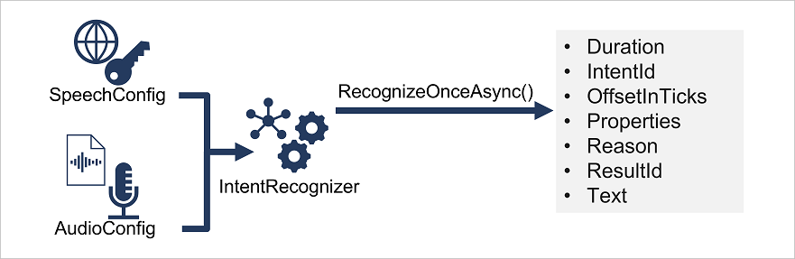

To use a Language Understanding model from the Speech SDK, your code should follow this pattern:

1. Use a **SpeechConfig** object to encapsulate the information required to connect to your Language Understanding prediction resource (<u>not</u> a Speech resource). Specifically, the **SpeechConfig** must be configured with the **location** and **key** of the Language Understanding prediction resource.
2. Optionally, use an **AudioConfig** to define the input source for the speech to be analyzed. By default, this is the default system microphone, but you can also specify an audio file.
3. Use the **SpeechConfig** and **AudioConfig** to create an **IntentRecognizer** object, and add the model and the intents you want to recognize to its configuration.
4. Use the methods of the **IntentRecognizer** object to submit utterances to the Language understanding prediction endpoint. For example, the **RecognizeOnceAsync()** method submits a single spoken utterance.
5. Process the response. In the case of the **RecognizeOnceAsync()** method, the result is an **IntentRecognitionResult** object that includes the following properties:

    - Duration
    - IntendId
    - OffsetInTicks
    - Properties
    - Reason
    - ResultId
    - Text

If the operation was successful, the **Reason** property has the enumerated value **RecognizedIntent**, and the **IntentId** property contains the top intent name. Full details of the Language Understanding prediction can be found in the **Properties** property, which includes the full JSON prediction.

Other possible values for **Result** include **RecognizedSpeech**, which indicates that the speech was successfully transcribed (the transcription is in the **Text** property), but no matching intent was identified. If the result is **NoMatch**, the audio was successfully parsed but no speech was recognized, and if the result is **Canceled**, an error occurred (in which case, you can check the **Properties** collection for the **CancellationReason** property to determine what went wrong.)
