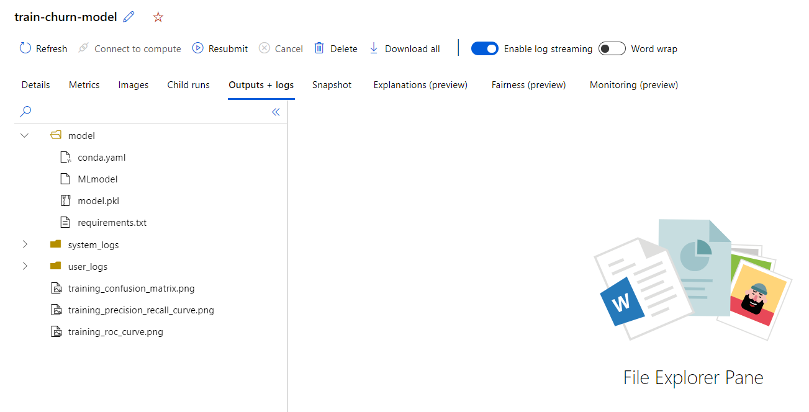

Use MLflow to create the necessary model assets that will allow you to manage and share models easily.

As a data scientist, you'll train and retrain models continuously over time. Tracking the input and output of each of these models will help you to monitor the models and decide which iteration performs best. After deciding which model performs best, you want to share the model. You can share the model by taking the assets, and registering the model. Once you have the model assets, you'll be able to deploy the model in any way you want.

You'll learn how you can take the model assets created with MLflow and use them to create a model in the Azure Machine Learning workspace.

## Create a model to track in the workspace

Imagine you used customer data to train a model, to classify whether a customer will churn or not. You created a training script and enabled MLflow autologging to track all parameters, metrics, and artifacts. You submitted the job with the CLI (v2) using the following command:

```azurecli
az ml job create --file mlflow-job.yml
```

The output in the shell will show you the summary information of the job you submitted. It will show you the inputs you defined in the `mlflow-job.yml` file, and the details that Azure Machine Learning adds, like the **name**:

```
{
  "description": "Train a classification model on customer data using a registered dataset as input. Use MLflow autologging to track parameter, metric, and artifact.",
  "display_name": "tender_airport_mpqxw22m",
  "environment": "azureml:basic-env-scikit:1",
  "environment_variables": {},
  "experiment_name": "train-churn-model",
  "id": "azureml:/subscriptions/7ab3b8d0-8479-4753-a593-83f4c4c701a5/resourceGroups/diabetes-dev-rg/providers/Microsoft.MachineLearningServices/workspaces/aml-diabetes-dev/jobs/a29e10e9-aa33-415c-b4f9-50b38706cfa9",
  "inputs": {
    "customer": {
      "dataset": "azureml:customer-data:1",
      "mode": "ro_mount"
    }
  },
  "name": "a30e10e9-aa33-415c-b4f9-50b38706cfa9",
  "outputs": {
    "default": {
      "folder": "azureml://datastores/workspaceartifactstore/ExperimentRun/dcid.a29e10e9-aa33-415c-b4f9-50b38706cfa9",
      "mode": "rw_mount"
    }
  },
```

The name, also known as the **run_id**, can be used to download the metrics and model assets.

The model assets can also be viewed in the Azure Machine Learning Studio. You can find them in the experiment run, under **Outputs + Logs**. When using MLflow autologging, a `model` folder will contain all model assets.



To download the output files using the CLI (2), first, set the current directory of the shell to where you want to download all job-related files to. Then, to actually download the files for a specific job, you use the following command:

```azurecli
az ml job download --name a30e10e9-aa33-415c-b4f9-50b38706cfa9
```

To share the model, we can register and deploy the model to an endpoint. To register a model, use the `ml model create` command.

In the example of the customer churn model, MLflow autologging was enabled. As a result, all model assets are stored in the `model` folder with the experiment run. To register the model from the model assets, you can use the following command:

```azurecli
az ml model create --name churn-example --version 1 --local-path a30e10e9-aa33-415c-b4f9-50b38706cfa9/model/
```

Creating the model will register it in the Azure Machine Learning workspace. To list all models in the workspace, use:

```azurecli
az ml model list
```

You can also view the list of models in the Azure Machine Learning Studio. In a browser, navigate to [https://ml.azure.com](https://ml.azure.com), and find all registered models in the **Models** tab.
