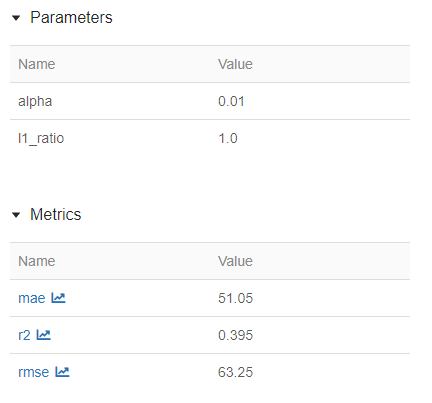
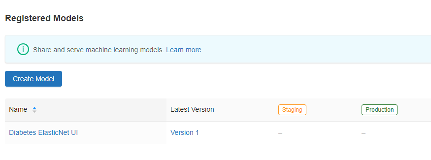
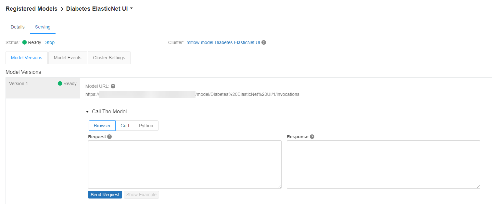

**MLflow** is an open-source product designed to manage the Machine Learning development lifecycle. That is, MLflow allows data scientists to train models, register those models, deploy the models to a web server, and manage model updates.

## The importance of MLflow

MLflow is an important part of machine learning with Azure Databricks, as it integrates key operational processes with the Azure Databricks interface. MLflow makes it easy for data scientists to train models and make them available without writing a great deal of code.

As a side note, MLflow will also operate on workloads outside of Azure Databricks. The examples in this module will all use Azure Databricks but this is not a requirement.

## MLflow product components

There are four components to MLflow: 
- MLflow Tracking
- MLflow Projects
- MLflow Models
- MLflow Model Registry

### MLflow Tracking

MLflow Tracking allows data scientists to work with experiments. For each run in an experiment, a data scientist may log parameters, versions of libraries used, evaluation metrics, and generated output files when training machine learning models.

MLflow Tracking provides the ability to audit the results of prior model training executions.  

### MLflow Projects

An MLflow Project is a way of packaging up code in a manner, which allows for consistent deployment and the ability to reproduce results.  MLflow supports several environments for projects, including via Conda, Docker, and directly on a system.

### MLflow Models

MLflow offers a standardized format for packaging models for distribution. This standardized model format allows MLflow to work with models generated from several popular libraries, including `scikit-learn`, `Keras`, `MLlib`, `ONNX`, and more. Review the [MLflow Models documentation](https://mlflow.org/docs/latest/models.html) for information on the full set of supported model flavors.

### MLflow Model Registry

The MLflow Model Registry allows data scientists to register models in a registry.

From there, MLflow Models and MLflow Projects combine with the MLflow Model Registry to allow operations team members to deploy models in the registry, serving them either through a REST API or as part of a batch inference solution using Azure Databricks.

