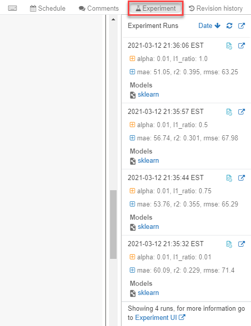
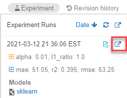
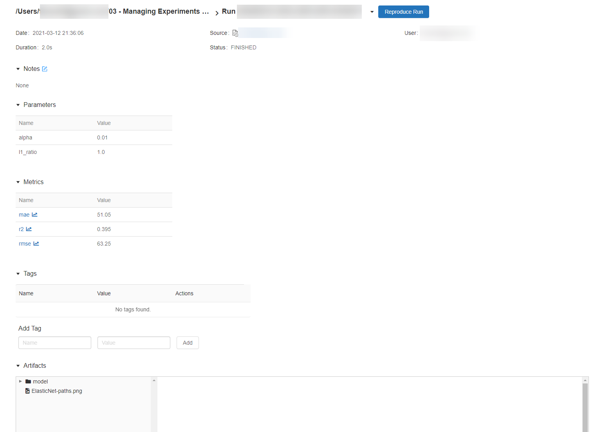

MLflow experiments allow data scientists to track training runs in a collection called an **experiment**. This is useful for comparing changes over time or comparing the relative performance of models with different hyperparameter values.

Creating an experiment in Azure Databricks happens automatically when you start a run. Here is an example of starting a run in MLflow, logging two parameters, and logging one metric:

```python
with mlflow.start_run():
    mlflow.log_param("input1", input1)
    mlflow.log_param("input2", input2)
    # Perform operations here like model training.
    mlflow.log_metric("rmse", rmse)
```

In this case, the experiment's name will be the name of the notebook. It is possible to export a variable named `MLFLOW_EXPERIMENT_NAME` to change the name of your experiment should you choose.

## Reviewing Experiments

Inside a notebook, the **Experiment** menu option displays a context bar, which includes information on runs of the current experiment.



Selecting the External Link icon in the experiment run will provide additional details on a particular run.



This link will provide the information that MLflow Tracker logged, including notes, parameters, metrics, tags, and artifacts.


