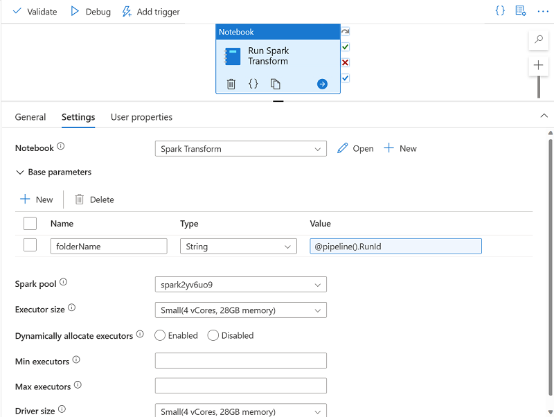

Parameters enable you to dynamically pass values for variables in the notebook each time it's run. This approach provides flexibility, enabling you to adjust the logic encapsulated in the notebook for each run.

## Create a *parameters* cell in the notebook

To define the parameters for a notebook, you declare and initialize variables in a cell, which you then configure as a **Parameters** cell by using the toggle option in the notebook editor interface.

Initializing a variable ensures that it has a default value, which will be used if the parameter isn't set in the notebook activity.

## Set *base parameters* for the notebook activity

After defining a parameters cell in the notebook, you can set values to be used when the notebook is run by a notebook activity in a pipeline. To set parameter values, expand and edit the **Base parameters** section of the settings for the activity.

You can assign explicit parameter values, or use an expression to assign a dynamic value. For example, the expression `@pipeline().RunId` returns the unique identifier for the current run of the pipeline.
