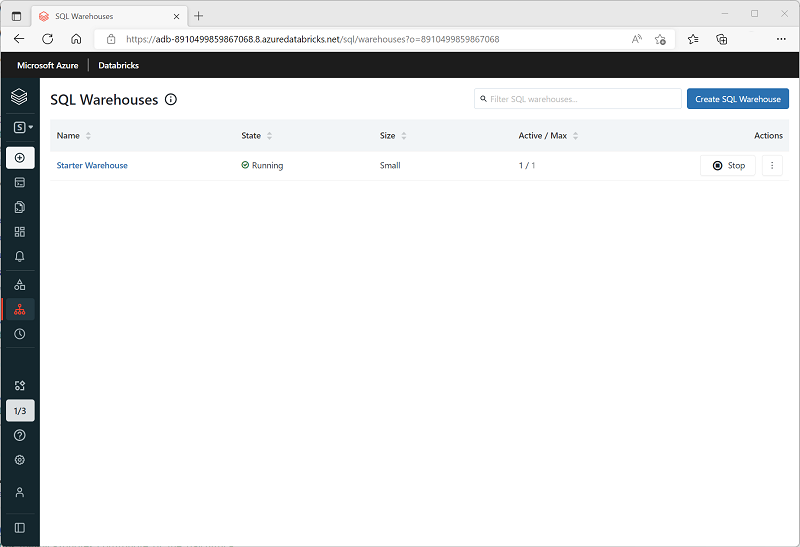

SQL Warehouses (formerly known as SQL Endpoints) provide a relational database interface for data in Azure Databricks. The data is stored in files that are abstracted by Delta tables in a hive metastore, but from the perspective of the user or client application, the SQL Warehouse behaves like a relational database.

## Creating a SQL Warehouse

When you create a premium-tier Azure Databricks workspace, it includes a default SQL Warehouse named **Starter Warehouse**, which you can use to explore sample data and get started with SQL-based data analytics in Azure Databricks. You can modify the configuration of the default SQL Warehouse to suit your needs, or you can create more SQL Warehouses in your workspace.

You can manage the SQL Warehouses in your Azure Databricks workspace by using the Azure Databricks portal in the **SQL** persona view.

### SQL Warehouse configuration settings

When you create or configure a SQL Warehouse, you can specify the following settings:

- **Name**: A name used to identify the SQL Warehouse.
- **Cluster size**: Choose from a range of standard sizes to control the number and size of compute resources used to support the SQL Warehouse. Available sizes range from *2X-Small* (a single worker node) to *4X-Large* (256 worker nodes). For more information, see [Cluster size](/azure/databricks/sql/admin/sql-endpoints#cluster-size) in the Azure Databricks documentation.
- **Auto Stop**: The amount of time the cluster will remain running when idle before being stopped. Idle clusters continue to incur charges when running.
- **Scaling**: The minimum and maximum number of clusters used to distribute query processing.
- **Advanced options**: You can add tags to help identify and monitor SQL Warehouse usage. You can also disable the *[serverless SQL Warehouse](/azure/databricks/serverless-compute/)* option (which at the time of writing is in preview) or configure *spot instances* for *classic* (non-serverless) SQL Warehouses to control how clusters make use of *spot* instances of virtual machines (which leverage unused Azure capacity to reduce costs).

> [!NOTE]
> You can create a SQL Warehouse with any available size, but if you have insufficient quota for the number of cores required to support your choice in the region where Azure Databricks is provisioned, the SQL Warehouse will fail to start.
