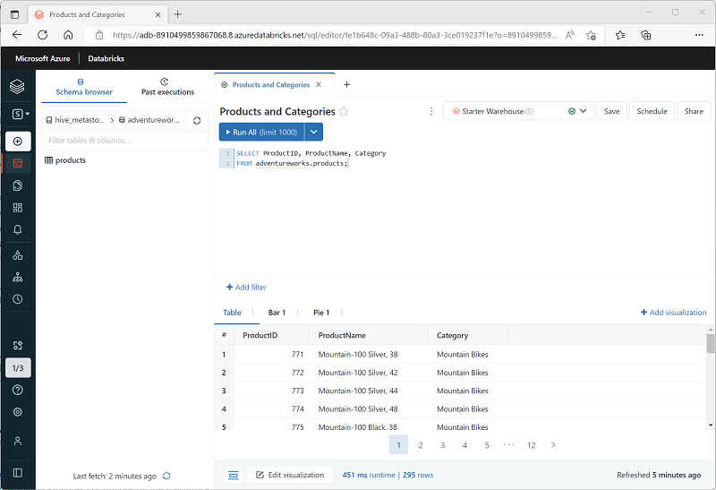
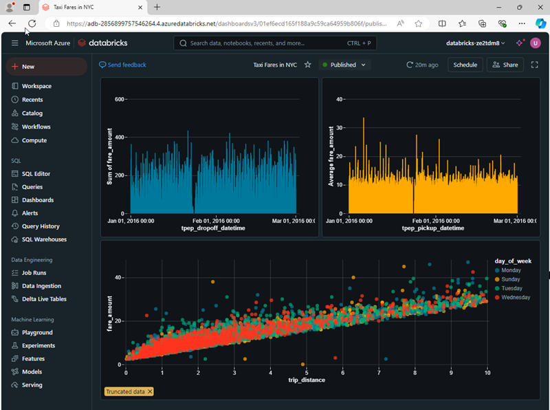

Azure Databricks SQL is primarily designed for data analytics and visualization workloads. To support these workloads, users can create *queries* to retrieve and summarize data from tables, and *dashboards* to share visualizations of the data.

## Queries

You can use the SQL Editor in the Azure Databricks portal to create a query based on any valid SQL `SELECT` statement, and then save the query with a meaningful name to be retrieved and run later.

After saving the query, you can schedule it to be run automatically at regular intervals to refresh the data, or you can open it and run it interactively.

## Dashboards

Dashboards enable you to display the results of queries, either as tables of data or as graphical visualizations.

You can create multiple visualizations in a dashboard and share it with users in your organization. As with individual queries, you can schedule the dashboard to refresh is data periodically, and notify subscribers by email that new data is available.
