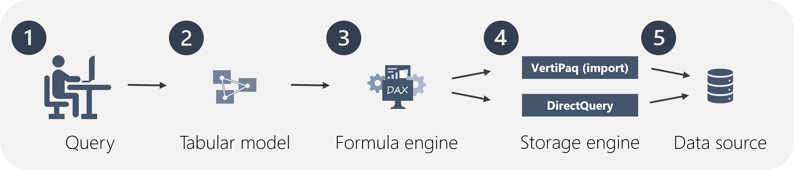
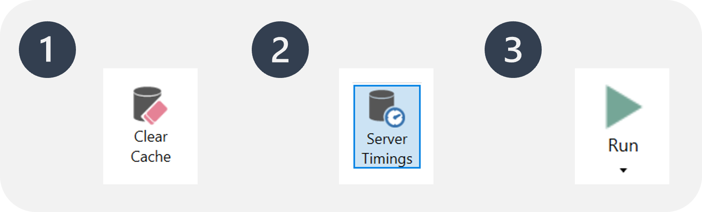
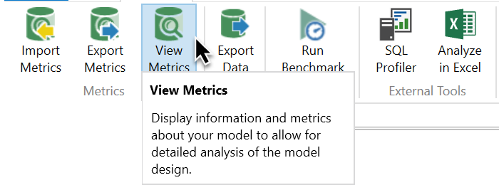
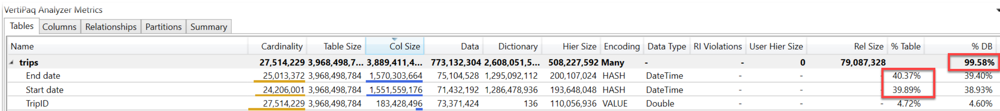
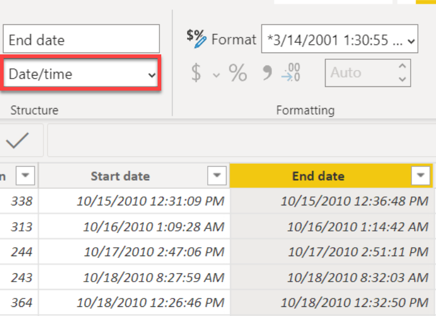

In unit 2, we learned that Performance analyzer data can be further analyzed in DAX Studio. Import performance data into DAX Studio, where you can view, sort, and filter all performance data. You can also bring a single query into the editor where you can make adjustments to the query to improve performance. 

## Understand the VertiPaq engine

Before jumping into optimization, it's important to understand what's happening under the hood of Power BI. By using compression algorithms and a multi-threaded query processor, the Analysis Services *VertiPaq engine* delivers fast access to tabular model objects and data by Power BI.

Power BI reads the content of your data source and transforms it in the internal VertiPaq columnar data structure, where each column is encoded and compressed. Dictionaries and indexes are created for each column. Finally, data structures are created for relationships and computation and compression of calculated columns occurs.

DAX queries are being processed by two engines, the *formula engine* and the *storage engine.* We'll talk more about these engines below.

## Describe DAX Studio

[DAX Studio](https://daxstudio.org/) is an open-source tool for executing DAX queries against Power BI and Analysis Services models. DAX Studio is useful for:
- Reviewing the contents of your data model.
- Writing and optimizing complex DAX formulas and queries.

Download and install DAX Studio with the default settings, connect to your data model, and begin working on your queries. Once DAX Studio is installed, it can also be launched from the **External Tools** tab of the ribbon in Power BI desktop. 

## Optimize the data model

Now that you have an idea of how the VertiPaq engine works, let's discuss how you can use DAX Studio to optimize DAX queries that run in this environment.

### Optimize DAX queries

Calculations using DAX, either measures or columns, are a part of a DAX query, which is processed by two engines in VertiPaq. When a query is processed, the *formula engine* processes the request, asks the storage engine for data, and performs necessary calculations. The *storage engine* retrieves and aggregates data requested by the formula engine. 

In the diagram below, the DAX query is sent to the tabular model in steps 1 and 2. The request is then processed by the formula engine and sent to the storage engine, represented by step 3. In step 4, the storage engine either retrieves the data from the model and stores it in memory (for import mode), or passes the query on to the data source (for DirectQuery). For import mode, refreshing the data will retrieve the data from the source.



Troubleshooting in DAX Studio enables you to see detailed statistics on the server timings of your query. You're able to view the proportion of time the query takes in each engine, and can then adjust your queries accordingly to improve performance.

Let's talk through a scenario to understand how you can optimize a query using DAX Studio.

You have a report that contains a matrix visualizing 6 measures. Your CEO informs you that the visual is slow to render, and therefore the report is unusable. You start to dig in and confirmed slow render times using the Performance analyzer in Power BI desktop. 

You then copy the query to look at it in DAX Studio to get more information on what might be causing your problem. In DAX Studio, you clear the cache(1), turn on the server timings (2),  and then run the query (3).



From top left to bottom right, the statistics tell you how many milliseconds it took to run the query, and the duration the storage engine (SE) CPU took. In this case, the formula engine (FE) took 73.5% of the time, while the SE took the remaining 26.5% of the time. There were 34 individual SE queries and 21 cache hits.


From here, you can investigate what in your measures might be causing the issues. This requires deep DAX knowledge and is sometimes a case of trial and error. 

You experiment with the measures and recognize that improving the sales measure by replacing complicated `IF` statements in DAX with variables and a time intelligence function. A safe way to experiment is to comment out measures and rework them. You can comment out measures by typing two forward slashes at the beginning of a line (```//```). For multi-row comments, use ```/*``` at the beginning of the comment and ```*/``` to close the comment.

After experimenting, you clear the cache and run the query again with the updates you made to the measure. You find that your updated measure performs much better, with nearly a 50% reduction in query execution time.


>[!IMPORTANT]
>The storage engine caches the results in memory for reuse. Because of this cache, it is critical to **clear the cache** prior to running queries in DAX Studio.

### View model metrics using VertiPaq Analyzer

Viewing the *VertiPaq Analyzer Metrics* in DAX Studio is a great way to get an overall view of what's going on in your data model. VertiPaq Analyzer reports the memory consumption of the data model and can be used to quickly identify where you're spending the most memory. In short - you can use VertiPaq Analyzer to make memory gobbling offenders obvious, rectify them in Power BI, and then rerun VertiPaq Analyzer to see the immediate benefits of your data model updates.

>[!NOTE]
>The VertiPaq engine only stores data in memory in *import* models. If you're using *DirectQuery*, the VertiPaq engine simply sends that query to the source. This means that viewing the VertiPaq Analyzer Metrics will only be helpful for *import* or *composite* models.

You can look at the size of the table, columns, etc., in bytes. The .pbix file further compresses these sizes - the displayed sizes in bytes are evaluated prior to compression.

To view model metrics, launch DAX Studio from the external tools tab of the Power BI ribbon and select View Metrics from the Advanced tab in DAX Studio.



VertiPaq analyzer displays a number of important metrics about your model. We're going to focus specifically on memory consumption and cardinality. For a complete list of what each of these columns mean, consult the [DAX Studio documentation](https://daxstudio.org/docs/intro/).

Viewing metrics in DAX Studio helps you immediately find and fix problems. In this case, you can see that the problem is a column with high cardinality. You can then fix that issue back in Power BI, refresh the metrics, and immediately see the effects of your changes on the model.

For example, notice that the model in the image below contains a table that consumes 99.6% of the database memory. By drilling into the table, you can see that two columns, End date and Start date are gobbling up the most memory.



Take a look at those two columns back in Power BI desktop and notice that they're Date/time columns. Date/time columns inherently have high cardinality due to all of the possible combinations of dates and times.



Using the VertiPaq Analyzer in DAX Studio can help you easily identify and eliminate columns with high cardinality (including auto Date/time and floating-point decimal data types), and identify and remove columns that aren't used for anything.

>[!NOTE]
>Refer to the [Power BI optimization guide](/power-bi/guidance/power-bi-optimization#optimizing-the-data-model) for more detailed information on optimizing the data model.
