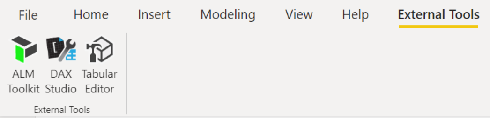
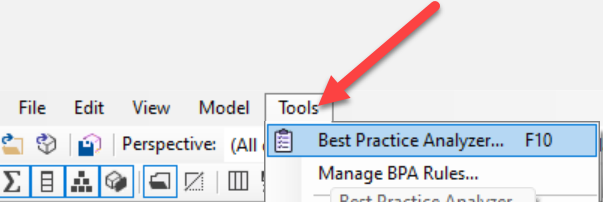
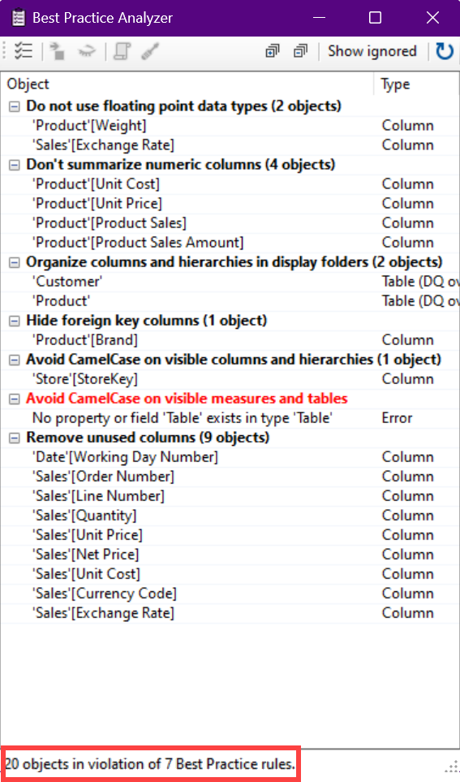
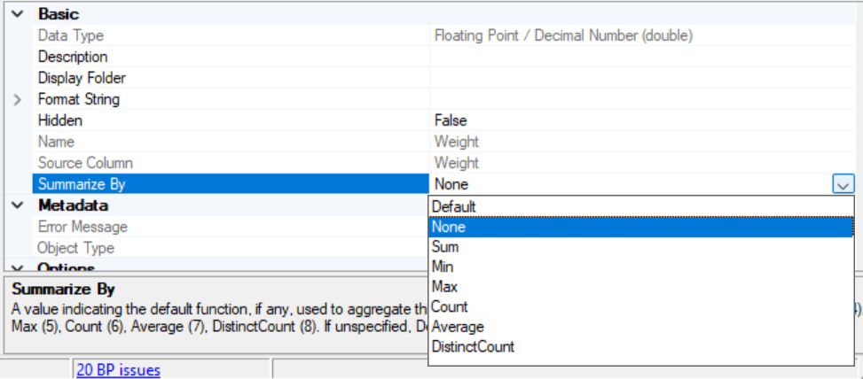

How can you be sure to implement data modeling best practices as you design and build data models in Power BI? There's a tool for that! The Best Practice Analyzer (BPA) in Tabular Editor can be used during the development of tabular models in Power BI or Analysis Services models.

## Describe Tabular Editor

Tabular Editor is an alternative tool for authoring tabular models for Analysis Services and Power BI. Tabular Editor 2 is an open-source project that can edit a BIM file without accessing any data in the model. Tabular editor enables users to easily manipulate tabular models and can be used in a few different ways. Tabular Editor can be used to:
- quickly edit data models
- automate repetitive tasks using scripting
- incorporate DevOps with tabular models
- run BPA rules

This unit focuses on using Tabular Editor to run the BPA to ensure you're implementing data modeling best practices as you build.

## Describe the Best Practice Analyzer (BPA)

BPA is a set of rules run in Tabular Editor that notify you of potential modeling missteps or changes that you can make to improve your model design and performance. It includes recommendations for naming, user experience, and common optimizations that you can apply to improve performance. For more information, see [Best practice rules to improve your model's performance](https://powerbi.microsoft.com/blog/best-practice-rules-to-improve-your-models-performance/).

BPA rules are a set of rules that you can add to your instance of Tabular Editor. When BPA rules are run on your tabular model, you'll get a list of rules that your model violates, and can fix them using Tabular Editor.

BPA includes a [set of pre-defined rules](https://powerbi.microsoft.com/blog/best-practice-rules-to-improve-your-models-performance/), and you can also define your own rules to encourage certain conventions and practices when developing tabular models.

To use the pre-defined BPA rules, download the [BPA rules .json file](https://github.com/microsoft/Analysis-Services/tree/master/BestPracticeRules) from the GitHub repository. The rules are divided into categories for easier viewing, for example:
- Performance
- DAX Expressions 
- Error Prevention
- Formatting
- Maintenance 

Each rule has a description, and many of the rules also have a reference article/video. Reading the rule description and article will provide context as to why the rule is important and why you should follow it. 

> [!NOTE]
> BPA rules can be run against tabular models in Power BI Desktop, SQL Server Analysis Services, Azure Analysis Services, or Power BI Premium.

## Run BPA in Tabular Editor

1. Install [Tabular Editor](https://github.com/TabularEditor/TabularEditor).
  
   *Tabular Editor has an open-source and a paid version. This unit refers to use of the open-source version only.*

2. Download the Best Practice Rules from [GitHub](https://github.com/TabularEditor/BestPracticeRules/releases).
   
3. Save the file in `C:\Users\username\AppData\Local\TabularEditor` and name it **`BPARules.json`**.

4. In Power BI Desktop, select Tabular Editor on the External Tools tab of the ribbon.
    
    

   *Tabular Editor will automatically connect to the data model*
  
5. On the Tools tab, select **Best Practice Analyzer**.
   
    

6. The Best Practice Analyzer window will open, displaying any violations of the Best Practice Rules. 
 
   

     > [!NOTE] 
     > The best practice analyzer scans your model for issues whenever a change is made to the model. This is on by default but can be disabled.

7. Review the objects in violation of the rules and fix them using Tabular Editor. For example, let's fix the columns violating the **Don't summarize numeric columns** rule, starting with the Weight column in the Product table.

8. Double select (or right select) the object to go to the object in Tabular Editor. Change the object properties as necessary. In this case, we're changing **Summarize by** from **Sum** to **None**.

    

9. To save your changes to back to the Model.bim file, select **Save,** or use the keyboard shortcut **ctrl + s**.

> [!IMPORTANT]
> Tabular Editor uses the [Tabular Object Model (TOM)](/analysis-services/tom/introduction-to-the-tabular-object-model-tom-in-analysis-services-amo) to load and save metadata to and from Model.bim files. When fixing Best Practice rule violations, saving changes in Tabular Editor pushes modifications to the connected Power BI desktop data model.

## Customize BPA for your organization

BPA was designed to enable you to create custom rules and best practices for your organization. If the Best Practice Rules don't suit your needs, you can create rules required for data modeling best practices as you deem appropriate.

You can also edit existing rules, disable and ignore rules, and set severity levels for each rule. From the Best Practice Analyzer window, select **Manage Best Practice Rules**. This will enable you to turn rules to use in your scan on and off, edit rules, and delete rules. Edits you make to Best Practice Rules in this window will then be saved to the .json file.

### Incorporate the use of BPA into your Continuous Integration/Continuous Deployment (CI/CD) process

If your organization has an established CI/CD process using Git, BPA can be integrated into your Azure Pipelines. If  objects violate Best Practice Rules in the build, you can establish a process to either fail the build or proceed with warning based on the severity of the violation.

> [!NOTE]
> The severity level that you set for each rule while managing your best practice rules only comes into play when deploying models using the [command line option](https://docs.tabulareditor.com/te2/Command-line-Options.html) in Tabular Editor.
