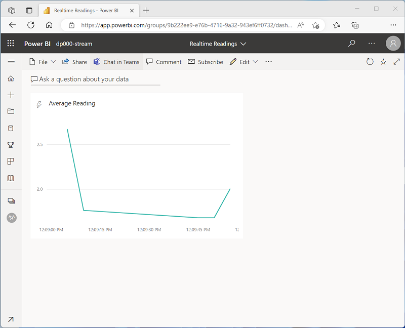

When you successfully run an Azure Stream Analytics job that sends results to a Power BI output, a streaming dataset containing a single table is created in the Power BI workspace specified for the output. The table contains the data produced by the Stream Analytics query.

## Creating real-time visualizations in a dashboard

To visualize data in real-time, you can create a *dashboard* with a real-time visualization tile. Real-time visualizations on a dashboard show data from a streaming dataset, and are updated dynamically as new data flows into the dataset.

