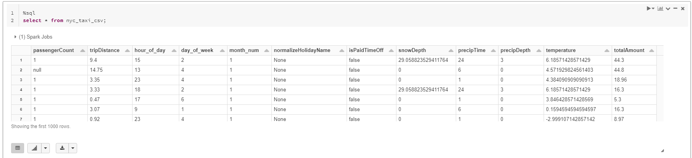
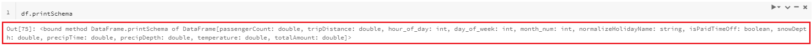

Spark uses 3 different APIs: RDDs, DataFrames, and DataSets. The architectural foundation is the resilient distributed dataset (RDD). The DataFrame API was released as an abstraction on top of the RDD, followed later by the Dataset API. We'll only use DataFrames in our notebook examples.

DataFrames are the distributed collections of data, organized into rows and columns. Each column in a DataFrame has a name and an associated type.

Spark DataFrames can be created from various sources, such as CSV files, JSON, Parquet files, Hive tables, log tables, and external databases.

> [!NOTE]
> **More information:** for more information about Spark data structures, see [DataFrames](/azure/databricks/spark/latest/dataframes-datasets/) in the Azure Databricks documentation.

## Using Spark to load table data

Assuming we have this data available in a table:
[](../media/01-02-01-select-sql.png#lightbox)

We can use Spark to load the table data by using the `sql` method:
```python
df = spark.sql("SELECT * FROM nyc_taxi_csv")
```

## Using Spark to load file/DBFS data

We can also read the data from the original files we've uploaded; or indeed from any other file available in the DBFS. The code is the same regardless of whether a file is local or in remote storage that was mounted, thanks to DBFS mountpoints.

```python
df = spark.read.csv('dbfs:/FileStore/tables/nyc_taxi.csv', header=True, inferSchema=True)
```

Spark supports many different data formats, such as CSV, JSON, XML, Parquet, Avro, ORC and more.

## DataFrame size

To get the number of rows available in a DataFrame, we can use the `count()` method.

```python
df.count
```

## DataFrame structure

To get the schema metadata for a given DataFrame, we can use the `printSchema()` method.

Each column in a given DataFrame has a name, a type, and a nullable flag.

```python
df.printSchema
```
[](../media/01-02-04-spark-dataframe-printschema.png#lightbox)

## DataFrame contents

Spark has a built-in function that allows to print the rows inside a DataFrame: `show()`

```python
df.show
df.show(100, truncate=False) #show more lines, do not truncate
```

By default it will only show the first 20 lines in your DataFrame and it will truncate long columns. 
Additional parameters are available to override these settings.