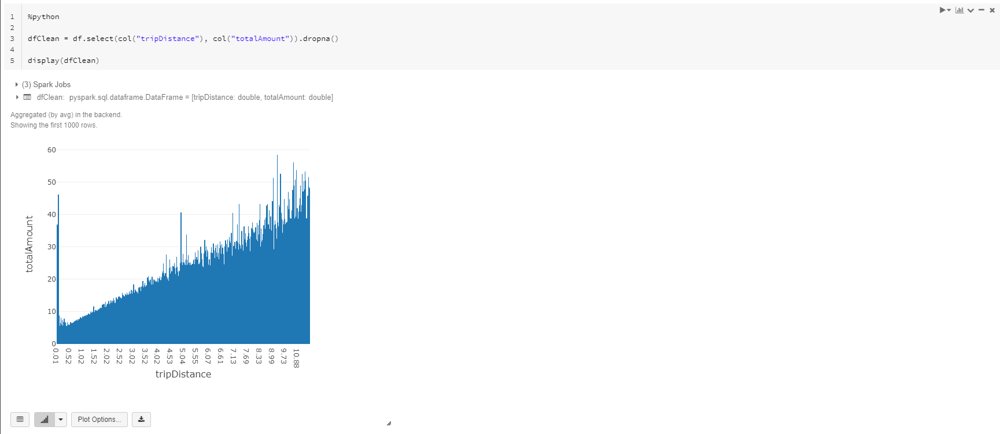
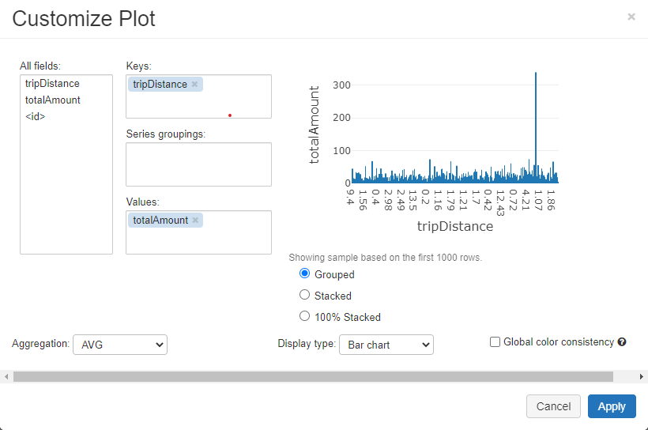

Spark has a built-in `show` function, which allows to print the rows in a DataFrame.

Azure Databricks adds its own display capabilities and adds various other types of visualizations out-of-the-box using the `display` and `displayHTML` functions.

The same data we've seen previously as a table can be displayed as a bar chart, pie, histogram, or other graphs. Even maps or images can be displayed:

## Plot options

The following display options are available:
- We can choose the DataFrame columns to be used as axes (keys, values).
- We can choose to group our series of data.
- We can choose the aggregations to be used with our grouped data (avg, sum, count, min, max).

> [!NOTE]
> **More information:** for more information about the available visualizations, see [Visualizations](/azure/databricks/notebooks/visualizations?azure-portal=true) in the Azure Databricks documentation.
