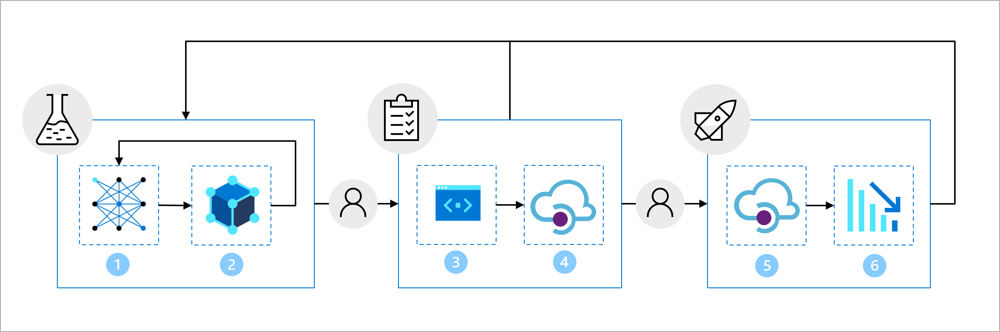

When you work on smaller projects with smaller teams, it may make sense to have one Azure Machine Learning workspace. The one workspace can be used for everything: to train, test, and deploy your model. However, at Proseware, you want to have a robust and future-proof solution that can easily scale when you build and maintain multiple models that you want to integrate with our web application for practitioners. 

To quickly but safely move a model from development to production, you've agreed upon a high-level **machine learning operations** (**MLOps**) architecture.

> [!Note]
> The diagram is a simplified representation of a MLOps architecture. To view a more detailed architecture, explore the various use cases in the [MLOps (v2) solution accelerator](https://github.com/Azure/mlops-v2).

The architecture includes:

1. **Setup**: Create all necessary Azure resources for the solution.
2. **Model development (inner loop)**: Explore and process the data to train and evaluate the model.
3. **Continuous integration**: Package and register the model.
4. **Model deployment (outer loop)**: Deploy the model.
5. **Continuous deployment**: Test the model and promote to production environment.
6. **Monitoring**: Monitor model and endpoint performance.

To work with machine learning models at a large scale, Proseware wants to use separate environments for different stages. Having separate environments will make it easier to control access to resources. Each environment can then be associated with a separate Azure Machine Learning workspace.

> [!Note]
> In this module, we refer to the DevOps interpretation of environments. Note that Azure Machine Learning also uses the term environments to describe a collection of Python packages needed to run a script. These two concepts of environments are independent from each other. Learn more about [Azure Machine Learning environments](/azure/machine-learning/concept-environments).

To allow for models to be tested before being deployed, you want to work with three environments:

The **development** environment is used for the inner loop:

1. Data scientists train the model.
2. The model is packaged and registered.

The **staging** environment is used for part of the outer loop:

3. Test the code and model with linting and unit testing.
4. Deploy the model to test the endpoint.

The **production** environment is used for the another part of the outer loop:

5. Deploy the model to the production endpoint. The production endpoint is integrated with the web application.
6. Monitor the model and endpoint performance to trigger retraining when necessary.

Although many machine learning tasks can and should be automated, you'll also want to plan for points where you want gated approval. When a model has been trained and packaged, you want to notify the lead data scientist to validate the model before it moves to the staging environment. 

Similarly, after the model has been tested vigorously in the staging environment, you want to add gated approval to ensure someone from the software development team verifies that all tests were successful before deploying your model to production.

When you work with environments, gated approval allows you to control deployments from one environment to the next.