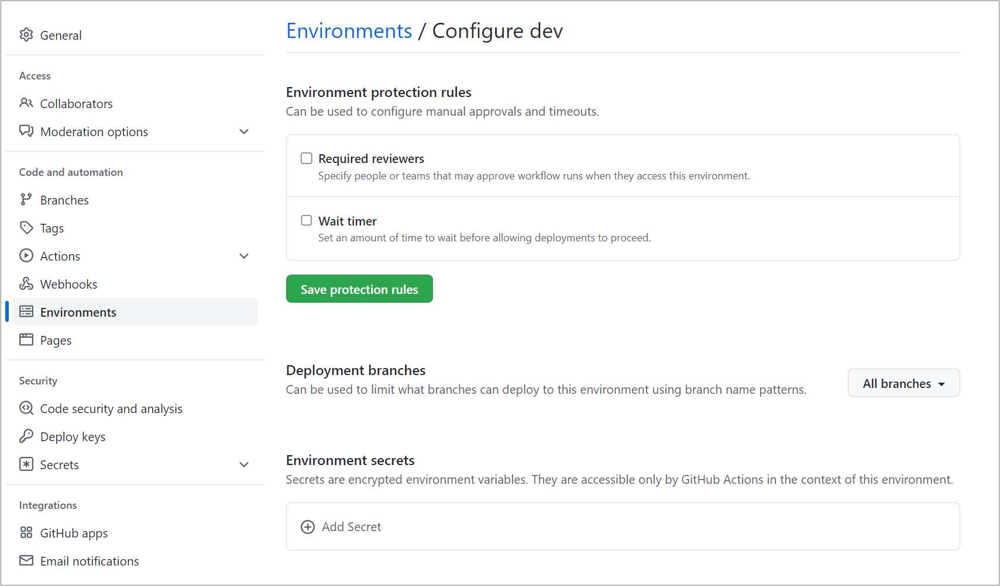

To implement environments when working with machine learning models, you can use a platform like GitHub. To automate tasks that need to run in separate environments, you'll need to:

- Set up environments in GitHub.
- Use environments in GitHub Actions.
- Add approvals to assign required reviewers before moving the model to the next environment.

## Set up environments in GitHub

To create an environment within your GitHub repo:

1. Go to the **Settings** tab within your repo.
2. Select **Environments**.
3. Create a **new environment**.
4. Enter a name.
5. Select **Configure environment**.

To associate an environment with a specific Azure Machine Learning workspace, you can create an **environment secret** to give only that environment access to an Azure Machine Learning workspace.

To give GitHub access to any Azure Machine Learning workspace, you need to create a service principal in Azure. Next, you need to give the service principal access to the Azure Machine Learning workspace in Azure. Learn how to [integrate Azure Machine Learning with DevOps tools such as GitHub](/learn/modules/introduction-development-operations-principles-for-machine-learn/4-integrate-azure-development-operations-tools).

You can create a secret in the repo to store the credentials of the service principal. Alternatively, when working with environments, you can create an environment secret to define which GitHub environment should have access to which Azure Machine Learning workspace.

To create an environment secret, go to the **Environments** tab in the **Settings** tab.

1. Go to your new environment.
2. Navigate to the **Environment secrets** section.
3. Add a new secret.
4. Enter `AZURE_CREDENTIALS` as the name.
5. Enter the service principal credentials in the value field.

## Use environments in GitHub Actions and add approvals

After creating environments in your GitHub repo, you can refer to the environment from your GitHub Actions workflows. Whenever you want to add a manual check between environments, you can add approvals. 

For example, whenever trigger an Azure Machine Learning job in your GitHub Actions workflow, the task may be executed successfully. However, it may be that during model training, there's a failure because of an issue with the training script. Or after model training, when you evaluate the model's metrics, you may decide that you need to retrain the model. 

To give you the opportunity to review the output of the model training in the Azure Machine Learning workspace, you can add an approval for an environment. Whenever a GitHub Actions workflow wants to run a task in a specific environment, the required reviewers will be notified and need to approve the tasks before they'll be run. 

> [!Tip]
> Learn more about [how to use environments in GitHub Actions and how to add approvals](/learn/modules/continuous-deployment-for-machine-learning/).
