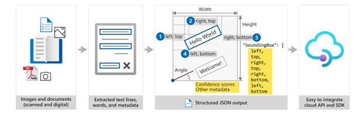
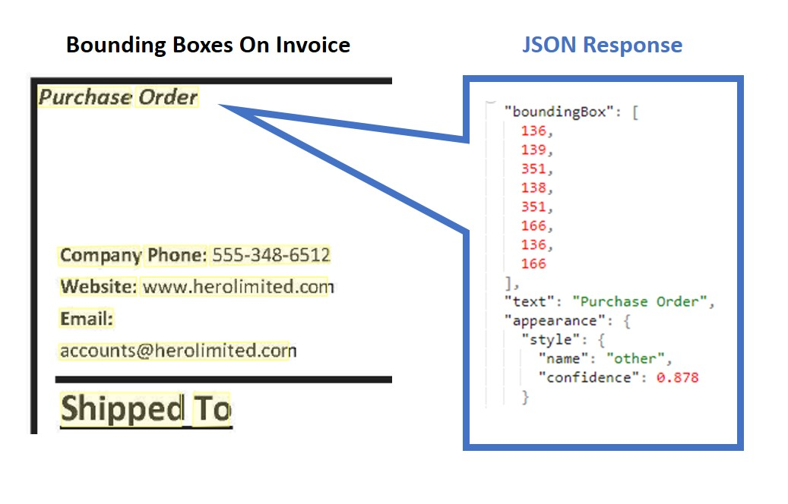

Azure Document Intelligence is one of many Azure AI Services, cloud-based artificial intelligence (AI) services with REST APIs and client library SDKs that can be used to build intelligence into your applications. 

Azure Document Intelligence uses Optical Character Recognition (OCR) capabilities and deep learning models to extract text, key-value pairs, selection marks, and tables from documents.

> [!div class="mx-imgBorder"]
>    

OCR captures document structure by creating bounding boxes around detected objects in an image. The locations of the bounding boxes are recorded as coordinates in relation to the rest of the page. Azure Document Intelligence services return bounding box data and other information in a structured form with the relationships from the original file.  

> [!div class="mx-imgBorder"]
> 

To build a high-accuracy model from scratch, people need to build deep learning models, use a large amount of compute resources, and face long model training times. These factors could make a project infeasible. Azure Document Intelligence provides underlying models that have been trained on thousands of form examples. The underlying models enable you to do high-accuracy data extraction from your forms with little to no model training.   

## Azure Document Intelligence service components 

Azure Document Intelligence is composed of the following services: 

- **Document analysis models**: which take an input of JPEG, PNG, PDF, and TIFF files and return a JSON file with the location of text in bounding boxes, text content, tables, selection marks (also known as checkboxes or radio buttons), and document structure. 

- **Prebuilt models**: which detect and extract information from document images and return the extracted data in a structured JSON output. Azure Document Intelligence currently supports prebuilt models for several forms, including: 
    - W-2 forms
    - Invoices
    - Receipts
    - ID documents 
    - Business cards

- **Custom models**: custom models extract data from forms specific to your business. Custom models can be trained through the [Azure Document Intelligence Studio](https://formrecognizer.appliedai.azure.com/studio). 

> [!NOTE]
> Some Azure Document Intelligence features are in preview, as of the time this content was authored, and as a result, features and usage details may change. You should refer to the [official page](/azure/ai-services/document-intelligence/overview?azure-portal=true) for up-to-date information.

## Access services with the client library SDKs or REST API 

You can access Azure Document Intelligence services by using a REST API, client library SDKs, and through the Azure Document Intelligence Studio to integrate the services into your workflow or application. 

> [!TIP]
> This module's exercise focuses on the Python and .NET SDKs. The underlying REST services can be used by any language.

Check out the [documentation](/azure/ai-services/document-intelligence/quickstarts/get-started-sdks-rest-api) for quick start guides on all the available SDKs and the REST API.