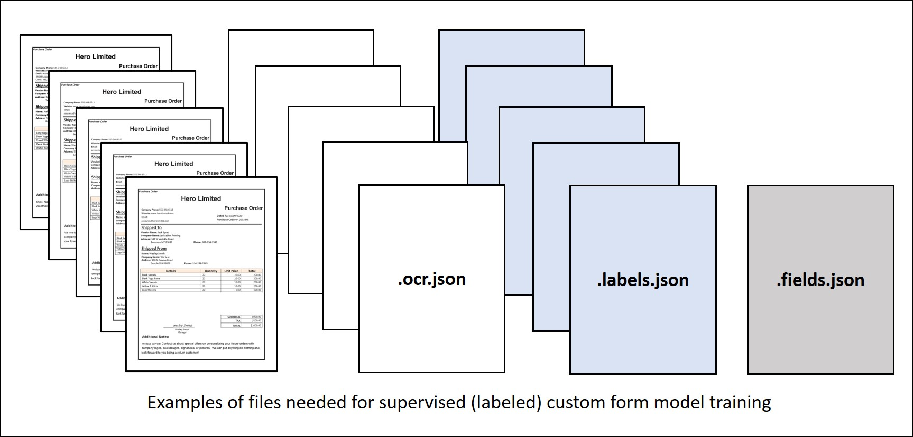
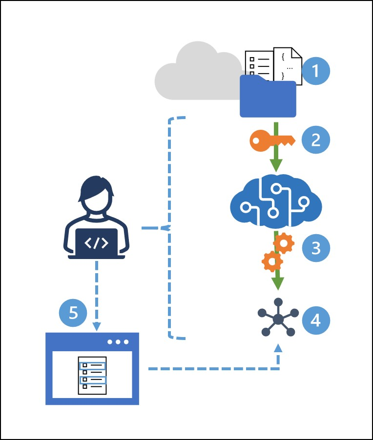

Training a custom form recognizer model with unlabeled forms often provides adequate results; but if your form is complex, or you need to define explicit field mappings, you can use a *supervised* learning approach and train your model using labeled forms.

Supervised training requires an input of form documents _and_ JSON documents. 

To train a custom model using labeled sampled forms:

1. Store sample forms in an Azure blob container, along with JSON files containing layout and label field information.
    - You can generate an **ocr.json** file for each sample form using the Form Recognizer's **Analyze Layout** function. Additionally, you need a single **fields.json** file describing the fields you want to extract, and a **labels.json** file for each sample form mapping the fields to their location in that form.  
2. Generate a shared access security (SAS) URL for the container. 
3. Use the **Train Custom Model** REST API function (or equivalent SDK method) with the **useLabelFile** parameter set to **true** to train the model. 
4. Use the **Get Custom Model** REST API function (or equivalent SDK method) to get the trained **model ID**.

**OR**

5. Use the Sample Labeling Tool to label and train. 
    
