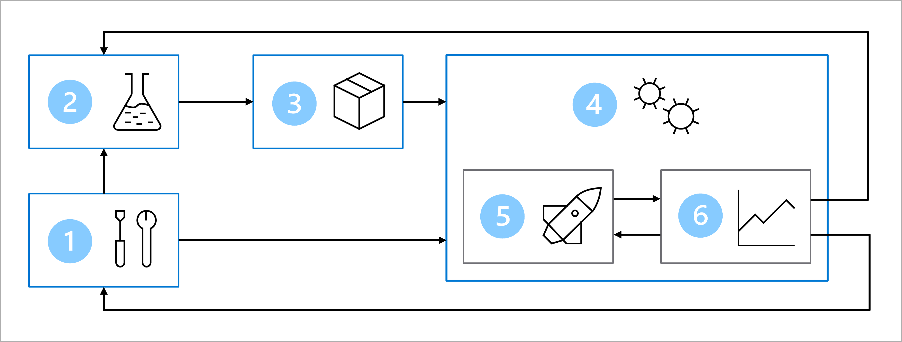
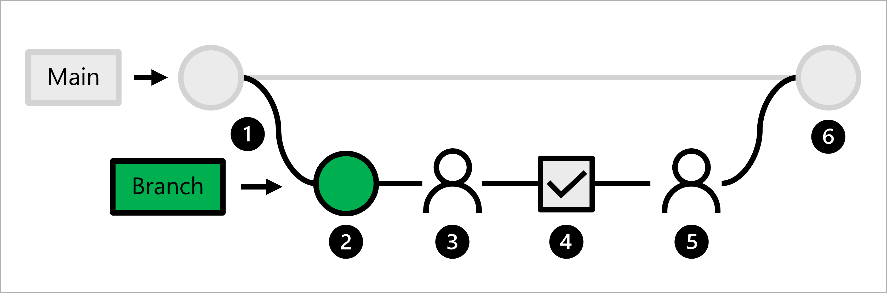

Let's review the architecture you've decided upon for the **machine learning operations** (**MLOps**) workflow to understand where and when we should verify the code.

> [!Note]
> The diagram is a simplified representation of a MLOps architecture. To view a more detailed architecture, explore the various use cases in the [MLOps (v2) solution accelerator](https://github.com/Azure/mlops-v2).

The main goal of the MLOps architecture is to create a robust and reproducible solution. To achieve that the architecture includes:

1. **Setup**: Create all necessary Azure resources for the solution.
2. **Model development (inner loop)**: Explore and process the data to train and evaluate the model.
3. **Continuous integration**: Package and register the model.
4. **Model deployment (outer loop)**: Deploy the model.
5. **Continuous deployment**: Test the model and promote to production environment.
6. **Monitoring**: Monitor model and endpoint performance.

To move a model from development to deployment, you'll need continuous integration. During continuous integration, you'll package and register the model. Before you package a model however, you'll need to verify the code used to train the model. 

Together with the data science team, you've agreed to use trunk-based development. Not only will branches protect the production code, it will also allow you to automatically verify any proposed changes before merging it with the production code.

Let's explore the workflow for a data scientist:

1. The production code is hosted in the **main** branch.
2. A data scientist creates a **feature branch** for model development.
3. The data scientist creates a **pull request** to propose to push changes to the main branch.
4. When a pull request is created, a **GitHub Actions workflow** is triggered to verify the code.
5. When the code passes **linting** and **unit testing**, the lead data scientist needs to approve the proposed changes.
6. After the lead data scientist approves the changes, the pull request is **merged**, and the main branch is updated accordingly.

As a machine learning engineer, you'll need to create a GitHub Actions workflow that verifies the code by running a linter and unit tests whenever a pull request is created.

> [!Tip]
> Learn more about [how to work with source control for machine learning projects, including trunk-based development and verifying your code locally](/learn/modules/source-control-for-machine-learning-projects/).